# 도서관 나들이

도서관 데이터를 기반으로 도서관, 도서, 문화 프로그램, 이용 후기를 탐색하고 저장하는 웹 애플리케이션입니다. 현재 구현은 부산 데이터를 기준으로 하며, 전국 도서관 데이터 확장과 주기적 데이터 갱신, 성향 분석 고도화를 고려한 구조를 지향합니다.

## 목차

- [도서관 나들이](#도서관-나들이)
  - [목차](#목차)
  - [A. 팀원 정보 및 업무 분담 내역](#a-팀원-정보-및-업무-분담-내역)
      - [1552063 박신영](#1552063-박신영)
      - [1551132 주소정](#1551132-주소정)
  - [B. 목표 서비스 및 실제 구현 정도](#b-목표-서비스-및-실제-구현-정도)
    - [목표 서비스](#목표-서비스)
    - [실제 구현 정도](#실제-구현-정도)
  - [C. 데이터베이스 모델링](#c-데이터베이스-모델링)
  - [D. 추천 알고리즘에 대한 기술적 설명](#d-추천-알고리즘에-대한-기술적-설명)
    - [홈 추천](#홈-추천)
    - [점수 기준](#점수-기준)
    - [나의 나들이 성향 분석](#나의-나들이-성향-분석)
  - [E. 핵심 기능](#e-핵심-기능)
    - [인증과 세션](#인증과-세션)
    - [도서관](#도서관)
    - [도서](#도서)
    - [문화 프로그램](#문화-프로그램)
    - [후기 커뮤니티](#후기-커뮤니티)
    - [나의 나들이와 선호 설정](#나의-나들이와-선호-설정)
    - [프론트엔드 페이지](#프론트엔드-페이지)
  - [F. 생성형 AI를 활용한 부분](#f-생성형-ai를-활용한-부분)
  - [G. 서비스 URL](#g-서비스-url)
  - [H. 기타](#h-기타)
    - [기술 스택](#기술-스택)
    - [데이터와 fixture](#데이터와-fixture)
    - [RESTful 설계](#restful-설계)
    - [Git 작업 원칙](#git-작업-원칙)
    - [향후 고도화](#향후-고도화)

## A. 팀원 정보 및 업무 분담 내역

#### 1552063 박신영
데이터 수집, 가공, 기획/설계, 백엔드, QA

#### 1551132 주소정
데이터 수집, 가공, 디자인 기획, 프론트, QA

## B. 목표 서비스 및 실제 구현 정도

### 목표 서비스

도서관 나들이는 사용자가 오늘 갈 만한 도서관을 찾고, 관심 있는 책과 문화 프로그램을 함께 살펴보며, 실제 방문 경험을 후기로 공유할 수 있는 서비스입니다.

핵심 목표는 다음과 같습니다.

- 도서관 MVP를 안정적으로 제공한다.
- 도서관, 도서, 문화 프로그램, 후기 데이터를 한 화면 흐름 안에서 연결한다.
- 사용자의 저장, 후기, 좋아요 활동을 기반으로 나의 나들이 성향을 분석한다.
- Celery와 Redis를 활용해 공공 데이터 갱신, 추천 세트 생성, 성향 재계산을 주기 작업으로 고도화할 수 있는 기반을 둔다.
- 더 고도화된 성향 분석에서는 저장·후기·좋아요뿐 아니라 최근성, 태그 점수, 도서관 이용 목적을 더 정교하게 반영한다.

### 실제 구현 정도

현재 구현된 주요 범위는 다음과 같습니다.

- 이메일 기반 회원가입, 로그인, refresh cookie 기반 토큰 갱신, 로그아웃
- 도서관 목록, 상세, 저장/저장 해제, 비슷한 도서관 조회
- 도서 목록, 인기 도서, 검색, 상세, 소장 도서관 조회, 저장/저장 해제
- 문화 프로그램 목록, 상세, 저장/저장 해제
- 후기 목록, 상세, 작성, 수정, 삭제, 좋아요, 댓글
- 나의 나들이 대시보드, 저장한 도서관·책·프로그램, 작성 후기, 좋아요한 후기 목록
- 선호 목적, 선호 지역, 선호 태그 설정
- 홈 오늘의 추천, 홈 공개 테마 5종, 개인화 추천
- 이미지 fallback, 공공 이미지 출처 오버레이, Kakao 지도 패널
- 공휴일, 일일 운영표, 도서관 시설, 도서, 프로그램, 데모 데이터 fixture

## C. 데이터베이스 모델링

현재 백엔드는 Django 앱 단위로 도메인을 나누고, 관계의 기준을 내부 식별자에 둡니다. 외부 데이터의 도서관명과 지역명은 import 매칭 입력일 뿐이며, 매칭 이후 관계는 `Library.id`를 기준으로 연결합니다.

```mermaid
erDiagram
    USER ||--|| USER_PROFILE : has
    USER ||--o{ USER_PREFERRED_REGION : selects
    USER ||--o{ USER_PREFERRED_TAG : selects
    USER ||--o{ USER_PREFERRED_PURPOSE : selects
    USER ||--o{ USER_REVIEW : writes
    USER ||--o{ USER_REVIEW_LIKE : likes
    USER ||--o{ USER_REVIEW_COMMENT : comments
    USER ||--o{ USER_LIBRARY_SAVE : saves
    USER ||--o{ USER_BOOK_SAVE : saves
    USER ||--o{ USER_PROGRAM_SAVE : saves
    USER ||--o{ USER_PREFERENCE : analyzed_as

    LIBRARY ||--o{ LIBRARY_ALIAS : has
    LIBRARY ||--o{ LIBRARY_EXTERNAL_IDENTIFIER : maps
    LIBRARY ||--o{ LIBRARY_OPENING_HOUR : opens
    LIBRARY ||--o{ LIBRARY_CLOSURE_RULE : closes
    LIBRARY ||--o{ LIBRARY_DAILY_SCHEDULE : scheduled
    LIBRARY ||--o{ LIBRARY_STATISTIC_SNAPSHOT : measured
    LIBRARY ||--|| LIBRARY_FACILITY_PROFILE : may_have
    LIBRARY ||--o{ LIBRARY_TAG : tagged
    LIBRARY ||--o{ LIBRARY_IMAGE : has
    LIBRARY ||--o{ LIBRARY_HOLDING : holds
    LIBRARY ||--o{ PROGRAM : hosts
    LIBRARY ||--o{ USER_REVIEW : receives
    LIBRARY ||--o{ USER_LIBRARY_SAVE : saved_by
    LIBRARY ||--o{ DAILY_LIBRARY_RECOMMENDATION_ITEM : recommended

    BOOK ||--o{ BOOK_TAG : tagged
    BOOK ||--o{ LIBRARY_HOLDING : held_by
    BOOK ||--o{ POPULAR_BOOK_ITEM : ranked
    BOOK ||--o{ REVIEW_BOOK_REFERENCE : referenced
    BOOK ||--o{ USER_BOOK_SAVE : saved_by

    PROGRAM ||--o{ PROGRAM_TAG : tagged
    PROGRAM ||--o{ PROGRAM_IMAGE : has
    PROGRAM ||--o{ REVIEW_PROGRAM_REFERENCE : referenced
    PROGRAM ||--o{ USER_PROGRAM_SAVE : saved_by

    USER_REVIEW ||--o{ USER_REVIEW_LIKE : liked_by
    USER_REVIEW ||--o{ USER_REVIEW_COMMENT : has
    USER_REVIEW ||--o{ USER_REVIEW_IMAGE : may_have
    USER_REVIEW ||--o{ REVIEW_BOOK_REFERENCE : references
    USER_REVIEW ||--o{ REVIEW_PROGRAM_REFERENCE : references
    USER_REVIEW ||--o{ REVIEW_TAG : tagged

    TAG ||--o{ LIBRARY_TAG : used_by
    TAG ||--o{ BOOK_TAG : used_by
    TAG ||--o{ PROGRAM_TAG : used_by
    TAG ||--o{ REVIEW_TAG : used_by
    TAG ||--o{ USER_PREFERRED_TAG : preferred
    TAG ||--o{ PURPOSE_TAG_RULE : scores
    TAG ||--o{ DAILY_RECOMMENDATION_TAG_RULE : scores
    TAG ||--o{ USER_PREFERENCE_ITEM : analyzed

    PURPOSE ||--o{ USER_PREFERRED_PURPOSE : preferred
    PURPOSE ||--o{ PURPOSE_TAG_RULE : has
    PURPOSE ||--o{ PURPOSE_METRIC_RULE : has

    DAILY_RECOMMENDATION_THEME ||--o{ DAILY_RECOMMENDATION_METRIC_RULE : has
    DAILY_RECOMMENDATION_THEME ||--o{ DAILY_RECOMMENDATION_TAG_RULE : has
    DAILY_RECOMMENDATION_THEME ||--o{ DAILY_LIBRARY_RECOMMENDATION_SET : generates
    DAILY_LIBRARY_RECOMMENDATION_SET ||--o{ DAILY_LIBRARY_RECOMMENDATION_ITEM : contains

    PUBLIC_HOLIDAY_CALENDAR ||--o{ PUBLIC_HOLIDAY : contains
    POPULAR_BOOK_SNAPSHOT ||--o{ POPULAR_BOOK_ITEM : contains
    MEDIA_ASSET ||--o{ DEFAULT_MEDIA_ASSET_RULE : fallback_rule
    MEDIA_ASSET ||--o{ LIBRARY_IMAGE : library_image
    MEDIA_ASSET ||--o{ PROGRAM_IMAGE : program_image
    SOURCE_SYNC_RUN }o--|| USER : triggered_by
```

앱별 책임은 다음과 같습니다.

| 앱 | 책임 |
|---|---|
| `accounts` | 이메일 기반 사용자, 프로필, 직접 선택한 선호 목적·지역·태그 |
| `libraries` | 도서관 canonical 데이터, 별칭, 외부 식별자, 운영, 공휴일, 운영표, 시설, 통계, 이미지 |
| `books` | 책 메타데이터, KDC/태그, 소장 관계, 인기 도서 스냅샷 |
| `programs` | 문화 프로그램, 신청/운영 상태, 분류, 대상, 이미지 |
| `community` | 후기, 댓글, 좋아요, 관련 책·프로그램, 후기 태그 |
| `myoutings` | 도서관·책·프로그램 저장과 나의 나들이 조회 |
| `preferences` | 행동 기반 성향 상태와 성향 태그 점수 |
| `recommendations` | 홈 테마, 방문 목적, 일일 추천 규칙과 결과 |
| `tags` | 시설·분류·후기 경험 태그 어휘 |
| `media_assets` | 공식 이미지, 시스템 대체 이미지, 라이선스와 출처 문구 |
| `integrations` | 외부 API client, 동기화 실행 기록, GMS 연동 |

## D. 추천 알고리즘에 대한 기술적 설명

추천은 규칙 기반 점수 계산으로 동작합니다. GMS나 생성형 AI는 추천 후보 선정, 추천 점수, 추천 순위, 도서관 사실 판단에 관여하지 않습니다.

### 홈 추천

`/api/v1/home/`은 `build_home_payload()`에서 다음 세 묶음을 생성합니다.

- 오늘의 추천: 날짜별 `DailyLibraryRecommendationSet`이 있으면 저장된 추천 세트를 우선 사용하고, 없으면 활성 `DailyRecommendationTheme` 중 날짜 기준으로 하나를 선택해 최대 3개 도서관을 반환합니다.
- 공개 테마 추천: 홈 공개 테마 `study`, `book`, `kids`, `mood`, `nearby`별로 최대 6개 도서관을 반환합니다.
- 개인화 추천: 로그인 사용자에게 선호 목적, 선호 지역, 선호 시설 태그와 행동 기반 태그 점수를 합산해 최대 3개 도서관을 반환합니다.

### 점수 기준

도서관 후보는 활성 도서관을 대상으로 하며, 현재 통계 스냅샷, 시설 profile, 활성 태그, 썸네일 이미지를 함께 조회합니다.

- `study`: 열람 좌석 수 정규화 점수와 열람실 보유 여부
- `book`: 장서 수 정규화 점수
- `kids`: 어린이 도서관 유형과 어린이자료실 보유 여부
- `mood`: 건물 면적, 부지 면적, 휴게 공간, 카페, 야외 공간
- `nearby`: 위도·경도가 있으면 현재 위치와의 거리 역수, 위치가 없으면 좌표 존재 여부
- 개인화: 직접 선호 점수에 행동 기반 태그 점수를 가중치로 더함

동점 정렬은 점수 내림차순 이후 도서관명, 내부 id 기준으로 안정적으로 처리합니다.

### 나의 나들이 성향 분석

`/api/v1/my-outings/dashboard/`는 사용자의 저장·후기·좋아요 활동을 행동 신호로 사용합니다.

- 저장한 도서관의 지역, 명시적으로 `True`인 시설
- 저장한 책과 후기 관련 책의 주제 태그
- 저장한 프로그램과 후기 관련 프로그램의 카테고리
- 작성 후기와 좋아요한 후기의 경험 태그

이 신호를 `study`, `book`, `program`, `rest` 축으로 가중 합산하고, 백분율로 정규화해 성향 요약을 만듭니다. 활동 신호가 없으면 분석 불충분 상태를 반환합니다.

## E. 핵심 기능

### 인증과 세션

- 회원가입: `POST /api/v1/auth/signup/`
- 로그인: `POST /api/v1/auth/login/`
- 토큰 갱신: `POST /api/v1/auth/token/refresh/`
- 로그아웃: `POST /api/v1/auth/logout/`
- 내 정보 조회/수정: `GET/PATCH /api/v1/users/me/`
- 내 선호 조회/수정: `GET/PUT /api/v1/users/me/preferences/`

로그인 식별자는 이메일입니다. access token은 프론트 메모리 상태에서 사용하고, refresh token은 HttpOnly Cookie로 관리합니다. 프론트 `apiClient`는 401 응답을 받으면 refresh를 한 번 시도한 뒤 원 요청을 재시도하고, refresh 실패 시 세션을 초기화합니다.

### 도서관

- 목록: `GET /api/v1/libraries/`
- 상세: `GET /api/v1/libraries/{library_id}/`
- 저장/저장 해제: `POST/DELETE /api/v1/libraries/{library_id}/save/`
- 비슷한 도서관: `GET /api/v1/libraries/{library_id}/similar/`

프론트는 `/libraries`, `/libraries/:id` 라우트에서 목록과 상세를 제공합니다. 상세 화면에는 이미지, 출처 오버레이, 시설 정보, Kakao 지도 패널, 관련 데이터가 연결됩니다.

### 도서

- 목록: `GET /api/v1/books/`
- 인기 도서: `GET /api/v1/books/popular/`
- 검색: `GET /api/v1/books/search/`
- 상세: `GET /api/v1/books/{isbn13}/`
- 소장 도서관: `GET /api/v1/books/{isbn13}/libraries/`
- 저장/저장 해제: `POST/DELETE /api/v1/books/{isbn13}/save/`

프론트는 `/books`, `/books/:isbn13` 라우트에서 도서 탐색과 상세를 제공합니다.

### 문화 프로그램

- 목록: `GET /api/v1/programs/`
- 상세: `GET /api/v1/programs/{program_id}/`
- 저장/저장 해제: `POST/DELETE /api/v1/programs/{program_id}/save/`

프로그램 상태는 신청 기간과 운영 기간을 기준으로 목록·상세 조회 전 재계산합니다. 서비스 내부 신청, 예약, 결제는 현재 범위가 아닙니다.

### 후기 커뮤니티

- 후기 목록/작성: `GET/POST /api/v1/reviews/`
- 후기 상세/수정/삭제: `GET/PATCH/DELETE /api/v1/reviews/{review_id}/`
- 후기 좋아요/좋아요 해제: `POST/DELETE /api/v1/reviews/{review_id}/like/`
- 댓글 목록/작성: `GET/POST /api/v1/reviews/{review_id}/comments/`
- 댓글 상세/수정/삭제: `GET/PATCH/DELETE /api/v1/reviews/{review_id}/comments/{comment_id}/`

후기는 1~200자 본문, 1~5개 경험 태그, 선택적 관련 책·프로그램으로 구성됩니다. 별도 제목, 별점, 방문 목적 FK, 후기 저장 기능은 사용하지 않습니다.

### 나의 나들이와 선호 설정

- 대시보드: `GET /api/v1/my-outings/dashboard/`
- 저장 도서관: `GET /api/v1/my-outings/libraries/`
- 저장 도서: `GET /api/v1/my-outings/books/`
- 저장 프로그램: `GET /api/v1/my-outings/programs/`
- 작성 후기: `GET /api/v1/my-outings/reviews/`
- 작성 댓글: `GET /api/v1/my-outings/comments/`
- 좋아요한 후기: `GET /api/v1/my-outings/liked-reviews/`
- 선호 옵션: `GET /api/v1/preferences/options/`

프론트는 저장·좋아요 상태를 API 응답의 가상 필드에 의존하지 않고, 나의 나들이 목록을 통해 hydration할 수 있는 구조를 둡니다.

### 프론트엔드 페이지

실제 Vue Router 기준 주요 페이지는 다음과 같습니다.

- `/`: 홈 추천
- `/libraries`, `/libraries/:id`: 도서관 목록과 상세
- `/books`, `/books/:isbn13`: 도서 목록과 상세
- `/programs`, `/programs/:id`: 문화 프로그램 목록과 상세
- `/community`, `/reviews/:id`, `/reviews/new`, `/reviews/:id/edit`: 후기 커뮤니티
- `/my-outings/dashboard`, `/my-outings/libraries`, `/my-outings/books`, `/my-outings/programs`, `/my-outings/reviews`, `/my-outings/liked-reviews`: 나의 나들이
- `/preferences`, `/onboarding/preferences`: 선호 설정
- `/profile`, `/profile/edit`: 프로필
- `/auth/login`, `/auth/signup`: 인증

## F. 생성형 AI를 활용한 부분

생성형 AI는 GMS를 통해 나의 나들이 대시보드의 `summary_sentence`를 순화하는 용도로만 사용합니다.

동작 흐름은 다음과 같습니다.

1. 백엔드가 저장, 후기, 좋아요 활동을 기반으로 규칙 기반 성향 문장을 먼저 생성합니다.
2. `GMS_SUMMARY_ENABLED`, `GMS_API_KEY`, `GMS_OPENAI_BASE_URL`, `GMS_MODEL`이 모두 설정된 경우에만 GMS 요청을 보냅니다.
3. 요청 payload는 `top_axis`, `top_labels`, `signal_count`, `rule_sentence`로 제한합니다.
4. 시스템 프롬프트는 입력된 사실만 유지하고 새로운 도서관명, 책명, 프로그램명, 시설 정보를 만들지 않도록 제한합니다.
5. 응답은 한 문장, 최대 100자, 줄바꿈 없음 조건을 통과해야 합니다.
6. GMS가 비활성화되었거나 실패하거나 유효하지 않은 문장을 반환하면 규칙 기반 문장을 그대로 사용합니다.

따라서 AI는 표현을 다듬는 보조 수단이며, 추천 후보 선정, 추천 점수, 추천 순위, 시설·운영·도서·프로그램 사실 판단에는 사용되지 않습니다.

## G. 서비스 URL

미배포

## H. 기타

### 기술 스택

Backend:

- Python 3.11
- Django 5.2 계열
- Django REST Framework 3.16 계열
- djangorestframework-simplejwt
- django-cors-headers
- django-filter
- drf-spectacular
- psycopg
- Celery, Redis
- httpx
- beautifulsoup4
- Pillow
- pytest, pytest-django

Frontend:

- Vue 3
- Vite
- Vue Router
- Pinia
- Axios
- Bootstrap 5.3
- Kakao Map JavaScript SDK

### 데이터와 fixture

현재 저장소에는 load 가능한 데이터 seed와 import 결과물이 포함되어 있습니다.

- 도서관 표준 데이터, 시설 데이터, 이미지 데이터: `backend/fixtures/library_seed/`
- 도서관 외부 식별자: `backend/fixtures/library_identifier_seed/`
- 공휴일 데이터: `backend/fixtures/public_holiday_seed/`
- 일일 운영표 데이터: `backend/fixtures/daily_schedule_seed/`
- 인기 도서와 도서 상세 보강 데이터: `backend/fixtures/book_seed/`
- 문화 프로그램 데이터와 import report: `backend/fixtures/program_seed/`
- 데모 사용자 활동과 로컬 프로젝트 스냅샷: `backend/fixtures/demo_seed/`

데이터 import의 핵심 원칙은 외부 `library_name`, `sigungu`를 FK처럼 사용하지 않고 정규화와 매칭을 거쳐 내부 `Library.id`로 확정한 뒤 연결하는 것입니다.

### RESTful 설계

공개 API는 `/api/v1`을 기준으로 도메인별 리소스를 나누고, 상태 변경 의도에 맞는 HTTP Method를 사용합니다.

- 조회: `GET`
- 생성, 저장, 좋아요: `POST`
- 전체 선호 수정: `PUT`
- 부분 수정: `PATCH`
- 삭제, 저장 해제, 좋아요 해제: `DELETE`

목록 API는 DRF pagination wrapper를 사용하며, 인증이 필요한 API는 `Authorization: Bearer <access_token>`을 사용합니다.

### Git 작업 원칙

프로젝트 작업 시 다음 원칙을 기준으로 운영합니다.

- 기능 단위로 작업 범위를 분리한다.
- commit message는 기능 개발, 버그 수정, 문서 작성 등 목적이 드러나도록 작성한다.
- 백엔드 모델, migration, serializer, 공개 API 계약 변경은 프론트 편의만으로 임의 수정하지 않는다.
- 현재 구현과 명세가 충돌하면 코드를 자동 변경하지 않고 차이를 먼저 확인한다.

### 향후 고도화

- 전국 도서관 단위로 데이터 확장
- Celery beat 기반 공공 데이터 주기 수집과 운영표 갱신
- Redis 기반 추천 생성 lock, 캐시, 비동기 작업 상태 관리
- 사용자 행동 신호의 최근성 반영과 4축 성향 분석 고도화
- PostgreSQL `pg_trgm` 기반 도서관명·주소 검색 품질 개선
- 배포 환경에서 정적 파일, media, CORS, Cookie 보안 설정 정리
- 실시간 좌석, 실시간 대출 가능 여부, 내부 프로그램 예약·결제, AI 활용 확장
