# 도서관 나들이 ERD 명세서

- 문서 버전: 2.0
- 작성 기준일: 2026-06-22
- 기준 자료: 서비스 목업, 메인페이지 서술, 데이터셋 명세, 전국도서관표준데이터, 도서관 정보나루 Open API
- 적용 범위: 홈, 도서관 찾기, 책 둘러보기, 문화 프로그램, 커뮤니티, 나의 나들이, 프로필, 프로필 설정, 도서관 상세

---

## 1. 설계 변경 요약

이번 개정에서는 서비스 의도와 다르게 해석되었던 구조를 다음과 같이 바로잡았다.

1. `DataSource`, `SourceSyncRun`, `LibrarySourceRecord`와 별도 `sources` 앱을 제거한다. 수집 출처는 필요한 엔터티에 `provider_code`, `source_url`, `reference_date`, `fetched_at` 등의 값으로 직접 보존한다.
2. 실시간 열람실 좌석 기능과 `ReadingRoom`, `LibraryOperationalStatusSnapshot`, `ReadingRoomStatusSnapshot`을 현재 설계와 MVP에서 제거한다. 전국도서관표준데이터의 `열람좌석수`는 정적 통계로 유지한다.
3. `Tag`를 도서관 전용 특징이 아니라 도서관·책·프로그램·후기 데이터를 공통 언어로 표준화한 **사용자 선호 집계 기준**으로 재정의한다.
4. 공통 태그 정의는 `tags.Tag`가 소유하고, 각 도메인의 연결 모델은 해당 도메인 앱이 소유한다: `LibraryTag`, `BookTag`, `ProgramTag`, `ReviewTag`.
5. 가입 시에는 이메일·닉네임·비밀번호만 받는다. 프로필 이미지와 자기소개는 `UserProfile`, 사용자가 직접 고르는 선호 지역·선호 태그는 `UserPreferredRegion`, `UserPreferredTag`에 저장한다.
6. 프로필 설정에서 직접 선택한 선호는 즉시 추천 보너스로 사용하고, `UserPreference`와 `UserPreferenceItem`은 저장·후기 행동을 분석한 자동 성향 결과만 저장한다.
7. `UserPreferenceItem`은 문자열 `item_type/item_code`가 아니라 `tag_id`를 중심으로 저장한다.
8. `ProgramSession`을 제거한다. 같은 이름의 프로그램이라도 운영 날짜나 원천 게시물이 다르면 별도의 `Program` 행으로 저장한다.
9. 사용자 관여 데이터를 담당하는 앱을 `saves` 또는 `interactions`가 아니라 `myoutings`로 명명한다. 저장한 도서관·책·프로그램·후기를 관리하고, 작성한 후기는 `UserReview.user_id`로 조회한다.
10. 이미지 자산은 `media_assets` 앱으로 분리한다. 도서관 유형별, 프로그램 분류별, 후기 무이미지 상태별 대체 이미지를 `DefaultMediaAssetRule`로 관리한다.
11. 커뮤니티 후기는 도서관에 귀속되고, 선택적으로 관련 책·프로그램을 연결할 수 있다. 후기의 의미 태그는 `ReviewTag`로 관리한다.

---

## 2. 최종 설계 원칙

1. 도서관·프로그램·사용자 저장·후기는 내부 DB를 기준으로 조회한다.
2. 전국 전체 장서를 사전 적재하지 않고, 실제 검색·상세·저장·인기 목록에 노출된 책과 확인된 소장 관계만 선택적으로 저장한다.
3. 실시간 열람실 잔여 좌석과 방문자 수는 수집·저장·추천에 사용하지 않는다.
4. 태그는 특정 엔터티의 장식용 속성이 아니라 서로 다른 도메인의 데이터를 같은 의미 축으로 연결하는 공통 선호 어휘다.
5. 실시간·상대적 상태인 `nearby`, `open_now`, `loan_available`, `current_popular`는 영구 태그로 저장하지 않고 요청 시 계산하거나 스냅샷으로 관리한다.
6. 사용자가 프로필에서 직접 선택한 선호 지역·태그와 행동에서 추론한 자동 성향은 분리한다.
7. 수동 선호는 행동 신호 수와 관계없이 즉시 추천에 반영할 수 있다. 행동 기반 성향 보너스는 설정된 최소 신호 수를 충족하고 계산이 완료된 경우에만 반영한다.
8. 브라우저 현재 좌표는 요청 중 거리 계산에만 사용하고 영구 저장하지 않는다.
9. 홈 TOP 1~3은 날짜별 추천 테마를 기준으로 미리 생성한다. 같은 날짜·지역·알고리즘 버전에는 같은 기본 후보를 제공한다.
10. 프로그램은 조회·검색·저장 대상이며, 서비스 내부 신청·예약·결제·참여 이력을 관리하지 않는다. 원천의 신청 상태 문구는 표시용 원문으로만 보존할 수 있다.
11. 후기 자동 텍스트 태깅은 MVP에서 제외한다. 후기 태그는 사용자가 선택한 태그를 우선 사용한다.
12. 공식·시스템 이미지와 사용자 업로드 이미지는 구분한다. 공식 이미지에는 출처와 이용허락 정보를 보존한다.
13. 대체 이미지는 엔터티에 실제 이미지처럼 연결하지 않고 응답 생성 시 규칙으로 해석한다.

---

## 3. 페이지별 데이터 사용 의도

| 페이지 | 주요 데이터 | 파생·계산 데이터 | 비고 |
|---|---|---|---|
| 홈 | 도서관, 시설, 통계, 운영시간, 태그, 프로그램, 추천 규칙 | 날짜별 TOP 1~3, 수동 선호 보너스, 행동 기반 성향 보너스 | 실시간 좌석 미사용 |
| 도서관 찾기 | 도서관, 시설, 최신 통계, `LibraryTag`, 대표 이미지 | 일자별 운영표, 요청 좌표 기반 거리 | 지역·유형·운영·시설·태그 필터 |
| 도서관 상세 | 도서관 기준정보, 시설, 통계, 프로그램, 후기, 이미지 | 일자별 운영 여부, 후기 요약 | 열람실 정보는 정적 좌석 수만 제공 |
| 책 둘러보기 | 캐시된 책, `BookTag`, 사용자 저장 | 외부 검색 결과, 소장 도서관, 대출 가능 스냅샷, 인기 도서 | 전체 장서 사전 적재 안 함 |
| 문화 프로그램 | 프로그램, `ProgramTag`, 개최 도서관, 프로그램 이미지 | 일정 상태 계산 | 회차 테이블·내부 신청 이력 없음 |
| 커뮤니티 | 후기, 후기 이미지, `ReviewTag`, 관련 책·프로그램 | 최신순·평점·태그 필터 | 후기는 한 도서관에 귀속 |
| 나의 나들이 | 저장한 도서관·책·프로그램·후기, 작성 후기 | 자동 성향 준비 상태와 상위 태그 | 설정 화면이 아니라 관여 이력·분석 화면 |
| 프로필 | 닉네임, 프로필 이미지, 자기소개 | 저장·후기 수 요약 | 읽기 중심 화면 |
| 프로필 설정 | 닉네임, 프로필 이미지, 자기소개, 선호 지역, 선호 태그 | 수동 추천 가중치 | 체크리스트 기반 설정 |

---

## 4. Django 앱별 모델 배치

| Django 앱 | `models.py` 소속 모델 | 책임 |
|---|---|---|
| `accounts` | `User`, `UserProfile`, `UserPreferredRegion`, `UserPreferredTag` | 인증, 프로필, 사용자가 직접 선언한 선호 |
| `tags` | `Tag` | 공통 태그 어휘와 표시·선택 정책 |
| `libraries` | `Library`, `LibraryExternalIdentifier`, `LibraryOpeningHour`, `LibraryClosureRule`, `PublicHoliday`, `LibraryDailySchedule`, `LibraryStatisticSnapshot`, `LibraryFacility`, `LibraryTag`, `LibraryImage` | 도서관 검색·운영·시설·태그·이미지 연결 |
| `media_assets` | `MediaAsset`, `DefaultMediaAssetRule` | 공식·시스템 이미지와 대체 이미지 규칙 |
| `books` | `Book`, `BookTag`, `LibraryHolding`, `LibraryHoldingCopy`, `BookAvailabilitySnapshot`, `PopularBookSnapshot`, `PopularBookItem` | 책 메타데이터·분류 태그·소장·인기 목록 |
| `programs` | `Program`, `ProgramTag`, `ProgramImage` | 문화 프로그램·태그·이미지 연결 |
| `community` | `UserReview`, `UserReviewImage`, `ReviewBookReference`, `ReviewProgramReference`, `ReviewTag` | 후기 작성·이미지·관련 콘텐츠·후기 태그 |
| `myoutings` | `UserLibrarySave`, `UserBookSave`, `UserProgramSave`, `UserReviewSave` | 사용자가 저장한 콘텐츠 |
| `preferences` | `UserPreference`, `UserPreferenceItem` | 행동 기반 자동 성향 집계 결과 |
| `recommendations` | `Purpose`, `PurposeTagRule`, `PurposeMetricRule`, `DailyRecommendationTheme`, `DailyRecommendationMetricRule`, `DailyLibraryRecommendationSet`, `DailyLibraryRecommendationItem` | 목적별·날짜별 추천 규칙과 결과 |

`integrations` 앱은 외부 API client, 파일 loader, normalizer, import service를 담당하지만 영속 모델을 두지 않는다.

---

## 5. 데이터 저장·갱신 정책

| 데이터 | 저장 방식 | 갱신·캐시 정책 | 관련 엔터티 |
|---|---|---|---|
| 전국도서관표준데이터 | 정규화 현재값 + 기준일 통계 | 새 파일 확인 시 idempotent upsert | `Library`, 운영시간·휴관·통계 |
| 정보나루 도서관 코드 | 외부 식별자 | 필요 시 또는 주기 갱신 | `LibraryExternalIdentifier` |
| 정보나루 도서 검색·상세 | 선택적 영구 캐시 | 30~90일 후 재확인 | `Book` |
| 도서 소장·청구기호 | 조회 기반 미러 | 7~30일 후 재확인 | `LibraryHolding`, `LibraryHoldingCopy` |
| 대출 가능 여부 | 시점 스냅샷 | 기본 24시간 fresh | `BookAvailabilitySnapshot` |
| 전국·지역·도서관 인기 도서 | 순위 스냅샷 | 기본 매일 갱신 | `PopularBookSnapshot`, `PopularBookItem` |
| 프로그램 JSON·공식 게시물 | 현재 미러 + soft delete | 원천에 맞춰 6~24시간 또는 월 단위 | `Program` |
| 시설 JSON·운영자 보정 | 상태값 저장 | 데이터 갱신 또는 검수 시 | `LibraryFacility` |
| 공휴일 | 연도별 공식 API 값 | 주기 확인, 다음 연도 선적재 | `PublicHoliday` |
| 일자별 운영표 | 규칙 기반 파생 | 향후 180일 생성, 원천 변경 시 재생성 | `LibraryDailySchedule` |
| 공통 태그 연결 | 규칙 기반 또는 사용자 선택 | 원천 엔터티 변경 후 idempotent 재계산 | 각 도메인의 `*Tag` |
| 날짜별 추천 TOP 1~3 | 규칙 기반 파생 | 매일 지역별 생성 | 일일 추천 세트·항목 |
| 공식·기본 이미지 | 선별 저장 | 이용조건·링크 점검 | `MediaAsset`, 연결 모델, 기본 규칙 |
| 사용자 저장·후기 | 내부 원본 | 즉시 반영 | `myoutings`, `community` |
| 자동 성향 | 행동 변경 후 debounce | 현재 결과만 유지 | `UserPreference`, `UserPreferenceItem` |

별도 raw staging·수집 실행 이력 테이블은 두지 않는다. 실패 행, import 통계, upstream 오류는 관리 명령 출력·구조화 로그·관리자용 리포트 파일로 남긴다.

---

## 6. 공통 모델 규칙

- 기본 PK는 `BigAutoField`를 사용한다.
- 서비스가 직접 관리하는 테이블은 `created_at`, `updated_at`을 가진다.
- 외부 데이터에는 필요한 범위에서 `provider_code`, `source_url`, `reference_date`, `fetched_at`, `last_verified_at`을 직접 둔다.
- 외부 원천에서 사라질 수 있는 엔터티는 `is_active`, `is_visible`, `deleted_at`을 사용하고 즉시 물리 삭제하지 않는다.
- DB 시각은 UTC로 저장하고 화면에서는 `Asia/Seoul`로 변환한다.
- 코드 필드는 Django `TextChoices` 또는 안정적인 문자열 코드로 관리한다.
- 위도·경도는 nullable이다. 현재 위치와의 거리는 요청 시 계산한다.
- ISBN은 문자열로 저장하며 숫자형으로 저장하지 않는다.
- 빈 원천값과 실제 0을 구분하기 위해 통계 숫자는 nullable을 허용한다.
- 원천의 `00:00~00:00`은 자동으로 24시간 운영으로 해석하지 않는다.
- 대체 이미지는 DB의 엔터티별 이미지 관계에 삽입하지 않고 serializer/service에서 해석한다.

---

## 7. 최종 엔터티 명세

### 7.1 accounts

#### User

Django `AbstractUser`를 기반으로 하되 이메일을 로그인 식별자로 사용한다.

| 필드 | 타입 개념 | 설명 |
|---|---|---|
| id | PK | 사용자 식별자 |
| email | email, unique | 로그인·연락용 이메일 |
| nickname | varchar | 화면 표시명 |
| password | password hash | Django 인증 비밀번호 |
| is_active / is_staff / is_superuser | boolean | Django 인증·권한 상태 |
| last_login / date_joined | datetime | 인증 이력 |
| created_at / updated_at | datetime | 관리 시각 |

`default_sido`, `default_sigungu`, 현재 위치 좌표는 `User`에 두지 않는다. 가입 입력은 이메일·닉네임·비밀번호로 제한한다.

#### UserProfile

프로필 화면 표시용 부가정보다.

| 필드 | 설명 |
|---|---|
| user_id | OneToOne `User` |
| profile_image | 사용자 업로드 이미지, nullable |
| profile_image_alt | 대체 텍스트, nullable |
| bio | 짧은 자기소개, nullable |
| created_at / updated_at | 관리 시각 |

프로필 이미지가 없으면 `DefaultMediaAssetRule(target_domain=profile)`을 사용할 수 있다.

#### UserPreferredRegion

프로필 설정에서 사용자가 직접 선택한 선호 지역이다.

| 필드 | 설명 |
|---|---|
| user_id | `User` FK |
| region_key | 정규화 지역 키. 예: `21:*`, `21:21050` |
| sido | 시·도 표시명 |
| sigungu | 시·군·구 표시명, nullable |
| weight | 서비스가 적용하는 가중치. 기본 1.0 |
| display_order | 설정 화면 표시·우선순위 |
| is_active | 현재 사용 여부 |
| created_at / updated_at | 관리 시각 |

제약조건: `UNIQUE(user_id, region_key)`.

선호 지역은 검색 범위를 강제로 고정하지 않는다. 명시적 요청 지역이 없을 때도 서비스 기본 범위를 사용하고, 선호 지역은 추천 보너스로 적용한다.

#### UserPreferredTag

프로필 체크리스트에서 사용자가 직접 선택한 태그다.

| 필드 | 설명 |
|---|---|
| user_id | `User` FK |
| tag_id | `Tag` FK |
| weight | 서비스가 적용하는 가중치. 기본 1.0 |
| is_active | 현재 사용 여부 |
| created_at / updated_at | 관리 시각 |

제약조건: `UNIQUE(user_id, tag_id)`.

`Tag.is_profile_selectable=True`인 태그만 선택할 수 있다. 수동 태그는 `UserPreferenceItem`에 복사하지 않고 추천 시 별도 보너스로 결합한다.

---

### 7.2 tags

#### Tag

도서관·책·프로그램·후기에서 추출되거나 사용자가 선택하는 공통 선호 어휘다.

| 필드 | 타입 개념 | 설명 |
|---|---|---|
| id | PK | 태그 식별자 |
| code | varchar, unique | 안정적인 내부 코드 |
| label | varchar | 사용자 표시명 |
| tag_group | enum/varchar | 선호 축. 예: `library_type`, `operation`, `facility`, `space`, `collection`, `book_subject`, `program_type`, `program_target`, `review_context`, `region` |
| description | text, nullable | 태그의 엄밀한 정의 |
| is_profile_selectable | boolean | 프로필 체크리스트 노출 여부 |
| is_review_selectable | boolean | 후기 작성 태그 노출 여부 |
| is_filterable | boolean | 목록 필터 노출 여부 |
| display_order | integer | 그룹 내 노출 순서 |
| is_active | boolean | 사용 여부 |
| created_at / updated_at | datetime | 관리 시각 |

`Tag`에는 원천 도메인을 고정하는 `tag_type`을 두지 않는다. 같은 태그가 여러 도메인에서 같은 의미로 사용될 수 있기 때문이다. 도메인은 각 연결 모델이 표현한다.

다음과 같은 시점 의존 값은 태그로 저장하지 않는다.

- `nearby`: 사용자 좌표에 따라 달라짐
- `open_now`: 날짜·시각에 따라 달라짐
- `loan_available`: 책×도서관×기준일에 따라 달라짐
- `current_popular`: 집계 기간에 따라 달라짐

---

### 7.3 libraries

#### Library

| 필드 | 타입 개념 | 설명 |
|---|---|---|
| id | PK | 도서관 식별자 |
| name | varchar | 도서관명 |
| normalized_name | varchar | 검색·매칭용 정규화 이름 |
| sido / sigungu | varchar | 지역 |
| library_type | enum/varchar | `public`, `small`, `children`, `other` 등 정규화 유형 |
| library_type_raw | varchar, nullable | 원천 유형 문구 |
| road_address | varchar | 도로명주소 |
| normalized_address | varchar | 검색·매칭용 주소 |
| latitude / longitude | decimal, nullable | 좌표 |
| phone | varchar, nullable | 전화번호 |
| homepage_url | URL, nullable | 홈페이지 |
| operating_agency | varchar, nullable | 운영 기관 |
| short_description | varchar, nullable | 카드용 한 줄 설명 |
| is_active | boolean | 서비스 대상 여부 |
| created_at / updated_at | datetime | 관리 시각 |

권장 인덱스: `(sido, sigungu, library_type, is_active)`, `normalized_name`, 좌표.

#### LibraryExternalIdentifier

정보나루 등 외부 제공처의 개별 도서관 코드를 연결한다.

| 필드 | 설명 |
|---|---|
| library_id | `Library` FK |
| provider_code | `data4library` 등 제공처 코드 |
| code_type | `lib_code`, `library_id`, `facility_code` 등 |
| external_code | 외부 코드 |
| external_name | 원천 도서관명, nullable |
| first_seen_at / last_verified_at | 확인 시각 |
| is_active | 현재 유효 여부 |

제약조건: `UNIQUE(provider_code, code_type, external_code)`.

전국도서관표준데이터의 `제공기관코드`는 개별 도서관 코드가 아니므로 여기에 직접 넣지 않는다.

#### LibraryOpeningHour

| 필드 | 설명 |
|---|---|
| library_id | `Library` FK |
| provider_code | 원천 코드 |
| day_type | `day_of_week`, `public_holiday`, `specific_date` |
| day_of_week | 월=0~일=6, nullable |
| specific_date | 특정일, nullable |
| sequence | 같은 날 여러 구간 순서 |
| schedule_status | `open`, `closed`, `unknown` |
| open_time / close_time | 운영 시각, nullable |
| closes_next_day | 익일 종료 여부 |
| valid_from / valid_to | 적용 기간, nullable |
| raw_text | 원문, nullable |
| source_url | 근거 URL, nullable |
| source_reference_date | 원천 기준일, nullable |
| fetched_at | 수집·적재 시각 |
| is_current | 현재 규칙 여부 |

`day_type`에 따라 필요한 필드를 `CheckConstraint`로 검증한다.

#### LibraryClosureRule

| 필드 | 설명 |
|---|---|
| library_id | `Library` FK |
| provider_code | 원천 코드 |
| rule_type | `weekly`, `nth_weekday`, `public_holiday`, `named_holiday`, `temporary`, `full_closure`, `unknown` |
| normalized_rule | 구조화 JSON |
| raw_text | 원문 |
| valid_from / valid_to | 적용 기간, nullable |
| priority | 충돌 우선순위 |
| source_url | 근거 URL, nullable |
| source_reference_date | 원천 기준일, nullable |
| is_current | 현재 적용 여부 |
| fetched_at | 적재 시각 |

#### PublicHoliday

| 필드 | 설명 |
|---|---|
| provider_code | 공식 특일 제공처 코드 |
| date | 날짜 |
| holiday_code | 서비스 정규화 코드 |
| name | 공휴일명 |
| is_public_holiday | 공공기관 휴일 여부 |
| is_substitute | 대체공휴일 여부 |
| is_temporary | 임시공휴일 여부 |
| source_url | 원천 URL, nullable |
| fetched_at | 수집 시각 |

제약조건: `UNIQUE(date, holiday_code)`.

#### LibraryDailySchedule

| 필드 | 설명 |
|---|---|
| library_id | `Library` FK |
| date | 대상 날짜 |
| status | `open`, `closed`, `unknown` |
| open_time / close_time | 해당 날짜 운영시간, nullable |
| closes_next_day | 익일 종료 여부 |
| reason_code | 휴관·예외 사유 코드, nullable |
| reason_text | 화면 표시 사유, nullable |
| calculation_basis | 적용 규칙·공휴일 정보 JSON |
| rule_version | 계산 규칙 버전 |
| generated_at | 생성 시각 |

제약조건: `UNIQUE(library_id, date)`.

#### LibraryStatisticSnapshot

| 필드 | 설명 |
|---|---|
| library_id | `Library` FK |
| provider_code | 원천 코드 |
| reference_date | 원천 기준일 |
| reading_seat_count | 정적 열람좌석 수, nullable |
| book_count | 도서 자료 수, nullable |
| serial_count | 연속간행물 수, nullable |
| non_book_count | 비도서 자료 수, nullable |
| loan_limit_count | 1인 대출 가능 권수, nullable |
| loan_period_days | 대출 가능 일수, nullable |
| site_area / building_area | 면적, nullable |
| fetched_at | 적재 시각 |
| is_current | 화면 조회용 최신 행 여부 |

제약조건: `UNIQUE(library_id, provider_code, reference_date)`.

`reading_seat_count`는 실시간 잔여좌석이 아니라 정적 총 좌석 통계다.

#### LibraryFacility

도서관별 시설의 확인 상태를 저장한다.

| 필드 | 설명 |
|---|---|
| library_id | `Library` FK |
| facility_type | `reading_room`, `children_room`, `digital_room`, `parking`, `cafe`, `wifi`, `nursing_room`, `accessible_facility`, `elevator`, `lounge`, `outdoor_space` 등 |
| status | `available`, `unavailable`, `unknown` |
| facility_name | 표시명, nullable |
| floor_info | 층·위치, nullable |
| description | 설명, nullable |
| provider_code | 원천 또는 `manual` |
| evidence_url | 공식 근거, nullable |
| last_verified_at | 마지막 확인 시각, nullable |
| is_active | 현재 유효 여부 |
| created_at / updated_at | 관리 시각 |

제약조건: `UNIQUE(library_id, facility_type)`.

검색 필터는 `status=available`, `is_active=True`만 긍정 조건으로 사용한다. 원천 필드 누락은 `unavailable`이 아니라 `unknown`이다.

#### LibraryTag

| 필드 | 설명 |
|---|---|
| library_id | `Library` FK |
| tag_id | `Tag` FK |
| source_method | `field_rule`, `facility_rule`, `program_rollup`, `review_rollup`, `book_rollup`, `manual` |
| source_field | 산출 원천 필드명, nullable |
| score | 태그 강도 |
| confidence | 신뢰도 |
| evidence_url | 근거 URL, nullable |
| is_active | 사용 여부 |
| created_at / updated_at | 관리 시각 |

제약조건: `UNIQUE(library_id, tag_id, source_method)`.

`program_rollup`은 해당 도서관의 프로그램 태그, `review_rollup`은 공개 후기의 사용자 선택 태그를 집계한 결과다. 후기 본문 자동 태깅은 사용하지 않는다.

#### LibraryImage

| 필드 | 설명 |
|---|---|
| library_id | `Library` FK |
| media_asset_id | `MediaAsset` FK |
| image_type | `main`, `exterior`, `interior`, `children_room`, `facility`, `other` |
| is_main | 대표 이미지 여부 |
| display_order | 노출 순서 |
| caption | 설명, nullable |
| created_at / updated_at | 관리 시각 |

한 도서관의 활성 대표 이미지는 하나만 허용한다. 실제 이미지가 없을 때 유형별 대체 이미지를 연결 행으로 생성하지 않는다.

---

### 7.4 media_assets

#### MediaAsset

공식 이미지와 서비스 기본 이미지를 관리한다. 후기·프로필의 사용자 업로드 파일은 해당 도메인 모델에서 별도로 관리한다.

| 필드 | 설명 |
|---|---|
| asset_origin | `official_external`, `system_default`, `admin_upload` |
| original_url | 외부 원본 URL, nullable |
| file | 자체 저장 파일, nullable |
| source_name | 출처 기관·저작물명, nullable |
| source_page_url | 출처 페이지, nullable |
| source_asset_id | 원천 저작물 ID, nullable |
| checksum | 파일 체크섬, nullable |
| mime_type / width / height | 파일 속성, nullable |
| license_code | 공공누리 유형·자체 저작물 코드, nullable |
| attribution_text | 화면 출처표시 문구, nullable |
| commercial_use_allowed | 상업적 이용 가능 여부, nullable |
| modification_allowed | 변경 가능 여부, nullable |
| license_verified_at | 이용조건 확인 시각, nullable |
| is_active | 사용 여부 |
| created_at / updated_at | 관리 시각 |

`original_url`과 `file` 중 적어도 하나가 존재해야 한다.

#### DefaultMediaAssetRule

엔터티에 실제 이미지가 없을 때 적용할 대체 이미지 규칙이다.

| 필드 | 설명 |
|---|---|
| target_domain | `library`, `program`, `review`, `profile` |
| target_code | 유형·분류 코드. 범용 규칙은 `default` |
| media_asset_id | `MediaAsset` FK |
| priority | 동일 조건 내 우선순위 |
| is_active | 사용 여부 |
| created_at / updated_at | 관리 시각 |

예시:

- 도서관: `public`, `small`, `children`, `other`, `default`
- 프로그램: `lecture_humanities`, `reading_writing`, `culture_art`, `experience_education`, `exhibition`, `other`, `default`
- 후기: `default`
- 프로필: `default`

이미지 해석 순서는 다음과 같다.

1. 엔터티의 활성 대표 이미지 또는 사용자 업로드 이미지
2. 대상 유형·분류의 대체 이미지
3. 대상 도메인의 `default` 이미지
4. 이미지 없음 상태

---

### 7.5 books

#### Book

| 필드 | 설명 |
|---|---|
| isbn13 | 13자리 ISBN, nullable |
| set_isbn13 | 세트 ISBN, nullable |
| title | 도서명 |
| authors_text | 저자 원문, nullable |
| publisher | 출판사, nullable |
| publication_date | 출판일, nullable |
| publication_year | 출판년도, nullable |
| volume | 권, nullable |
| addition_symbol | ISBN 부가기호, nullable |
| kdc_class_no / kdc_class_name | KDC 분류, nullable |
| description | 책소개, nullable |
| cover_image_url | 표지 URL, nullable |
| source_detail_url | 원천 상세 URL, nullable |
| provider_code | 주 메타데이터 제공처, nullable |
| metadata_fetched_at | 마지막 상세 확인 시각, nullable |
| is_active | 서비스 사용 여부 |
| created_at / updated_at | 관리 시각 |

ISBN이 존재할 때 `UNIQUE(isbn13)`.

#### BookTag

| 필드 | 설명 |
|---|---|
| book_id | `Book` FK |
| tag_id | `Tag` FK |
| source_method | `kdc_rule`, `metadata_rule`, `manual` |
| source_field | 원천 필드명, nullable |
| score / confidence | 강도·신뢰도 |
| is_active | 사용 여부 |
| created_at / updated_at | 관리 시각 |

제약조건: `UNIQUE(book_id, tag_id, source_method)`.

MVP의 책 태그는 KDC 대·중분류를 주된 근거로 한다. 일시적 인기 순위는 태그로 만들지 않는다.

#### LibraryHolding

| 필드 | 설명 |
|---|---|
| library_id | `Library` FK |
| book_id | `Book` FK |
| provider_code | 확인 제공처 |
| first_seen_at / last_verified_at | 확인 시각 |
| registered_date | 대표 등록일, nullable |
| is_active | 현재 소장으로 간주하는지 여부 |
| deactivated_at | 비활성화 시각, nullable |

제약조건: `UNIQUE(library_id, book_id)`.

#### LibraryHoldingCopy

| 필드 | 설명 |
|---|---|
| holding_id | `LibraryHolding` FK |
| provider_code | 제공처 |
| external_copy_key | 외부 복본 키 또는 해시 |
| call_number | 청구기호, nullable |
| separate_shelf_code / name | 별치기호·명, nullable |
| book_code | 도서기호, nullable |
| shelf_location_code / name | 배가기호·명, nullable |
| copy_code | 복본기호, nullable |
| registered_date | 등록일, nullable |
| last_verified_at | 확인 시각 |
| is_active | 현재 유효 여부 |

제약조건: `UNIQUE(holding_id, provider_code, external_copy_key)`.

#### BookAvailabilitySnapshot

| 필드 | 설명 |
|---|---|
| library_id | `Library` FK |
| book_id | `Book` FK |
| holding_id | `LibraryHolding` FK, nullable |
| provider_code | 제공처 |
| has_book | 소장 여부 |
| is_loan_available | 대출 가능 여부, nullable |
| source_effective_date | 상태 기준일 |
| fetched_at | API 조회 시각 |
| fresh_until | 기본 24시간 |
| raw_status | 원천 상태 코드, nullable |

#### PopularBookSnapshot

| 필드 | 설명 |
|---|---|
| provider_code | 제공처 |
| scope_type | `national`, `region`, `library` |
| library_id | 도서관 범위일 때 FK, nullable |
| region_code / detail_region_code | 지역 범위 코드, nullable |
| period_start / period_end | 집계 기간 |
| query_params | 연령·성별·KDC 등 조건 JSON |
| query_hash | 정규화 조회조건 해시 |
| result_count | 항목 수 |
| fetched_at | 수집 시각 |
| fresh_until | 기본 24시간 |

#### PopularBookItem

| 필드 | 설명 |
|---|---|
| snapshot_id | `PopularBookSnapshot` FK |
| book_id | `Book` FK |
| rank | 순위 |
| loan_count | 대출 횟수, nullable |
| source_payload | 목록별 추가 필드 JSON, nullable |

제약조건: `UNIQUE(snapshot_id, rank)`, `UNIQUE(snapshot_id, book_id)`.

---

### 7.6 programs

#### Program

한 행은 한 원천 게시물 또는 하나의 운영 기간을 가진 프로그램 모집·안내 단위다.

| 필드 | 설명 |
|---|---|
| library_id | 개최 `Library` FK |
| provider_code | 제공처 코드 |
| external_program_key | 원천 ID 또는 안정적 해시 |
| title | 프로그램명 |
| category_code | `lecture_humanities`, `reading_writing`, `culture_art`, `experience_education`, `exhibition`, `other` |
| target_text | 원문 대상, nullable |
| target_codes | `infant`, `elementary`, `teen`, `adult`, `senior`, `family`, `all` 배열 |
| summary / description | 설명, nullable |
| operation_start_date / operation_end_date | 운영 시작·종료일, nullable |
| place | 장소, nullable |
| capacity | 정원, nullable |
| fee_amount | 정규화 비용, nullable |
| fee_text | 원문 비용, nullable |
| application_status_raw | 원천 신청 상태 문구, nullable |
| is_canceled | 명시적 취소 여부 |
| source_board | 원천 게시판명, nullable |
| source_url | 공식 원문 URL, nullable |
| post_date | 게시일, nullable |
| collected_at | 수집 시각 |
| content_hash | 변경 탐지 해시 |
| is_visible | 서비스 노출 여부 |
| deleted_at | soft delete 시각, nullable |
| created_at / updated_at | 관리 시각 |

제약조건: `UNIQUE(provider_code, external_program_key)`.

같은 제목이라도 운영 연월일 또는 원천 게시물이 다르면 별도 `Program`으로 저장한다. `ProgramSession`은 사용하지 않는다. `scheduled`, `ongoing`, `ended`, `canceled`, `unknown`은 날짜와 `is_canceled`로 조회 시 계산한다.

#### ProgramTag

| 필드 | 설명 |
|---|---|
| program_id | `Program` FK |
| tag_id | `Tag` FK |
| source_method | `category_rule`, `target_rule`, `metadata_rule`, `manual` |
| source_field | 원천 필드명, nullable |
| score / confidence | 강도·신뢰도 |
| is_active | 사용 여부 |
| created_at / updated_at | 관리 시각 |

제약조건: `UNIQUE(program_id, tag_id, source_method)`.

#### ProgramImage

| 필드 | 설명 |
|---|---|
| program_id | `Program` FK |
| media_asset_id | `MediaAsset` FK |
| is_main | 대표 여부 |
| display_order | 노출 순서 |
| caption | 설명, nullable |
| created_at / updated_at | 관리 시각 |

실제 이미지가 없으면 `Program.category_code`에 맞는 기본 규칙을 사용한다.

---

### 7.7 community

#### UserReview

| 필드 | 설명 |
|---|---|
| user_id | 작성 `User` FK |
| library_id | 대상 `Library` FK |
| purpose_id | 방문 목적 `Purpose` FK, nullable |
| rating | 1~5 |
| title | 제목, nullable |
| content | 후기 본문 |
| visited_at | 방문일, nullable |
| is_visible | 노출 여부 |
| moderation_status | `pending`, `visible`, `hidden` |
| created_at / updated_at | 관리 시각 |

후기는 반드시 한 도서관에 귀속된다.

#### UserReviewImage

| 필드 | 설명 |
|---|---|
| review_id | `UserReview` FK |
| image | 사용자 업로드 파일 |
| alt_text | 대체 텍스트, nullable |
| display_order | 노출 순서 |
| created_at | 등록 시각 |

이미지가 없으면 `DefaultMediaAssetRule(review, default)`을 응답에서 해석한다.

#### ReviewBookReference

후기에서 관련 책을 태그하듯 연결한다.

| 필드 | 설명 |
|---|---|
| review_id | `UserReview` FK |
| book_id | `Book` FK |
| display_order | 노출 순서 |
| created_at | 등록 시각 |

제약조건: `UNIQUE(review_id, book_id)`.

#### ReviewProgramReference

| 필드 | 설명 |
|---|---|
| review_id | `UserReview` FK |
| program_id | `Program` FK |
| display_order | 노출 순서 |
| created_at | 등록 시각 |

제약조건: `UNIQUE(review_id, program_id)`.

#### ReviewTag

후기의 맥락·경험을 표현하는 사용자 선택 태그다.

| 필드 | 설명 |
|---|---|
| review_id | `UserReview` FK |
| tag_id | `Tag` FK |
| source_method | `user_selected`, `moderator` |
| created_at | 등록 시각 |

제약조건: `UNIQUE(review_id, tag_id)`.

MVP에서는 `Tag.is_review_selectable=True`인 태그만 사용자가 선택할 수 있다. 후기 본문 모델 자동 태깅은 하지 않는다.

---

### 7.8 myoutings

#### UserLibrarySave

`user_id`, `library_id`, `memo`, `created_at`, `updated_at`.

제약조건: `UNIQUE(user_id, library_id)`.

#### UserBookSave

`user_id`, `book_id`, `memo`, `created_at`, `updated_at`.

제약조건: `UNIQUE(user_id, book_id)`.

#### UserProgramSave

`user_id`, `program_id`, `memo`, `created_at`, `updated_at`.

제약조건: `UNIQUE(user_id, program_id)`.

프로그램 저장은 관심 북마크이며 신청·참여·알림 상태가 아니다.

#### UserReviewSave

`user_id`, `review_id`, `memo`, `created_at`, `updated_at`.

제약조건: `UNIQUE(user_id, review_id)`.

자신이 작성한 후기는 별도 저장 없이 `UserReview.user_id`로 나의 나들이에 표시한다. 같은 후기를 행동 신호로 중복 집계하지 않기 위해 자신의 후기 저장은 허용하지 않는 것을 권장한다.

---

### 7.9 preferences

#### UserPreference

행동 기반 자동 성향 계산의 상태와 마지막 결과 메타데이터를 저장하는 사용자 1:1 모델이다.

| 필드 | 설명 |
|---|---|
| user_id | OneToOne `User` |
| status | `collecting`, `pending`, `ready`, `failed` |
| signal_count | 현재 행동 신호 총합 |
| library_signal_count | 도서관 저장 수 |
| book_signal_count | 책 저장 수 |
| program_signal_count | 프로그램 저장 수 |
| review_signal_count | 저장 후기와 유효한 작성 후기 수 합계 |
| algorithm_version | 계산 규칙 버전 |
| eligible_since | 행동 최소 신호 수 최초 충족 시각, nullable |
| calculated_at | 마지막 성공 계산 시각, nullable |
| failure_message | 최근 실패 요약, nullable |
| created_at / updated_at | 관리 시각 |

행동 신호 총합은 활성 도서관·책·프로그램·후기 저장과 공개 가능한 작성 후기를 기준으로 계산한다. 수동 선호 지역·태그는 이 카운트에 포함하지 않는다.

#### UserPreferenceItem

| 필드 | 설명 |
|---|---|
| user_preference_id | `UserPreference` FK |
| tag_id | `Tag` FK |
| score | 전체 행동 신호에서 정규화한 선호 점수 |
| count | 해당 태그의 가중 관측 횟수 |
| rank | 사용자 내 태그 순위 |
| source_count_library | 도서관 저장 기여 수 |
| source_count_book | 책 저장 기여 수 |
| source_count_program | 프로그램 저장 기여 수 |
| source_count_review | 저장·작성 후기 기여 수 |
| created_at / updated_at | 관리 시각 |

제약조건: `UNIQUE(user_preference_id, tag_id)`.

수동 설정은 이 테이블에 합쳐 저장하지 않는다. 최종 추천에서는 다음 세 성격을 별도로 결합한다.

1. 기본 추천 점수
2. 프로필의 `UserPreferredRegion`, `UserPreferredTag` 보너스
3. 준비 완료된 `UserPreferenceItem` 행동 성향 보너스

---

### 7.10 recommendations

#### Purpose

| code | 화면 문구 |
|---|---|
| `study` | 조용히 공부하고 싶어요 |
| `book` | 책을 빌리러 가요 |
| `kids` | 아이와 함께 가요 |
| `program` | 문화프로그램을 즐기고 싶어요 |
| `mood` | 분위기 좋은 곳에 머물고 싶어요 |
| `nearby` | 가까운 곳이 좋아요 |

필드: `id`, `code`, `label`, `description`, `display_order`, `is_active`.

#### PurposeTagRule

| 필드 | 설명 |
|---|---|
| purpose_id | `Purpose` FK |
| tag_id | `Tag` FK |
| weight | 가중치 |
| is_required | 필수 조건 여부 |
| explanation_template | 추천 사유 템플릿 |
| created_at / updated_at | 관리 시각 |

제약조건: `UNIQUE(purpose_id, tag_id)`.

#### PurposeMetricRule

| 필드 | 설명 |
|---|---|
| purpose_id | `Purpose` FK |
| metric_code | `reading_seat_count`, `book_count`, `late_close_minutes`, `active_program_count`, `distance_m`, `review_rating`, `official_image_count` 등 |
| weight | 가중치 |
| is_required | 필수 조건 여부 |
| normalization_rule | min-max, 구간점수, 역거리 등 JSON |
| explanation_template | 추천 사유 템플릿 |
| created_at / updated_at | 관리 시각 |

제약조건: `UNIQUE(purpose_id, metric_code)`.

#### DailyRecommendationTheme

`id`, `code`, `label`, `description`, `display_order`, `is_active`, `created_at`, `updated_at`.

예시: 늦게까지 운영, 장서가 풍부함, 아이와 방문, 프로그램 다양성, 공간 만족도, 주말 이용 편의.

#### DailyRecommendationMetricRule

`theme_id`, `metric_code`, `weight`, `is_required`, `normalization_rule`, `explanation_template`.

제약조건: `UNIQUE(theme_id, metric_code)`.

#### DailyLibraryRecommendationSet

| 필드 | 설명 |
|---|---|
| recommendation_date | 추천 날짜 |
| theme_id | 적용 테마 FK |
| region_key | 정규화 지역 키 |
| sido / sigungu | 화면 표시 지역, 시군구 nullable |
| algorithm_version | 계산 규칙 버전 |
| candidate_count | 저장 후보 수 |
| generated_at | 생성 시각 |

제약조건: `UNIQUE(recommendation_date, theme_id, region_key, algorithm_version)`.

#### DailyLibraryRecommendationItem

| 필드 | 설명 |
|---|---|
| recommendation_set_id | 추천 세트 FK |
| library_id | `Library` FK |
| rank | 기본 순위 |
| score | 기본 점수 |
| reason_text | 기본 추천 사유 |
| score_detail | 지표별 기여도 JSON |

제약조건: `UNIQUE(recommendation_set_id, rank)`, `UNIQUE(recommendation_set_id, library_id)`.

사용자별 순위는 저장하지 않는다. 요청 시 같은 후보 안에서 수동 선호와 준비 완료된 행동 선호를 제한된 비율로 더해 재정렬한다.

---

## 8. 태그 생성·집계 규칙

### 8.1 태그 생성 예시

| 도메인 | 원천 필드·관계 | 생성되는 태그 예시 |
|---|---|---|
| 도서관 | `library_type=public` | `public_library` |
| 도서관 | `reading_seat_count` 상위 구간 | `many_seats` |
| 도서관 | `book_count` 상위 구간 | `rich_collection` |
| 도서관 | 늦은 운영 종료시간 | `late_open` |
| 시설 | `children_room=available` | `children_room`, `children_friendly` |
| 시설 | `cafe=available`, `lounge=available` | `cafe`, `stay_friendly` |
| 책 | KDC 문학 | `book_literature` |
| 책 | KDC 과학 | `book_science` |
| 프로그램 | `category_code=reading_writing` | `program_reading_writing` |
| 프로그램 | `category_code=culture_art` | `program_culture_art` |
| 프로그램 | `target_codes`에 `family` | `for_family` |
| 후기 | 사용자가 선택한 경험 태그 | `quiet`, `comfortable`, `good_for_kids` |
| 도서관 집계 | 관련 프로그램·후기 태그 집계 | 동일 의미의 `LibraryTag` rollup |

### 8.2 행동 기반 성향 입력

| 사용자 행동 | 태그 입력 원천 |
|---|---|
| 도서관 저장 | 해당 도서관의 활성 `LibraryTag` |
| 책 저장 | 해당 책의 활성 `BookTag` |
| 프로그램 저장 | 해당 프로그램의 활성 `ProgramTag` |
| 후기 저장 | 후기의 `ReviewTag`, 관련 책·프로그램 태그, 대상 도서관 태그 |
| 후기 작성 | 사용자가 선택한 `ReviewTag`, 연결한 책·프로그램 태그, 대상 도서관 태그 |

동일 행동에서 같은 태그가 여러 경로로 도달하면 한 번만 집계하거나, 계산 규칙에서 상한을 둔다.

### 8.3 후보 도서관 태그 벡터

도서관 추천의 후보 태그는 다음을 결합한다.

1. 도서관 기준정보·통계·시설에서 직접 산출한 `LibraryTag`
2. 현재 노출 중인 관련 프로그램의 `ProgramTag`를 집계한 `program_rollup`
3. 공개 후기의 사용자 선택 `ReviewTag`를 집계한 `review_rollup`
4. 소장·인기 도서 데이터가 충분할 때만 선택적으로 집계한 `book_rollup`

전체 장서를 적재하지 않으므로 책 주제 태그가 모든 도서관 추천에 항상 반영된다고 가정하지 않는다.

---

## 9. 이미지 대체 규칙

| 대상 | 실제 이미지 | 유형별 대체 | 최종 대체 |
|---|---|---|---|
| 도서관 | 활성 대표 `LibraryImage` | `library_type`별 규칙 | `library/default` |
| 프로그램 | 활성 대표 `ProgramImage` | `category_code`별 규칙 | `program/default` |
| 후기 | 첫 번째 `UserReviewImage` | 없음 | `review/default` |
| 프로필 | `UserProfile.profile_image` | 없음 | `profile/default` |

응답에는 다음 정보를 함께 제공하는 것을 권장한다.

- `url`
- `is_fallback`
- `fallback_key`
- `attribution_text`
- `license_code`

공식 이미지의 출처·라이선스 문구는 대체 이미지 여부와 관계없이 노출 정책을 따른다.

---

## 10. 최종 관계도

```mermaid
erDiagram
    USER ||--|| USER_PROFILE : has
    USER ||--o{ USER_PREFERRED_REGION : selects
    USER ||--o{ USER_PREFERRED_TAG : selects
    TAG ||--o{ USER_PREFERRED_TAG : preferred

    LIBRARY ||--o{ LIBRARY_EXTERNAL_IDENTIFIER : identifies
    LIBRARY ||--o{ LIBRARY_OPENING_HOUR : opens
    LIBRARY ||--o{ LIBRARY_CLOSURE_RULE : closes
    LIBRARY ||--o{ LIBRARY_DAILY_SCHEDULE : resolves
    LIBRARY ||--o{ LIBRARY_STATISTIC_SNAPSHOT : measures
    LIBRARY ||--o{ LIBRARY_FACILITY : provides
    LIBRARY ||--o{ LIBRARY_TAG : tagged
    TAG ||--o{ LIBRARY_TAG : assigned

    MEDIA_ASSET ||--o{ DEFAULT_MEDIA_ASSET_RULE : fallback
    MEDIA_ASSET ||--o{ LIBRARY_IMAGE : used
    LIBRARY ||--o{ LIBRARY_IMAGE : pictured

    BOOK ||--o{ BOOK_TAG : tagged
    TAG ||--o{ BOOK_TAG : assigned
    LIBRARY ||--o{ LIBRARY_HOLDING : holds
    BOOK ||--o{ LIBRARY_HOLDING : held
    LIBRARY_HOLDING ||--o{ LIBRARY_HOLDING_COPY : copies
    LIBRARY ||--o{ BOOK_AVAILABILITY_SNAPSHOT : checked
    BOOK ||--o{ BOOK_AVAILABILITY_SNAPSHOT : checked
    POPULAR_BOOK_SNAPSHOT ||--|{ POPULAR_BOOK_ITEM : contains
    BOOK ||--o{ POPULAR_BOOK_ITEM : appears
    LIBRARY o|--o{ POPULAR_BOOK_SNAPSHOT : scopes

    LIBRARY ||--o{ PROGRAM : hosts
    PROGRAM ||--o{ PROGRAM_TAG : tagged
    TAG ||--o{ PROGRAM_TAG : assigned
    MEDIA_ASSET ||--o{ PROGRAM_IMAGE : used
    PROGRAM ||--o{ PROGRAM_IMAGE : pictured

    USER ||--o{ USER_REVIEW : writes
    LIBRARY ||--o{ USER_REVIEW : reviewed
    PURPOSE o|--o{ USER_REVIEW : purpose
    USER_REVIEW ||--o{ USER_REVIEW_IMAGE : attaches
    USER_REVIEW ||--o{ REVIEW_BOOK_REFERENCE : mentions
    BOOK ||--o{ REVIEW_BOOK_REFERENCE : referenced
    USER_REVIEW ||--o{ REVIEW_PROGRAM_REFERENCE : mentions
    PROGRAM ||--o{ REVIEW_PROGRAM_REFERENCE : referenced
    USER_REVIEW ||--o{ REVIEW_TAG : tagged
    TAG ||--o{ REVIEW_TAG : assigned

    USER ||--o{ USER_LIBRARY_SAVE : saves
    LIBRARY ||--o{ USER_LIBRARY_SAVE : saved
    USER ||--o{ USER_BOOK_SAVE : saves
    BOOK ||--o{ USER_BOOK_SAVE : saved
    USER ||--o{ USER_PROGRAM_SAVE : saves
    PROGRAM ||--o{ USER_PROGRAM_SAVE : saved
    USER ||--o{ USER_REVIEW_SAVE : saves
    USER_REVIEW ||--o{ USER_REVIEW_SAVE : saved

    USER ||--|| USER_PREFERENCE : summarizes
    USER_PREFERENCE ||--o{ USER_PREFERENCE_ITEM : contains
    TAG ||--o{ USER_PREFERENCE_ITEM : scored

    PURPOSE ||--o{ PURPOSE_TAG_RULE : uses
    TAG ||--o{ PURPOSE_TAG_RULE : weighted
    PURPOSE ||--o{ PURPOSE_METRIC_RULE : scores

    DAILY_RECOMMENDATION_THEME ||--o{ DAILY_RECOMMENDATION_METRIC_RULE : scores
    DAILY_RECOMMENDATION_THEME ||--o{ DAILY_LIBRARY_RECOMMENDATION_SET : selects
    DAILY_LIBRARY_RECOMMENDATION_SET ||--|{ DAILY_LIBRARY_RECOMMENDATION_ITEM : contains
    LIBRARY ||--o{ DAILY_LIBRARY_RECOMMENDATION_ITEM : recommended
```

---

## 11. 핵심 무결성·인덱스

| 엔터티 | 제약·인덱스 |
|---|---|
| User | `UNIQUE(email)`, email 로그인 |
| UserProfile | `UNIQUE(user_id)` |
| UserPreferredRegion | `UNIQUE(user_id, region_key)` |
| UserPreferredTag | `UNIQUE(user_id, tag_id)` |
| Tag | `UNIQUE(code)`, `(tag_group, is_active, display_order)` |
| Library | `(sido, sigungu, library_type, is_active)`, `normalized_name`, 좌표 |
| LibraryExternalIdentifier | `UNIQUE(provider_code, code_type, external_code)` |
| LibraryOpeningHour | 현재 규칙의 날짜 유형·순서 조건부 unique |
| LibraryClosureRule | `(library_id, is_current, rule_type)`, 적용기간 |
| PublicHoliday | `UNIQUE(date, holiday_code)` |
| LibraryDailySchedule | `UNIQUE(library_id, date)`, `(date, status)` |
| LibraryStatisticSnapshot | `UNIQUE(library_id, provider_code, reference_date)` |
| LibraryFacility | `UNIQUE(library_id, facility_type)` |
| LibraryTag | `UNIQUE(library_id, tag_id, source_method)` |
| LibraryImage | 도서관별 활성 대표 이미지 조건부 unique |
| DefaultMediaAssetRule | 활성 `(target_domain, target_code, priority)` unique |
| Book | ISBN 조건부 unique, 제목·저자 검색 인덱스 |
| BookTag | `UNIQUE(book_id, tag_id, source_method)` |
| LibraryHolding | `UNIQUE(library_id, book_id)` |
| LibraryHoldingCopy | `UNIQUE(holding_id, provider_code, external_copy_key)` |
| BookAvailabilitySnapshot | `(library_id, book_id, fetched_at DESC)` |
| PopularBookSnapshot | `(scope_type, query_hash, fetched_at DESC)` |
| PopularBookItem | `UNIQUE(snapshot_id, rank)`, `UNIQUE(snapshot_id, book_id)` |
| Program | `UNIQUE(provider_code, external_program_key)`, `(library_id, operation_start_date)`, `(is_visible, operation_end_date)` |
| ProgramTag | `UNIQUE(program_id, tag_id, source_method)` |
| ProgramImage | 프로그램별 활성 대표 이미지 조건부 unique |
| UserReview | `(library_id, moderation_status, -created_at)`, `(user_id, -created_at)` |
| ReviewBookReference | `UNIQUE(review_id, book_id)` |
| ReviewProgramReference | `UNIQUE(review_id, program_id)` |
| ReviewTag | `UNIQUE(review_id, tag_id)` |
| 저장 테이블 | `UNIQUE(user_id, 대상_id)` |
| UserPreference | `UNIQUE(user_id)` |
| UserPreferenceItem | `UNIQUE(user_preference_id, tag_id)` |
| 추천 세트 | 날짜·테마·지역·알고리즘 버전 unique |
| 추천 항목 | `UNIQUE(set_id, rank)`, `UNIQUE(set_id, library_id)` |

---

## 12. 전국도서관표준데이터 필드 매핑

| 원천 필드 | 저장 위치 |
|---|---|
| 도서관명, 시도명, 시군구명, 도서관유형 | `Library` |
| 도로명주소, 운영기관명, 전화번호, 홈페이지, 위도, 경도 | `Library` |
| 평일·토요일·공휴일 운영 시작/종료 | `LibraryOpeningHour` |
| 휴관일 | `LibraryClosureRule.raw_text` + 가능한 범위의 `normalized_rule` |
| 열람좌석수, 자료수 3종, 대출가능권수·일수, 부지·건물면적 | `LibraryStatisticSnapshot` |
| 데이터기준일자 | 운영시간·휴관·통계의 `source_reference_date/reference_date` |
| 제공기관코드·제공기관명 | import 로그·보조 검증 정보. 개별 도서관 코드로 사용하지 않음 |

정제 규칙:

- 부산 MVP 로딩 시 `시도명=부산광역시`를 명시적으로 필터링한다.
- `00:00~00:00`은 휴관 문구와 함께 확인해 `closed` 또는 `unknown`으로 변환한다.
- 빈 좌표는 허용하고 거리 정렬에서는 제외하거나 후순위로 둔다.
- `휴관중`, `임시 휴관`은 `LibraryClosureRule`로 보존한다.
- 숫자형 이상치와 placeholder 전화번호는 reject report에 남긴다.
- 이름·주소 기반 병합은 import 코드에서 결정 근거를 로그로 남긴다.
- 운영 규칙 적재 후 `PublicHoliday`와 결합해 향후 180일 운영표를 생성한다.
- 도서관 유형·통계·시설 적재 후 관련 `LibraryTag`를 재계산한다.

---

## 13. 프로그램·시설·이미지 데이터 매핑

### 프로그램 데이터

| 원천 필드 | 저장 위치 |
|---|---|
| `sido`, `sigungu`, `library_name` | `Library` 매칭 보조 |
| `program_title` | `Program.title` |
| `program_type` | `Program.category_code` + `ProgramTag` |
| `target` | `Program.target_text/target_codes` + `ProgramTag` |
| `operation_start_date`, `operation_end_date` | `Program.operation_start_date/end_date` |
| `application_status` | `Program.application_status_raw` |
| `source_board`, `source_url`, `post_date`, `collected_at` | 동일 이름 필드 |

외부 ID가 없으면 도서관, 제목, 운영 시작·종료일, 원천 URL을 정규화하여 `external_program_key` 해시를 만든다.

### 시설 데이터

boolean 필드는 `LibraryFacility.status`로 변환한다.

- `true` → `available`
- `false` → 데이터셋이 명시적 부재를 보장할 때 `unavailable`
- 필드 누락·해석 불가 → `unknown`

### 이미지 데이터

도서관 외관 이미지 URL과 이용허락을 `MediaAsset`으로 저장하고 `LibraryImage`로 연결한다. 실제 이미지가 없는 도서관은 `library_type`에 맞는 기본 규칙을 사용한다.

---

## 14. 정보나루 API와 엔터티 매핑

| API | 서비스 사용 | 저장 위치 |
|---|---|---|
| `libSrch` | 참여 도서관 코드 매칭 | `LibraryExternalIdentifier` |
| `srchBooks` | 책 검색 | `Book` upsert, 검색 응답 Redis 캐시 |
| `srchDtlList` | 책 상세 | `Book` 갱신 |
| `itemSrch` | 장서·청구기호·복본 | `LibraryHolding`, `LibraryHoldingCopy` |
| `libSrchByBook` | 특정 ISBN 소장 도서관 | `LibraryHolding` |
| `bookExist` | 소장·대출 가능 여부 | `BookAvailabilitySnapshot` |
| `loanItemSrch` | 전국 인기대출 | `PopularBookSnapshot`, `PopularBookItem` |
| `loanItemSrchByLib` | 지역·도서관 인기대출 | `PopularBookSnapshot`, `PopularBookItem` |

주의사항:

- 대출 가능 여부는 원천 기준일과 API 조회 시각을 함께 표시한다.
- 인기 목록에는 집계 범위와 기간을 함께 제공한다.
- 마니아·다독자 추천, 급상승, 신착 목록은 현재 MVP 데이터 모델에 포함하지 않는다.

---

## 15. 스냅샷·파생 데이터 보존 정책

| 데이터 | fresh·생성 기준 | 권장 보존 | 화면 표시 |
|---|---:|---:|---|
| 도서 소장 관계 | 7~30일 재확인 | 현재 관계 중심 | 마지막 확인일 |
| 대출 가능 여부 | 24시간 | 30~90일 | 기준일 + 확인 시각 |
| 인기 도서 | 24시간 | 최근 3~12개월 선택 | 범위·기간 |
| 프로그램 미러 | 원천별 6~24시간 또는 월 단위 | 현재 + soft delete | 원문 URL·수집 시각 |
| 공휴일 | 주기 확인 | 연도별 영구 | 공휴일명 |
| 일자별 운영표 | 매일 향후 180일 | 과거 30일 + 향후 180일 | 운영 여부·사유 |
| 일일 추천 | 매일 | 최근 90일 | 추천 날짜·테마 |
| 도메인 태그 연결 | 원천 변경 후 재계산 | 현재 활성 연결 | 태그 근거 |
| 사용자 자동 성향 | 행동 변경 후 debounce | 현재 결과 | 상태·마지막 계산 시각 |
| 도서 상세 | 30~90일 재확인 | 선택적 영구 캐시 | 메타데이터 제공처 |

외부 API 장애 시 최근 성공 스냅샷을 stale 상태로 반환할 수 있다. 실시간 열람실 스냅샷 정책은 존재하지 않는다.

---

## 16. MVP 경계

### 16.1 MVP 포함

- 부산 지역 도서관 기본정보·운영시간·휴관 규칙·시설·정적 통계 검색
- 공식 공휴일 저장과 향후 180일 도서관 운영표
- 공통 태그 어휘와 도서관·책·프로그램·후기 태그 연결
- 날짜별 공통 TOP 1~3과 6개 방문 목적 추천
- 프로필·프로필 설정, 선호 지역·선호 태그 체크리스트
- 행동 신호 최소치 충족 사용자의 태그 기반 자동 성향
- 정보나루 도서 검색·상세·소장·대출 가능 여부
- 전국·부산·특정 도서관 인기 대출 도서
- 문화 프로그램 검색·상세·개최 도서관 연결·관심 저장
- 도서관 후기, 후기 이미지, 후기 태그, 관련 책·프로그램 연결
- 저장한 도서관·책·프로그램·후기와 작성 후기의 나의 나들이 목록
- 도서관·프로그램 유형별 및 후기 무이미지 대체 이미지
- 공식 이미지의 출처·이용허락 표시

### 16.2 MVP 제외 또는 후순위

- 실시간 열람실 잔여 좌석·방문자 수
- 전국 전체 장서 사전 적재
- 서비스 내부 프로그램 신청·예약·결제·신청상태 이력
- `ProgramSession` 기반 반복 회차 관리
- 프로그램 알림과 참여 이력
- 후기 텍스트 자동 태깅
- AI가 직접 추천 순위를 결정하는 기능
- 나의 나들이 AI 요약 문장
- 복잡한 사용자별 숫자 가중치 편집 UI

---

## 17. 참고 원천

- 전국도서관표준데이터: https://www.data.go.kr/data/15013109/standard.do
- 한국천문연구원 특일 정보: https://www.data.go.kr/data/15012690/openapi.do
- 도서관 정보나루 Open API: https://www.data4library.kr/apiUtilization
- 공공누리: https://www.kogl.or.kr/info/freeUse.do
- 부산광역시 Big-데이터웨이브: https://data.busan.go.kr/
