# 도서관 나들이 ERD 명세서

- 문서 버전: 2.4
- 작성 기준일: 2026-06-23
- 기준 자료: 서비스 목업, 메인페이지 서술, 데이터셋 정보 문서, 실제 부산 전국도서관표준데이터 JSON, 실제 LibraryImage CSV, 작업 중 시설 데이터 파일, 도서관 정보나루 Open API 매뉴얼, 한국천문연구원 특일 정보 API, GMS 사용 문서
- 적용 범위: 홈, 도서관 찾기, 책 둘러보기, 문화 프로그램, 커뮤니티, 나의 나들이, 프로필, 프로필 설정, 도서관 상세

---

## 1. 설계 변경 요약

이번 개정에서는 서비스 의도와 다르게 해석되었던 구조를 다음과 같이 바로잡았다.

1. `DataSource`, `SourceSyncRun`, `LibrarySourceRecord`와 별도 `sources` 앱을 제거한다. 수집 출처는 필요한 엔터티에 `provider_code`, `source_url`, `reference_date`, `fetched_at` 등의 값으로 직접 보존한다.
2. 실시간 열람실 좌석 기능과 `ReadingRoom`, `LibraryOperationalStatusSnapshot`, `ReadingRoomStatusSnapshot`을 현재 설계와 MVP에서 제거한다. 전국도서관표준데이터의 `열람좌석수`는 정적 통계로 유지한다.
3. `Tag`를 도서관 전용 특징이 아니라 도서관·책·프로그램·후기 데이터를 공통 언어로 표준화한 **사용자 선호 집계 기준**으로 재정의한다.
4. 공통 태그 정의는 `tags.Tag`가 소유하고, 각 도메인의 연결 모델은 해당 도메인 앱이 소유한다: `LibraryTag`, `BookTag`, `ProgramTag`, `ReviewTag`.
5. 가입 시에는 이메일·닉네임·비밀번호만 받는다. 프로필 이미지와 자기소개는 `UserProfile`, 사용자가 직접 고르는 선호 지역·선호 태그는 `UserPreferredRegion`, `UserPreferredTag`에 저장한다.
6. 프로필 설정에서 직접 선택한 선호와 저장·후기 행동에서 계산한 자동 성향을 분리한다. 수동 선호는 즉시 사용할 수 있고, 행동 성향은 신호량에 따라 신뢰도를 조절한다.
7. `UserPreferenceItem`은 문자열 `item_type/item_code`가 아니라 `tag_id`를 중심으로 저장한다.
8. `ProgramSession`을 제거한다. 같은 이름의 프로그램이라도 운영 날짜나 원천 게시물이 다르면 별도의 `Program` 행으로 저장한다.
9. 사용자 관여 데이터를 담당하는 앱을 `saves` 또는 `interactions`가 아니라 `myoutings`로 명명한다. 저장한 도서관·책·프로그램·후기를 관리하고, 작성한 후기는 `UserReview.user_id`로 조회한다.
10. 이미지 자산은 `media_assets` 앱으로 분리한다. 도서관 유형별, 프로그램 분류별, 후기 무이미지 상태별 대체 이미지를 `DefaultMediaAssetRule`로 관리한다.
11. 커뮤니티 후기는 도서관에 귀속되고, 선택적으로 관련 책·프로그램을 연결할 수 있다. 후기의 의미 태그는 `ReviewTag`로 관리한다.
12. 후기 태그는 네이버 플레이스식 긍정 경험 체크리스트로 수집한다. 작성자는 확정된 7개 그룹에서 1~5개를 선택하며, `Tag.review_label`과 `Tag.review_group`으로 후기 화면용 문구·그룹을 관리한다.
13. 후기 태그 중 `공지 정리가 잘 됨`, `직원이 친절함`, 모호한 `채광이 좋음`은 사용하지 않는다. 대신 `안내가 친절해요`, `근처 경관이 좋아요`처럼 서비스 경험과 장소 경험을 분명히 표현한다.
14. 홈은 **오늘의 추천 도서관 → 여기는 어때요? → 테마별 추천** 순서로 구성한다. 시각적 무게가 큰 테마별 탐색은 하단에 둔다.
15. 기존 “날짜별 TOP 1~3”의 화면명을 **오늘의 추천 도서관**으로 바꾼다. 매일 하나의 기준과 공개용 `subtitle`을 선택해 모든 사용자에게 동일한 기본 3개를 제공한다.
16. 오늘의 추천 도서관은 개인화로 재정렬하지 않는다. 회원 개인화는 별도 영역인 **여기는 어때요?**에서 기본 추천과 중복되지 않는 최대 3개로 제공한다.
17. 테마별 추천은 삭제하거나 일일 추천에 흡수하지 않는다. `Purpose` 6종을 이용한 사용자 선택형 탐색으로 유지한다.
18. 일일 추천은 숫자 지표뿐 아니라 후기·공간 태그를 사용할 수 있으므로 `DailyRecommendationTagRule`을 추가한다.
19. 오늘의 추천 기준은 넓은 공간, 풍부한 장서, 공간 분위기, 차분한 열람, 가족 나들이, 쉬어가기의 6종으로 시작한다. 일반 시설 편의는 일일 공통 큐레이션에서 제외하고 도서관 검색 필터·상세 정보·개인화 가중치에 사용한다.
20. 시설 데이터는 도서관별 고정 boolean 묶음이므로 행 단위 `LibraryFacility`를 제거하고, `Library`와 0..1 관계인 `LibraryFacilityProfile`의 nullable boolean 필드로 저장한다.
21. 시설·외관 이미지 데이터는 모든 도서관을 포괄하지 않는다. 시설 행이 없으면 미확인으로, 실제 이미지가 없으면 도서관 유형별 대체 이미지로 처리한다.
22. 공휴일은 초기 배포 시 해당 연도를 한 번 적재하고, 이후 매년 초 `getRestDeInfo`를 1월부터 12월까지 반복 호출해 연 단위로 완전 적재한다. 공휴일이 없는 달의 정상 빈 응답도 성공한 한 달로 계산하며, 12개월이 모두 성공한 연도만 완전한 공휴일 달력으로 인정한다.
23. 홈의 `오늘의 추천 도서관`과 `여기는 어때요?` 후보는 추천일의 `LibraryDailySchedule.status=open`인 도서관으로 제한한다. `closed`와 `unknown`은 점수와 무관하게 제외하며, 열린 후보가 3개 미만이면 휴관·미확인 도서관으로 채우지 않는다.
24. 업데이트된 정보나루 데이터셋에는 `srchBooks`, `loanItemSrch`, `srchDtlList`, `recommandList`, `libSrchByBook`만 포함된다. 현재 필수 ERD에서는 복본·청구기호와 대출 가능 스냅샷 모델을 제거하고, 인기 도서 범위를 전국·지역으로 제한한다.
25. `recommandList`는 DB 관계 테이블을 만들지 않고 요청 결과의 책만 `Book`으로 upsert한 뒤 ISBN 입력 조합을 기준으로 단기 캐시한다. 이를 다음 읽을 책 추천 기능에 사용한다.
26. 실제 외관 이미지 파일은 JSON이 아니라 `LibraryImage.csv`이며, `도서관명`, `구/군`, `이미지경로`, `이미지경로2`, `출처URL`, `공공누리 유형`, `출처` 열을 사용한다. 220개 도서관 행이 존재하더라도 실제 URL이 있는 도서관만 이미지 보유로 본다.
27. 현재 시설 파일은 JSON 배열이 아니라 독립 JSON 객체가 연속된 작업 중 파일이다. 직접 fixture/import 대상으로 간주하지 않고, 유효한 JSON 배열 또는 JSONL로 정규화한 뒤 중복·지역 불일치·이름 오타를 검수해야 한다.
28. 외부 데이터의 약칭·이전 명칭·오타 교정과 표준데이터 내 중복 후보를 안전하게 연결하기 위해 `LibraryAlias`를 `libraries` 앱에 추가한다. 동일 주소·좌표만으로 도서관을 자동 병합하지 않는다.
29. `Library`에 표준데이터의 최신 핵심 행을 공급한 기관 코드·기관명·기준일·행 해시를 보존한다. 제공기관코드는 개별 도서관 ID로 사용하지 않는다.
30. 운영시간과 휴관 문구가 충돌하면 한쪽을 임의로 우선하지 않고 해당 날짜를 `unknown`으로 계산한다. `open`은 개관 여부가 확정되었으나 정확한 시간이 없는 상태도 허용한다.
31. 정보나루 `libSrch`를 부산 참여 도서관의 `libCode`를 선연결하는 보조 동기화 API로 추가한다. 표준데이터의 핵심 정보를 덮어쓰지 않고 `LibraryExternalIdentifier` 연결과 매칭 검증에만 사용한다.
32. 통계 스냅샷에는 원천 payload와 품질 플래그를 보존한다. 빈 문자열과 0을 일괄 변환하지 않고 필드별 규칙으로 처리하며, 품질 플래그가 있는 값은 추천 지표에서 제외할 수 있다.
33. 작업 중 시설 데이터는 `draft` 상태로 적재할 수 있으나 검색 필터·개인화의 공식 시설 근거에는 `verified` 프로필만 사용한다.
34. 이미지 라이선스가 비어 있거나 검증되지 않은 외부 이미지는 공개 대표 이미지로 활성화하지 않고 대체 이미지를 사용한다. 동일 URL이 여러 도서관에 연결되면 데이터 품질 경고를 남긴다.
35. GMS는 사실 데이터 수집원이나 추천 순위 결정기로 사용하지 않는다. 추후 생성형 AI 기능을 붙이더라도 Django 서버를 경유하는 표현 보조 기능으로 한정한다.

## 2. 최종 설계 원칙

1. 도서관·프로그램·사용자 저장·후기는 내부 DB를 기준으로 조회한다.
2. 전국 전체 장서를 사전 적재하지 않고, 실제 검색·상세·저장·인기 목록에 노출된 책과 확인된 소장 관계만 선택적으로 저장한다.
3. 실시간 열람실 잔여 좌석과 방문자 수는 수집·저장·추천에 사용하지 않는다.
4. 태그는 특정 엔터티의 장식용 속성이 아니라 서로 다른 도메인의 데이터를 같은 의미 축으로 연결하는 공통 선호 어휘다.
5. 실시간·상대적 상태인 `nearby`, `open_now`, `current_popular`는 영구 태그로 저장하지 않고 요청 시 계산하거나 순위 스냅샷으로 관리한다.
6. 사용자가 프로필에서 직접 선택한 선호 지역·태그와 행동에서 추론한 자동 성향은 분리한다.
7. 수동 선호는 행동 신호 수와 관계없이 즉시 개인화에 사용할 수 있다. 행동 신호가 1건 이상이면 임시 성향 항목을 계산할 수 있고, 최소 신호 수 미만에서는 신뢰도에 비례해 약하게 반영한다. 최소 신호 수를 충족한 `ready` 상태에서만 전체 행동 가중치를 적용한다.
8. 브라우저 현재 좌표는 요청 중 거리 계산에만 사용하고 영구 저장하지 않는다.
9. 홈 섹션 순서는 `오늘의 추천 도서관`, `여기는 어때요?`, `테마별 추천`으로 고정한다.
10. `오늘의 추천 도서관`은 날짜별 기준으로 생성한 공통 기본 추천 최대 3개다. 같은 날짜·지역·알고리즘 버전에는 모든 사용자에게 같은 순서로 제공하며 수동·행동 선호로 재정렬하지 않는다.
11. `여기는 어때요?`는 로그인 사용자 중 활성 선호 지역·선호 태그 또는 1건 이상의 유효한 저장·후기 행동이 있는 경우에만 노출한다. 오늘의 추천 3개를 제외한 후보에서 개인화 점수를 계산해 최대 3개를 반환한다.
12. `테마별 추천`은 `Purpose` 6종을 사용자가 직접 선택하는 탐색 기능이다. 일일 기준과 별도이며 홈 하단에 배치하고, 선택한 테마의 기본 규칙으로 결과를 계산한다.
13. 오늘의 추천 기준은 6종으로 제한하여 순환한다. 일반 시설 편의는 검색 필터, 상세 정보, 프로필 선호와 `여기는 어때요?` 가중치에 사용하고 일일 공통 기준으로는 사용하지 않는다.
14. 프로그램은 조회·검색·저장 대상이며, 서비스 내부 신청·예약·결제·참여 이력을 관리하지 않는다. 원천의 신청 상태 문구는 표시용 원문으로만 보존할 수 있다.
15. 후기 자동 텍스트 태깅은 MVP에서 제외한다. 후기 작성자는 활성 후기 선택지 중 긍정 경험 태그를 1~5개 선택해야 한다.
16. 후기 태그의 미선택은 부정 평가를 뜻하지 않는다. 주관적 후기 태그는 공식 시설 유무나 현재 상태를 대체하지 않으며, 경험형 집계 신호로만 사용한다.
17. 공식·시스템 이미지와 사용자 업로드 이미지는 구분한다. 공식 이미지에는 출처와 이용허락 정보를 보존한다.
18. 대체 이미지는 엔터티에 실제 이미지처럼 연결하지 않고 응답 생성 시 규칙으로 해석한다.
19. 정규화가 끝난 시설 파일의 한 행은 `LibraryFacilityProfile` 한 행과 대응한다. 필드가 명시적으로 `true/false`이면 `True/False`, 필드 누락은 `NULL`, 도서관 자체의 시설 행 부재는 프로필 부재로 표현한다. 현재 작업 중 파일은 기본 `draft`이며 공식 시설 필터에는 사용하지 않는다.
20. 외관 이미지와 시설 데이터의 미수집은 정상 상태다. 이미지 CSV에 도서관 행이 있어도 URL이 비어 있으면 실제 이미지가 없는 것이다. 미수집을 이미지 부재·시설 부재라는 사실로 오해하지 않는다.
21. 공휴일 연도는 12개월 전체 호출이 성공한 경우에만 `PublicHolidayCalendar.is_complete=True`가 된다. 공휴일이 하나도 없는 달이라도 API 응답과 pagination 검증이 정상이면 성공 월로 센다. 공휴일 달력 완전성이 확인되지 않은 연도의 공휴일 의존 운영 판정은 `unknown`으로 둔다.
22. 당일 홈 추천은 개관 여부가 `open`으로 확정된 도서관만 사용한다. 정확한 운영시간이 없더라도 휴관 규칙상 개관이 확정될 수 있지만, 운영시간·휴관 원천이 충돌하면 `unknown`이다. 후보 부족 시 `closed` 또는 `unknown`을 포함하지 않는다.
23. 정보나루 MVP API는 `libSrch`(외부 코드 선연결), `srchBooks`, `srchDtlList`, `loanItemSrch`, `recommandList(type=reader)`, `libSrchByBook`이다. `itemSrch`, `bookExist`, `loanItemSrchByLib`는 MVP에서 구현하지 않는다.
24. `recommandList(type=reader)`는 최대 5개 ISBN을 입력으로 다음 책 후보를 반환하며, 결과 순서 관계는 DB에 영구 저장하지 않는다.
25. 외부 데이터 매칭은 정규화 이름·지역·주소와 `LibraryAlias`를 함께 사용한다. 주소·좌표가 같은 서로 다른 시설이 실제로 존재하므로 주소 또는 좌표만으로 자동 병합하지 않는다.
26. 이미지 이용허락이 확인되지 않은 asset은 비활성으로 보존하고 공개 응답에서는 대체 이미지로 해석한다.
27. GMS 출력은 사실 필드·시설·운영 여부·추천 점수에 반영하지 않는다.

## 3. 페이지별 데이터 사용 의도

| 페이지 | 주요 데이터 | 파생·계산 데이터 | 비고 |
|---|---|---|---|
| 홈 | 도서관, 통계, 태그, 후기 rollup, 추천 규칙, 당일 운영표 | 오늘의 추천 도서관 최대 3개, 회원용 여기는 어때요? 최대 3개, 6개 테마별 추천 | 순서: 오늘의 추천 → 여기는 어때요? → 테마별 추천; 당일 `open` 확정 후보만 사용 |
| 도서관 찾기 | 도서관, 시설, 최신 통계, `LibraryTag`, 대표 이미지 | 일자별 운영표, 요청 좌표 기반 거리 | 지역·유형·운영·시설·태그 필터 |
| 도서관 상세 | 도서관 기준정보, 시설, 통계, 프로그램, 후기, 이미지 | 일자별 운영 여부, 후기 요약 | 열람실 정보는 정적 좌석 수만 제공 |
| 책 둘러보기 | 캐시된 책, `BookTag`, 사용자 저장 | 외부 검색·상세, 소장 도서관, 전국·지역 인기 도서, 다독자 기반 다음 책 추천 | 전체 장서 사전 적재 안 함; 대출 가능·복본 정보는 현재 범위 아님 |
| 문화 프로그램 | 프로그램, `ProgramTag`, 개최 도서관, 프로그램 이미지 | 일정 상태 계산 | 회차 테이블·내부 신청 이력 없음 |
| 커뮤니티 | 후기, 후기 이미지, `ReviewTag`, 관련 책·프로그램 | 최신순·평점·태그 필터 | 후기는 한 도서관에 귀속, 긍정 경험 태그 1~5개 필수 |
| 나의 나들이 | 저장한 도서관·책·프로그램·후기, 작성 후기 | 자동 성향 준비 상태와 상위 태그 | 설정 화면이 아니라 관여 이력·분석 화면 |
| 프로필 | 닉네임, 프로필 이미지, 자기소개 | 저장·후기 수 요약 | 읽기 중심 화면 |
| 프로필 설정 | 닉네임, 프로필 이미지, 자기소개, 선호 지역, 선호 태그 | 수동 추천 가중치 | 체크리스트 기반 설정 |

---

## 4. Django 앱별 모델 배치

| Django 앱 | `models.py` 소속 모델 | 책임 |
|---|---|---|
| `accounts` | `User`, `UserProfile`, `UserPreferredRegion`, `UserPreferredTag` | 인증, 프로필, 사용자가 직접 선언한 선호 |
| `tags` | `Tag` | 공통 태그 어휘와 표시·선택 정책 |
| `libraries` | `Library`, `LibraryAlias`, `LibraryExternalIdentifier`, `LibraryOpeningHour`, `LibraryClosureRule`, `PublicHolidayCalendar`, `PublicHoliday`, `LibraryDailySchedule`, `LibraryStatisticSnapshot`, `LibraryFacilityProfile`, `LibraryTag`, `LibraryImage` | 도서관 정규화·별칭·외부 코드·운영·시설 프로필·태그·이미지 연결 |
| `media_assets` | `MediaAsset`, `DefaultMediaAssetRule` | 공식·시스템 이미지와 대체 이미지 규칙 |
| `books` | `Book`, `BookTag`, `LibraryHolding`, `PopularBookSnapshot`, `PopularBookItem` | 책 메타데이터·분류 태그·소장 도서관·전국/지역 인기 목록 |
| `programs` | `Program`, `ProgramTag`, `ProgramImage` | 문화 프로그램·태그·이미지 연결 |
| `community` | `UserReview`, `UserReviewImage`, `ReviewBookReference`, `ReviewProgramReference`, `ReviewTag` | 후기 작성·이미지·관련 콘텐츠·후기 태그 |
| `myoutings` | `UserLibrarySave`, `UserBookSave`, `UserProgramSave`, `UserReviewSave` | 사용자가 저장한 콘텐츠 |
| `preferences` | `UserPreference`, `UserPreferenceItem` | 행동 기반 자동 성향 집계 결과 |
| `recommendations` | `Purpose`, `PurposeTagRule`, `PurposeMetricRule`, `DailyRecommendationTheme`, `DailyRecommendationMetricRule`, `DailyRecommendationTagRule`, `DailyLibraryRecommendationSet`, `DailyLibraryRecommendationItem` | 오늘의 추천, 회원 개인화, 테마별 추천 규칙과 결과 |

`integrations` 앱은 외부 API client, 파일 loader, normalizer, import service를 담당하지만 영속 모델을 두지 않는다.

---

## 5. 데이터 저장·갱신 정책

| 데이터 | 저장 방식 | 갱신·캐시 정책 | 관련 엔터티 |
|---|---|---|---|
| 전국도서관표준데이터 | 정규화 현재값 + 기준일 통계 + 핵심 행 출처 메타데이터 | 새 파일 확인 시 alias·중복 override를 적용한 idempotent upsert | `Library`, `LibraryAlias`, 운영시간·휴관·통계 |
| 정보나루 도서관 코드 | `libSrch(region=21)` 기반 외부 식별자 | 초기 적재 후 월·분기 단위 또는 수동 재검증 | `LibraryExternalIdentifier` |
| 정보나루 도서 검색·상세 | 선택적 영구 캐시 | 30~90일 후 재확인 | `Book` |
| 도서 소장 도서관 | `libSrchByBook` 조회 기반 관계 | 7~30일 후 재확인 | `LibraryHolding`, `LibraryExternalIdentifier` |
| 전국·지역 인기 도서 | `loanItemSrch` 순위 스냅샷 | 기본 주 단위 수집, 화면 캐시는 필요에 따라 단축 | `PopularBookSnapshot`, `PopularBookItem` |
| 다독자 기반 다음 책 추천 | 요청 결과 단기 캐시, 반환 책 upsert | ISBN 입력 조합별 24시간 권장 | 별도 추천 관계 테이블 없음 |
| 프로그램 JSON·공식 게시물 | 현재 미러 + soft delete | 원천에 맞춰 6~24시간 또는 월 단위 | `Program` |
| 시설 데이터·운영자 보정 | 정규화된 JSON 배열/JSONL에서 선택적 1:1 nullable boolean 프로필 | 작업 중 파일은 `draft`, 검수 완료 후 `verified`로 승격 | `LibraryFacilityProfile` |
| 공휴일 | 연도별 완전 달력 + 날짜 항목 | 초기 배포 시 현재 연도 적재, 이후 매년 초 1~12월 전체 수집, 공식 변경 시 수동 재수집 | `PublicHolidayCalendar`, `PublicHoliday` |
| 일자별 운영표 | 운영시간·휴관 규칙·완전한 공휴일 달력의 파생값 | 향후 180일 생성, 원천 변경 시 재생성 | `LibraryDailySchedule` |
| 공통 태그 연결 | 규칙 기반 또는 사용자 선택 | 원천 엔터티 변경 후 idempotent 재계산 | 각 도메인의 `*Tag` |
| 오늘의 추천 도서관 기본 후보 | 날짜별 6개 기준 중 하나로 생성 | 매일 지역별 생성 | `DailyLibraryRecommendationSet`, `DailyLibraryRecommendationItem` |
| 여기는 어때요? | 요청 시 개인화 계산, 오늘의 추천과 중복 제거 | 수동 선호·행동 변경 시 캐시 무효화 | 별도 영속 결과 테이블 없음 |
| 테마별 추천 | `Purpose` 규칙 기반 요청 시 계산 | 규칙 변경 시 캐시 무효화 | 별도 영속 결과 테이블 없음 |
| 공식·기본 이미지 | 실제 CSV URL이 있고 이용허락이 검증된 엔터티만 활성 연결, 나머지는 규칙 기반 대체 | 링크·라이선스·중복 URL 점검 | `MediaAsset`, 연결 모델, `DefaultMediaAssetRule` |
| 사용자 저장·후기 | 내부 원본 | 즉시 반영 | `myoutings`, `community` |
| 자동 성향 | 행동 변경 후 debounce | 현재 결과만 유지 | `UserPreference`, `UserPreferenceItem` |

별도 raw staging·수집 실행 이력 테이블은 두지 않는다. 실패 행, import 통계, upstream 오류는 관리 명령 출력·구조화 로그·관리자용 리포트 파일로 남긴다.

---

## 6. 공통 모델 규칙

- 기본 PK는 `BigAutoField`를 사용한다.
- 서비스가 직접 관리하는 테이블은 `created_at`, `updated_at`을 가진다.
- 외부 데이터에는 필요한 범위에서 `provider_code`, `source_url`, `reference_date`, `fetched_at`, `last_verified_at`을 직접 둔다.
- 외부 원천에서 사라질 수 있는 엔터티는 `is_active`, `is_visible`, `deleted_at`을 사용하고 즉시 물리 삭제하지 않는다.
- DB 시각은 UTC로 저장하고 화면에서는 `Asia/Seoul`로 변환한다.
- 코드 필드는 Django `TextChoices` 또는 안정적인 문자열 코드로 관리한다.
- 위도·경도는 nullable이다. 현재 위치와의 거리는 요청 시 계산한다.
- ISBN은 문자열로 저장하며 숫자형으로 저장하지 않는다.
- 빈 원천값과 실제 0을 구분하기 위해 통계 숫자는 nullable을 허용하고, 원문과 필드별 품질 플래그를 스냅샷에 보존한다.
- 원천의 `00:00~00:00`은 자동으로 24시간 운영으로 해석하지 않는다.
- `open`은 개관 여부가 확정되었으나 정확한 시작·종료 시각이 없는 상태를 허용한다. 현재 시각 개관 여부는 시간이 모두 알려진 경우에만 확정한다.
- 운영시간과 휴관 규칙이 같은 날짜에 충돌하면 `unknown`과 `source_conflict` 사유를 생성한다.
- 대체 이미지는 DB의 엔터티별 이미지 관계에 삽입하지 않고 serializer/service에서 해석한다.
- 시설 boolean은 nullable로 저장한다. `False`는 원천 행이 해당 필드를 명시적으로 false로 제공한 경우에만 사용하고, 필드·행 부재는 `NULL` 또는 프로필 부재로 둔다. 공식 긍정 필터는 `data_status=verified`인 프로필만 사용한다.
- 외부 이름 매칭은 `LibraryAlias`를 거치며, 주소·좌표 단독 자동 병합을 금지한다.
- 당일 추천 후보는 해당 날짜 운영표가 `open`으로 확정된 경우만 허용한다. `closed`, `unknown`, 운영표 누락을 점수 fallback으로 포함하지 않는다.

---

## 7. 최종 엔터티 명세

### 7.1 accounts

#### User

Django `AbstractUser`를 기반으로 하되 이메일을 로그인 식별자로 사용한다.

| 필드 | 타입 개념 | 설명 |
|---|---|---|
| id | PK | 사용자 식별자 |
| email | email, unique | 로그인·연락용 이메일 |
| nickname | varchar | 화면 표시명 |
| password | password hash | Django 인증 비밀번호 |
| is_active / is_staff / is_superuser | boolean | Django 인증·권한 상태 |
| last_login / date_joined | datetime | 인증 이력 |
| created_at / updated_at | datetime | 관리 시각 |

`default_sido`, `default_sigungu`, 현재 위치 좌표는 `User`에 두지 않는다. 가입 입력은 이메일·닉네임·비밀번호로 제한한다.

#### UserProfile

프로필 화면 표시용 부가정보다.

| 필드 | 설명 |
|---|---|
| user_id | OneToOne `User` |
| profile_image | 사용자 업로드 이미지, nullable |
| profile_image_alt | 대체 텍스트, nullable |
| bio | 짧은 자기소개, nullable |
| created_at / updated_at | 관리 시각 |

프로필 이미지가 없으면 `DefaultMediaAssetRule(target_domain=profile)`을 사용할 수 있다.

#### UserPreferredRegion

프로필 설정에서 사용자가 직접 선택한 선호 지역이다.

| 필드 | 설명 |
|---|---|
| user_id | `User` FK |
| region_key | 정규화 지역 키. 예: `21:*`, `21:21050` |
| sido | 시·도 표시명 |
| sigungu | 시·군·구 표시명, nullable |
| weight | 서비스가 적용하는 가중치. 기본 1.0 |
| display_order | 설정 화면 표시·우선순위 |
| is_active | 현재 사용 여부 |
| created_at / updated_at | 관리 시각 |

제약조건: `UNIQUE(user_id, region_key)`.

선호 지역은 검색 범위를 강제로 고정하지 않는다. 명시적 요청 지역이 없을 때도 서비스 기본 범위를 사용하고, 선호 지역은 추천 보너스로 적용한다.

#### UserPreferredTag

프로필 체크리스트에서 사용자가 직접 선택한 태그다.

| 필드 | 설명 |
|---|---|
| user_id | `User` FK |
| tag_id | `Tag` FK |
| weight | 서비스가 적용하는 가중치. 기본 1.0 |
| is_active | 현재 사용 여부 |
| created_at / updated_at | 관리 시각 |

제약조건: `UNIQUE(user_id, tag_id)`.

`Tag.is_profile_selectable=True`인 태그만 선택할 수 있다. 수동 태그는 `UserPreferenceItem`에 복사하지 않고 추천 시 별도 보너스로 결합한다.

---

### 7.2 tags

#### Tag

도서관·책·프로그램·후기의 필드·관계에서 추출되거나 사용자가 직접 선택하는 공통 선호 어휘다. `Tag.label`은 도메인과 무관한 표준 명칭이고, 후기 화면에서는 필요할 때 `review_label`을 문장형 선택지로 사용한다.

| 필드 | 타입 개념 | 설명 |
|---|---|---|
| id | PK | 태그 식별자 |
| code | varchar, unique | 의미가 변하지 않는 안정적인 내부 코드 |
| label | varchar | 표준 명칭. 프로필·필터·분석 화면의 기본 표시명 |
| tag_group | enum/varchar | 태그의 의미 축 |
| description | text, nullable | 태그의 엄밀한 정의와 포함·제외 기준 |
| is_profile_selectable | boolean | 프로필 선호 체크리스트 노출 여부 |
| is_review_selectable | boolean | 후기 작성 선택지 노출 여부 |
| review_label | varchar, nullable | 후기 카드에 표시할 문장형 문구 |
| review_group | enum/varchar, nullable | 후기 화면에서 묶을 7개 UI 그룹 |
| is_filterable | boolean | 목록 필터 노출 여부 |
| display_order | integer | 기본·프로필·필터 화면의 그룹 내 순서 |
| review_display_order | integer | 후기 그룹 안의 노출 순서 |
| is_active | boolean | 사용 여부 |
| created_at / updated_at | datetime | 관리 시각 |

`tag_group`은 다음 의미 축을 사용한다.

| tag_group | 의미 | 대표 태그 |
|---|---|---|
| `library_type` | 도서관 유형 | `public_library`, `small_library`, `children_library` |
| `operation` | 비교적 안정적인 운영 특성 | `late_open`, `weekend_open` |
| `study_reading` | 공부·열람 경험 | `quiet_study`, `many_seats`, `laptop_friendly` |
| `facility` | 확인 가능한 시설 | `parking`, `wifi`, `children_room`, `outdoor_space` |
| `space_atmosphere` | 공간·분위기 경험 | `comfortable_space`, `stay_friendly`, `good_nearby_scenery` |
| `collection` | 장서·자료 이용 경험 | `rich_collection`, `frequent_new_books`, `easy_book_finding` |
| `book_subject` | 책 주제 | KDC 기반 `book_literature`, `book_science` 등 |
| `program_type` | 프로그램 분류 | `program_culture_art`, `program_reading_writing` 등 |
| `program_target` | 프로그램 대상 | `for_child`, `for_adult`, `for_family` 등 |
| `kids_family` | 아이·가족 방문 경험 | `children_friendly`, `family_friendly` |
| `access_convenience` | 접근·이용 편의 | `easy_to_visit`, `public_transport_access`, `accessible_facility` |
| `guidance_management` | 안내·관리 경험 | `kind_guidance`, `well_managed` |

후기 선택 UI의 `review_group`은 다음 7개로 고정한다.

| review_group | 화면 문구 |
|---|---|
| `study_reading` | 공부·열람 |
| `space_atmosphere` | 공간·분위기 |
| `collection` | 책·자료 |
| `program` | 프로그램 |
| `kids_family` | 아이·가족 |
| `access_convenience` | 접근·편의 |
| `guidance_management` | 안내·관리 |

검증 규칙:

- `is_review_selectable=True`이면 `review_label`, `review_group`, `review_display_order`가 반드시 유효해야 한다.
- `Tag`에는 원천 도메인을 고정하는 `tag_type`을 두지 않는다. 실제 도메인은 `LibraryTag`, `BookTag`, `ProgramTag`, `ReviewTag`가 표현한다.
- 같은 `Tag` 행을 공식 필드 기반 연결과 사용자 후기 연결이 공유할 수 있다. 예를 들어 `parking`은 `LibraryFacilityProfile.has_parking=True`에서 직접 생성될 수도 있고 후기에서 선택될 수도 있다.
- 후기에서 선택되었다는 이유만으로 공식 시설 유무를 확정하지 않는다. 공식 필터는 직접 필드·시설 근거를 우선한다.

다음 시점 의존·상대적 값은 영구 태그로 저장하지 않는다.

- `nearby`: 사용자 좌표에 따라 달라짐
- `open_now`: 날짜·시각에 따라 달라짐
- `current_popular`: 집계 기간에 따라 달라짐
- `low_occupancy`, `not_too_crowded`: 시간대·방문 시점에 따라 달라지고 현재 혼잡도로 오해될 수 있음

---

### 7.3 libraries

#### Library

| 필드 | 타입 개념 | 설명 |
|---|---|---|
| id | PK | 도서관 식별자 |
| name | varchar | 도서관명 |
| normalized_name | varchar | 검색·매칭용 정규화 이름 |
| sido / sigungu | varchar | 지역 |
| library_type | enum/varchar | `public`, `small`, `children`, `other` 등 정규화 유형 |
| library_type_raw | varchar, nullable | 원천 유형 문구 |
| road_address | varchar | 도로명주소 |
| normalized_address | varchar | 검색·매칭용 주소 |
| latitude / longitude | decimal, nullable | 좌표 |
| phone | varchar, nullable | 전화번호 |
| homepage_url | URL, nullable | 홈페이지 |
| operating_agency | varchar, nullable | 운영 기관 |
| short_description | varchar, nullable | 카드용 한 줄 설명 |
| standard_provider_agency_code | varchar, nullable | 현재 핵심 행을 공급한 `제공기관코드`; 개별 도서관 ID가 아님 |
| standard_provider_agency_name | varchar, nullable | 현재 핵심 행의 `제공기관명` |
| standard_reference_date | date, nullable | 현재 핵심 행의 `데이터기준일자` |
| standard_row_hash | varchar, nullable | 정규화 전 원천 행 변경 탐지 해시 |
| is_active | boolean | 서비스 대상 여부 |
| created_at / updated_at | datetime | 관리 시각 |

권장 인덱스: `(sido, sigungu, library_type, is_active)`, `normalized_name`, 좌표.

#### LibraryAlias

표준데이터·이미지·시설·프로그램·정보나루에서 사용하는 약칭, 이전 명칭, 오타 교정명을 내부 `Library`에 연결한다. 사용자에게 별도의 도서관으로 노출하지 않는다.

| 필드 | 설명 |
|---|---|
| library_id | `Library` FK |
| alias_name | 원천 또는 교정 전 명칭 |
| normalized_alias_name | 매칭용 정규화 명칭 |
| sigungu | 별칭이 유효한 구·군, nullable |
| alias_type | `source_name`, `short_name`, `legacy_name`, `correction`, `duplicate_merge` |
| provider_code | 별칭을 확인한 원천 코드, nullable |
| is_active | 매칭 사용 여부 |
| created_at / updated_at | 관리 시각 |

제약조건: `UNIQUE(library_id, normalized_alias_name, sigungu, provider_code)`.

`연산도서관`처럼 표준데이터에서 동일 시설의 별도 명칭으로 보이는 행은 자동 병합하지 않고 검수된 alias/merge override로만 합친다. 반대로 `남항 작은도서관`과 `영도도서관 남항분관`처럼 같은 주소·좌표를 공유해도 이름·전화·기능이 다른 행은 별도 `Library`로 유지한다.

#### LibraryExternalIdentifier

정보나루 등 외부 제공처의 개별 도서관 코드를 연결한다.

| 필드 | 설명 |
|---|---|
| library_id | `Library` FK |
| provider_code | `data4library` 등 제공처 코드 |
| code_type | `lib_code`, `library_id`, `facility_code` 등 |
| external_code | 외부 코드 |
| external_name | 원천 도서관명, nullable |
| external_address | 원천 주소, nullable |
| match_method | `exact_name_address`, `alias_address`, `phone_coordinate`, `manual` 등 |
| match_confidence | 0~1 매칭 신뢰도 |
| first_seen_at / last_verified_at | 확인 시각 |
| is_active | 현재 유효 여부 |

제약조건: `UNIQUE(provider_code, code_type, external_code)`.

전국도서관표준데이터의 `제공기관코드`는 개별 도서관 코드가 아니므로 여기에 직접 넣지 않는다. 정보나루 `libSrch(region=21)`의 `libCode`는 이 모델에 선연결하고, `libSrchByBook` 응답은 기존 연결을 우선 사용한다.

#### LibraryOpeningHour

| 필드 | 설명 |
|---|---|
| library_id | `Library` FK |
| provider_code | 원천 코드 |
| day_type | `day_of_week`, `public_holiday`, `specific_date` |
| day_of_week | 월=0~일=6, nullable |
| specific_date | 특정일, nullable |
| sequence | 같은 날 여러 구간 순서 |
| schedule_status | `open`, `closed`, `unknown` |
| open_time / close_time | 운영 시각, nullable |
| closes_next_day | 익일 종료 여부 |
| valid_from / valid_to | 적용 기간, nullable |
| raw_text | 원문, nullable |
| source_field | 원천 필드명, nullable |
| quality_flags | 충돌·해석 경고 JSON, nullable |
| source_url | 근거 URL, nullable |
| source_reference_date | 원천 기준일, nullable |
| fetched_at | 수집·적재 시각 |
| is_current | 현재 규칙 여부 |

`day_type`에 따라 필요한 필드를 `CheckConstraint`로 검증한다. `schedule_status=open`이어도 원천이 개관일만 확정하고 시간을 제공하지 않으면 `open_time`, `close_time`은 둘 다 null일 수 있다. 한쪽 시간만 존재하는 상태는 허용하지 않는다.

#### LibraryClosureRule

| 필드 | 설명 |
|---|---|
| library_id | `Library` FK |
| provider_code | 원천 코드 |
| rule_type | `weekly`, `nth_weekday`, `public_holiday`, `named_holiday`, `temporary`, `full_closure`, `unknown` |
| normalized_rule | 구조화 JSON |
| raw_text | 원문 |
| valid_from / valid_to | 적용 기간, nullable |
| priority | 충돌 우선순위 |
| source_url | 근거 URL, nullable |
| source_reference_date | 원천 기준일, nullable |
| is_current | 현재 적용 여부 |
| fetched_at | 적재 시각 |

#### PublicHolidayCalendar

연도별 공휴일 API 수집이 12개월 모두 완료되었는지 나타내는 도메인 상태다. 일반적인 원천 수집 이력 테이블을 다시 도입하는 것이 아니라, 공휴일 달력의 **완전성 판정**에만 사용한다.

| 필드 | 설명 |
|---|---|
| year | 대상 연도, unique |
| provider_code | `kasi_rest_de_info` 등 공식 제공처 코드 |
| is_complete | 1~12월 전체 호출·검증 완료 여부 |
| synced_month_count | 성공적으로 검증한 월 수, 0~12 |
| last_attempted_at | 마지막 전체 수집 시도 시각, nullable |
| last_completed_at | 마지막 12개월 완전 적재 시각, nullable |
| created_at / updated_at | 관리 시각 |

`is_complete=True`는 12개월 응답을 모두 받은 뒤 하나의 transaction에서 해당 연도 항목을 반영한 경우에만 설정한다. 재수집이 실패하면 기존의 완전한 달력을 지우지 않는다.

#### PublicHoliday

한국천문연구원 `getRestDeInfo` 응답 중 `isHoliday=Y`인 날짜 항목을 저장한다.

| 필드 | 설명 |
|---|---|
| calendar_id | `PublicHolidayCalendar` FK |
| date | `locdate`를 변환한 날짜 |
| source_seq | 원천 `seq` |
| date_kind | 원천 `dateKind` |
| name | 원천 `dateName` |
| holiday_code | 서비스 정규화 코드, nullable |
| is_public_holiday | 원천 `isHoliday=Y` 여부. 저장 행은 원칙적으로 `True` |
| fetched_at | 수집 시각 |

제약조건: `UNIQUE(calendar_id, date, source_seq)`.

`is_substitute`, `is_temporary`는 원천의 독립 필드가 아니므로 필수 저장 필드로 두지 않는다. 화면·규칙에 필요하면 `name`을 정규화해 `holiday_code`를 생성한다.

#### LibraryDailySchedule

| 필드 | 설명 |
|---|---|
| library_id | `Library` FK |
| date | 대상 날짜 |
| status | `open`, `closed`, `unknown` |
| open_time / close_time | 해당 날짜 운영시간, nullable |
| closes_next_day | 익일 종료 여부 |
| reason_code | 휴관·예외 사유 코드, nullable |
| reason_text | 화면 표시 사유, nullable |
| calculation_basis | 적용 규칙·공휴일 정보와 원천 충돌 근거 JSON |
| has_source_conflict | 운영시간·휴관 규칙 충돌 여부 |
| rule_version | 계산 규칙 버전 |
| generated_at | 생성 시각 |

제약조건: `UNIQUE(library_id, date)`.

공휴일 휴관 규칙을 가진 도서관은 해당 연도의 `PublicHolidayCalendar.is_complete=True`일 때만 공휴일 여부를 확정한다. 달력이 불완전하면 그 영향을 받는 날짜의 상태를 `unknown`으로 둔다. 휴관 문구가 해당 날짜의 개관을 명확히 허용하지만 일요일 전용 시간이 없으면 `status=open`, 시간 null로 둘 수 있다. 휴관 문구와 운영시간이 충돌하면 `has_source_conflict=True`, `status=unknown`, `reason_code=source_conflict`로 저장한다.

#### LibraryStatisticSnapshot

| 필드 | 설명 |
|---|---|
| library_id | `Library` FK |
| provider_code | 원천 코드 |
| reference_date | 원천 기준일 |
| reading_seat_count | 정적 열람좌석 수, nullable |
| book_count | 도서 자료 수, nullable |
| serial_count | 연속간행물 수, nullable |
| non_book_count | 비도서 자료 수, nullable |
| loan_limit_count | 1인 대출 가능 권수, nullable |
| loan_period_days | 대출 가능 일수, nullable |
| site_area / building_area | 면적, nullable |
| source_payload | 원천 통계 필드와 원문 값 JSON |
| quality_flags | `ambiguous_zero`, `invalid_range`, `missing_value` 등 JSON |
| fetched_at | 적재 시각 |
| is_current | 화면 조회용 최신 행 여부 |

제약조건: `UNIQUE(library_id, provider_code, reference_date)`.

`reading_seat_count`는 실시간 잔여좌석이 아니라 정적 총 좌석 통계다. `site_area`·`building_area`의 빈 값과 0은 면적 미제공으로 정규화할 수 있고, `serial_count`·`non_book_count`의 0은 실제 0으로 보존한다. `book_count`, `reading_seat_count`, 대출정책의 0은 원문을 보존하고 품질 플래그를 남겨 추천 지표 사용 여부를 별도로 판단한다.

#### LibraryFacilityProfile

현재 시설 JSON의 도서관별 고정 boolean 묶음을 그대로 보존하는 선택적 1:1 프로필이다. 모든 도서관이 이 데이터셋에 포함된다고 가정하지 않는다.

| 필드 | 설명 |
|---|---|
| library_id | OneToOne `Library` |
| has_reading_room | 열람실 보유 여부, nullable boolean |
| has_children_room | 어린이 자료실 또는 체험실 보유 여부, nullable boolean |
| has_digital_room | PC석·노트북석 등 디지털실 보유 여부, nullable boolean |
| has_parking | 주차장 보유 여부, nullable boolean |
| has_cafe | 카페 보유 여부, nullable boolean |
| has_wifi | 무료 와이파이 제공 여부, nullable boolean |
| has_nursing_room | 수유실 보유 여부, nullable boolean |
| has_accessible_facility | 장애인 편의시설 보유 여부, nullable boolean |
| has_elevator | 엘리베이터 보유 여부, nullable boolean |
| has_lounge | 휴게실 보유 여부, nullable boolean |
| has_outdoor_space | 야외공간 보유 여부, nullable boolean |
| provider_code | `facility_json` 또는 `manual` |
| data_status | `draft`, `verified` |
| verified_at | 프로필 검수 완료 시각, nullable |
| quality_flags | 이름·지역 보정, 중복, 원천 형식 경고 JSON |
| imported_at | 마지막 적재·확인 시각 |
| created_at / updated_at | 관리 시각 |

제약조건: `UNIQUE(library_id)` 또는 OneToOne 제약.

정합성 규칙:

- 원천 행의 명시적 `true` → `True`
- 원천 행의 명시적 `false` → `False`
- 원천 행은 있으나 필드 누락·해석 실패 → 해당 필드 `NULL`
- 도서관의 시설 데이터 행 자체가 없음 → `LibraryFacilityProfile` 행을 만들지 않음
- 현재 작업 중 파일은 `data_status=draft`로 적재하거나 import 자체를 보류한다.
- 검색·개인화의 공식 긍정 시설 근거는 `data_status=verified`이면서 해당 `has_*` 필드가 `True`인 경우만 사용한다. `False`, `NULL`, 프로필 부재, `draft` 프로필은 긍정 결과에 포함하지 않는다.

#### LibraryTag

| 필드 | 설명 |
|---|---|
| library_id | `Library` FK |
| tag_id | `Tag` FK |
| source_method | `field_rule`, `facility_rule`, `program_rollup`, `review_rollup`, `book_rollup`, `manual` |
| source_field | 산출 원천 필드명, nullable |
| score | 태그 강도 |
| confidence | 신뢰도 |
| evidence_url | 근거 URL, nullable |
| is_active | 사용 여부 |
| created_at / updated_at | 관리 시각 |

제약조건: `UNIQUE(library_id, tag_id, source_method)`.

`program_rollup`은 해당 도서관의 프로그램 태그, `review_rollup`은 공개 후기의 사용자 선택 태그를 집계한 결과다. 후기 본문 자동 태깅은 사용하지 않는다. `review_rollup`은 주관적 경험 신호이므로 `field_rule`, `facility_rule`, `manual` 근거를 대체하지 않는다. 예를 들어 후기에서 `parking`이 선택되어도 `LibraryFacilityProfile.has_parking=True`로 변경하지 않는다.

#### LibraryImage

| 필드 | 설명 |
|---|---|
| library_id | `Library` FK |
| media_asset_id | `MediaAsset` FK |
| image_type | `main`, `exterior`, `interior`, `children_room`, `facility`, `other` |
| is_main | 대표 이미지 여부 |
| display_order | 노출 순서 |
| caption | 설명, nullable |
| created_at / updated_at | 관리 시각 |

한 도서관의 활성 대표 이미지는 하나만 허용한다. `LibraryImage`가 0개인 도서관은 정상 상태이며, 이때 도서관 유형별 대체 이미지를 연결 행으로 생성하지 않고 응답 시 해석한다.

---

### 7.4 media_assets

#### MediaAsset

공식 이미지와 서비스 기본 이미지를 관리한다. 후기·프로필의 사용자 업로드 파일은 해당 도메인 모델에서 별도로 관리한다.

| 필드 | 설명 |
|---|---|
| asset_origin | `official_external`, `system_default`, `admin_upload` |
| original_url | 외부 원본 URL, nullable |
| file | 자체 저장 파일, nullable |
| source_name | 출처 기관·저작물명, nullable |
| source_page_url | 출처 페이지, nullable |
| source_asset_id | 원천 저작물 ID, nullable |
| checksum | 파일 체크섬, nullable |
| mime_type / width / height | 파일 속성, nullable |
| license_code | 공공누리 유형·자체 저작물 코드, nullable |
| attribution_text | 화면 출처표시 문구, nullable |
| commercial_use_allowed | 상업적 이용 가능 여부, nullable |
| modification_allowed | 변경 가능 여부, nullable |
| license_verified_at | 이용조건 확인 시각, nullable |
| is_active | 사용 여부 |
| created_at / updated_at | 관리 시각 |

`original_url`과 `file` 중 적어도 하나가 존재해야 한다. 외부 URL의 라이선스가 비어 있거나 검증되지 않았으면 asset은 보존할 수 있으나 `is_active=False`로 두고 공개 대표 이미지 해석에서 제외한다.

#### DefaultMediaAssetRule

엔터티에 실제 이미지가 없을 때 적용할 대체 이미지 규칙이다.

| 필드 | 설명 |
|---|---|
| target_domain | `library`, `program`, `review`, `profile` |
| target_code | 유형·분류 코드. 범용 규칙은 `default` |
| media_asset_id | `MediaAsset` FK |
| priority | 동일 조건 내 우선순위 |
| is_active | 사용 여부 |
| created_at / updated_at | 관리 시각 |

예시:

- 도서관: `public`, `small`, `children`, `other`, `default`
- 프로그램: `lecture_humanities`, `reading_writing`, `culture_art`, `experience_education`, `exhibition`, `other`, `default`
- 후기: `default`
- 프로필: `default`

이미지 해석 순서는 다음과 같다.

1. 엔터티의 활성 대표 이미지 또는 사용자 업로드 이미지
2. 대상 유형·분류의 대체 이미지
3. 대상 도메인의 `default` 이미지
4. 이미지 없음 상태

---

### 7.5 books

#### Book

| 필드 | 설명 |
|---|---|
| isbn13 | 13자리 ISBN, nullable |
| title | 도서명 |
| authors_text | 저자 원문, nullable |
| publisher | 출판사, nullable |
| publication_date | 출판일, nullable |
| publication_year | 출판년도, nullable |
| volume | 권, nullable |
| addition_symbol | ISBN 부가기호, nullable |
| kdc_class_no / kdc_class_name | KDC 분류, nullable |
| description | 책소개, nullable |
| cover_image_url | 표지 URL, nullable |
| source_detail_url | 원천 상세 URL, nullable |
| provider_code | 주 메타데이터 제공처, nullable |
| metadata_fetched_at | 마지막 상세 확인 시각, nullable |
| is_active | 서비스 사용 여부 |
| created_at / updated_at | 관리 시각 |

ISBN이 존재할 때 `UNIQUE(isbn13)`.

#### BookTag

| 필드 | 설명 |
|---|---|
| book_id | `Book` FK |
| tag_id | `Tag` FK |
| source_method | `kdc_rule`, `metadata_rule`, `manual` |
| source_field | 원천 필드명, nullable |
| score / confidence | 강도·신뢰도 |
| is_active | 사용 여부 |
| created_at / updated_at | 관리 시각 |

제약조건: `UNIQUE(book_id, tag_id, source_method)`.

MVP의 책 태그는 KDC 대·중분류를 주된 근거로 한다. 일시적 인기 순위는 태그로 만들지 않는다.

#### LibraryHolding

| 필드 | 설명 |
|---|---|
| library_id | `Library` FK |
| book_id | `Book` FK |
| provider_code | 확인 제공처 |
| first_seen_at / last_verified_at | 확인 시각 |
| is_active | 현재 소장으로 간주하는지 여부 |
| deactivated_at | 비활성화 시각, nullable |

제약조건: `UNIQUE(library_id, book_id)`.

#### PopularBookSnapshot

| 필드 | 설명 |
|---|---|
| provider_code | 제공처 |
| scope_type | `national`, `region` |
| region_code / detail_region_code | 지역 범위 코드, nullable |
| period_start / period_end | 집계 기간 |
| query_params | 연령·성별·KDC 등 조건 JSON |
| query_hash | 정규화 조회조건 해시 |
| result_count | 항목 수 |
| fetched_at | 수집 시각 |
| fresh_until | 기본 7일 또는 다음 주 수집 시점 |

#### PopularBookItem

| 필드 | 설명 |
|---|---|
| snapshot_id | `PopularBookSnapshot` FK |
| book_id | `Book` FK |
| rank | 순위 |
| loan_count | 대출 횟수, nullable |
| source_payload | 목록별 추가 필드 JSON, nullable |

제약조건: `UNIQUE(snapshot_id, rank)`, `UNIQUE(snapshot_id, book_id)`.

---

### 7.6 programs

#### Program

한 행은 한 원천 게시물 또는 하나의 운영 기간을 가진 프로그램 모집·안내 단위다.

| 필드 | 설명 |
|---|---|
| library_id | 개최 `Library` FK |
| provider_code | 제공처 코드 |
| external_program_key | 원천 ID 또는 안정적 해시 |
| title | 프로그램명 |
| category_code | `lecture_humanities`, `reading_writing`, `culture_art`, `experience_education`, `exhibition`, `other` |
| target_text | 원문 대상, nullable |
| target_codes | `infant`, `elementary`, `teen`, `adult`, `senior`, `family`, `all` 배열 |
| operation_start_date / operation_end_date | 운영 시작·종료일, nullable |
| application_status_raw | 원천 신청 상태 문구, nullable |
| source_board | 원천 게시판명, nullable |
| source_url | 공식 원문 URL, nullable |
| post_date | 게시일, nullable |
| collected_at | 수집 시각 |
| content_hash | 변경 탐지 해시 |
| is_visible | 서비스 노출 여부 |
| deleted_at | soft delete 시각, nullable |
| created_at / updated_at | 관리 시각 |

제약조건: `UNIQUE(provider_code, external_program_key)`.

같은 제목이라도 운영 연월일 또는 원천 게시물이 다르면 별도 `Program`으로 저장한다. `ProgramSession`은 사용하지 않는다. 화면 상태는 운영 시작·종료일을 기준으로 `scheduled`, `ongoing`, `ended`, `unknown`을 계산하고, 신청 가능 여부는 `application_status_raw` 원문을 그대로 표시한다.

#### ProgramTag

| 필드 | 설명 |
|---|---|
| program_id | `Program` FK |
| tag_id | `Tag` FK |
| source_method | `category_rule`, `target_rule`, `metadata_rule`, `manual` |
| source_field | 원천 필드명, nullable |
| score / confidence | 강도·신뢰도 |
| is_active | 사용 여부 |
| created_at / updated_at | 관리 시각 |

제약조건: `UNIQUE(program_id, tag_id, source_method)`.

#### ProgramImage

| 필드 | 설명 |
|---|---|
| program_id | `Program` FK |
| media_asset_id | `MediaAsset` FK |
| is_main | 대표 여부 |
| display_order | 노출 순서 |
| caption | 설명, nullable |
| created_at / updated_at | 관리 시각 |

실제 이미지가 없으면 `Program.category_code`에 맞는 기본 규칙을 사용한다.

---

### 7.7 community

#### UserReview

| 필드 | 설명 |
|---|---|
| user_id | 작성 `User` FK |
| library_id | 대상 `Library` FK |
| purpose_id | 방문 목적 `Purpose` FK, nullable |
| rating | 1~5 |
| title | 제목, nullable |
| content | 후기 본문 |
| visited_at | 방문일, nullable |
| is_visible | 노출 여부 |
| moderation_status | `pending`, `visible`, `hidden` |
| created_at / updated_at | 관리 시각 |

후기는 반드시 한 도서관에 귀속된다.

#### UserReviewImage

| 필드 | 설명 |
|---|---|
| review_id | `UserReview` FK |
| image | 사용자 업로드 파일 |
| alt_text | 대체 텍스트, nullable |
| display_order | 노출 순서 |
| created_at | 등록 시각 |

이미지가 없으면 `DefaultMediaAssetRule(review, default)`을 응답에서 해석한다.

#### ReviewBookReference

후기에서 관련 책을 태그하듯 연결한다.

| 필드 | 설명 |
|---|---|
| review_id | `UserReview` FK |
| book_id | `Book` FK |
| display_order | 노출 순서 |
| created_at | 등록 시각 |

제약조건: `UNIQUE(review_id, book_id)`.

#### ReviewProgramReference

| 필드 | 설명 |
|---|---|
| review_id | `UserReview` FK |
| program_id | `Program` FK |
| display_order | 노출 순서 |
| created_at | 등록 시각 |

제약조건: `UNIQUE(review_id, program_id)`.

#### ReviewTag

후기 작성자가 직접 선택한 긍정 경험 태그와 후기를 연결한다. 태그 정의·표시 문구·그룹은 `Tag`가 소유하고, `ReviewTag`는 선택 사실만 보존한다.

| 필드 | 설명 |
|---|---|
| review_id | `UserReview` FK |
| tag_id | `Tag` FK |
| created_at | 등록 시각 |

제약조건: `UNIQUE(review_id, tag_id)`.

서비스 검증 규칙:

- 후기 생성 시 활성 상태이며 `Tag.is_review_selectable=True`인 태그를 **최소 1개, 최대 5개** 선택해야 한다.
- 동일 태그 ID 중복은 허용하지 않는다.
- 후기 수정에서 `tag_ids`를 전달하면 기존 연결을 원자적으로 전체 교체한다. 필드를 생략하면 기존 선택을 유지한다.
- 후기 태그는 “좋았던 점”을 수집하는 긍정 키워드다. 미선택은 부정 의미가 아니며, 불만·세부 맥락은 평점과 본문으로 표현한다.
- 관리자는 부적절한 후기를 숨길 수 있지만 사용자의 주관적 경험 태그를 임의로 추가하지 않는다.
- 후기 본문 자동 태깅과 모델 추론 태그는 MVP에서 저장하지 않는다.

---

### 7.8 myoutings

#### UserLibrarySave

`user_id`, `library_id`, `memo`, `created_at`, `updated_at`.

제약조건: `UNIQUE(user_id, library_id)`.

#### UserBookSave

`user_id`, `book_id`, `memo`, `created_at`, `updated_at`.

제약조건: `UNIQUE(user_id, book_id)`.

#### UserProgramSave

`user_id`, `program_id`, `memo`, `created_at`, `updated_at`.

제약조건: `UNIQUE(user_id, program_id)`.

프로그램 저장은 관심 북마크이며 신청·참여·알림 상태가 아니다.

#### UserReviewSave

`user_id`, `review_id`, `memo`, `created_at`, `updated_at`.

제약조건: `UNIQUE(user_id, review_id)`.

자신이 작성한 후기는 별도 저장 없이 `UserReview.user_id`로 나의 나들이에 표시한다. 같은 후기를 행동 신호로 중복 집계하지 않기 위해 자신의 후기 저장은 허용하지 않는 것을 권장한다.

---

### 7.9 preferences

#### UserPreference

행동 기반 자동 성향 계산의 상태와 마지막 결과 메타데이터를 저장하는 사용자 1:1 모델이다.

| 필드 | 설명 |
|---|---|
| user_id | OneToOne `User` |
| status | `collecting`, `pending`, `ready`, `failed` |
| signal_count | 현재 행동 신호 총합 |
| library_signal_count | 도서관 저장 수 |
| book_signal_count | 책 저장 수 |
| program_signal_count | 프로그램 저장 수 |
| review_signal_count | 저장 후기와 유효한 작성 후기 수 합계 |
| algorithm_version | 계산 규칙 버전 |
| eligible_since | 행동 최소 신호 수 최초 충족 시각, nullable |
| calculated_at | 임시·정식 성향을 포함한 마지막 성공 계산 시각, nullable |
| failure_message | 최근 실패 요약, nullable |
| created_at / updated_at | 관리 시각 |

행동 신호 총합은 활성 도서관·책·프로그램·후기 저장과 공개 가능한 작성 후기를 기준으로 계산한다. 수동 선호 지역·태그는 이 카운트에 포함하지 않는다.

`signal_count=0`이면 자동 성향 항목을 두지 않는다. `1 <= signal_count < 최소 신호 수`인 `collecting` 상태에서도 임시 `UserPreferenceItem`을 계산할 수 있으며, 홈의 `여기는 어때요?`에서 `signal_count / 최소 신호 수`에 따른 신뢰도 계수를 곱해 약하게 사용한다. 최소 신호 수 이상에서 계산이 완료된 `ready` 상태는 전체 행동 가중치를 사용할 수 있다.

#### UserPreferenceItem

| 필드 | 설명 |
|---|---|
| user_preference_id | `UserPreference` FK |
| tag_id | `Tag` FK |
| score | 전체 행동 신호에서 정규화한 선호 점수 |
| count | 해당 태그의 가중 관측 횟수 |
| rank | 사용자 내 태그 순위 |
| source_count_library | 도서관 저장 기여 수 |
| source_count_book | 책 저장 기여 수 |
| source_count_program | 프로그램 저장 기여 수 |
| source_count_review | 저장·작성 후기 기여 수 |
| created_at / updated_at | 관리 시각 |

제약조건: `UNIQUE(user_preference_id, tag_id)`.

수동 설정은 이 테이블에 합쳐 저장하지 않는다. `오늘의 추천 도서관`과 `테마별 추천`은 공통 결과이므로 이 항목을 사용하지 않는다. 회원 전용 `여기는 어때요?`에서만 다음 요소를 결합한다.

1. 후보 도서관의 안정적인 기본 적합도와 데이터 충실도
2. 프로필의 `UserPreferredRegion`, `UserPreferredTag` 보너스
3. `collecting` 상태의 신뢰도 축소 행동 성향 또는 `ready` 상태의 전체 행동 성향 보너스

---

### 7.10 recommendations

#### Purpose

테마별 추천에서 사용자가 직접 선택하는 6개 탐색 목적이다.

| code | 화면 문구 |
|---|---|
| `study` | 조용히 공부하고 싶어요 |
| `book` | 책을 빌리러 가요 |
| `kids` | 아이와 함께 가요 |
| `program` | 문화프로그램을 즐기고 싶어요 |
| `mood` | 분위기 좋은 곳에 머물고 싶어요 |
| `nearby` | 가까운 곳이 좋아요 |

필드: `id`, `code`, `label`, `description`, `display_order`, `is_active`.

#### PurposeTagRule

| 필드 | 설명 |
|---|---|
| purpose_id | `Purpose` FK |
| tag_id | `Tag` FK |
| weight | 가중치 |
| is_required | 필수 조건 여부 |
| created_at / updated_at | 관리 시각 |

제약조건: `UNIQUE(purpose_id, tag_id)`.

#### PurposeMetricRule

| 필드 | 설명 |
|---|---|
| purpose_id | `Purpose` FK |
| metric_code | `reading_seat_count`, `book_count`, `late_close_minutes`, `active_program_count`, `distance_m`, `review_rating`, `official_image_count` 등 |
| weight | 가중치 |
| is_required | 필수 조건 여부 |
| normalization_rule | min-max, 구간점수, 역거리 등 JSON |
| created_at / updated_at | 관리 시각 |

제약조건: `UNIQUE(purpose_id, metric_code)`.

테마별 추천은 선택한 `Purpose`의 규칙만으로 계산하며, 홈의 `여기는 어때요?`와 달리 사용자 선호 보너스로 재정렬하지 않는다.

#### DailyRecommendationTheme

오늘의 추천 도서관에 사용할 날짜별 공통 기준이다. 화면의 큰 제목은 항상 **오늘의 추천 도서관**이고, `label`은 운영·관리용 기준명, `subtitle`은 사용자에게 보이는 오늘의 제안 문구다.

| 필드 | 설명 |
|---|---|
| id | PK |
| code | 안정적인 테마 코드, unique |
| label | 운영·관리용 기준명 |
| subtitle | 오늘의 추천 제목 옆에 표시할 공개 문구 |
| description | 점수 산정 근거와 포함·제외 기준 |
| display_order | 날짜 순환 순서 |
| is_active | 사용 여부 |
| created_at / updated_at | 관리 시각 |

초기 seed는 다음 6개로 고정한다.

| code | label | subtitle | 주된 산정 기준 |
|---|---|---|---|
| `large_space` | 넓은 공간 | 오늘은 조금 넓은 도서관으로 가볼까요? | `building_area` 중심, `site_area` 보조 |
| `rich_collection` | 풍부한 장서 | 서가 사이를 천천히 둘러보기 좋은 날이에요 | `book_count` |
| `mood_space` | 공간 분위기 | 분위기도 함께 즐겨보세요 | `good_nearby_scenery`, `outdoor_space`, 분위기 계열 후기 rollup |
| `study_seats` | 차분한 열람 | 오늘은 차분히 앉아 있을 곳을 찾아볼까요? | `reading_seat_count`, `quiet_study`, `focused_atmosphere`, `comfortable_reading_space` |
| `family_outing` | 가족 나들이 | 가족 나들이처럼 들르기 좋은 도서관이에요 | `children_room`, `children_friendly`, `family_friendly`, 어린이 책·프로그램 태그 |
| `restful_space` | 쉬어가기 | 잠깐 쉬어가도 좋은 공간을 골라봤어요 | `comfortable_space`, `clean_space`, `stay_friendly` |

`convenient_facility`, 위치 접근 편의, 프로그램 다양성은 초기 오늘의 추천 테마로 두지 않는다. 시설은 검색 필터·상세 정보·프로필 선호·개인화에 사용하고, 프로그램은 테마별 추천의 `program` 목적에서 다룬다.

#### DailyRecommendationMetricRule

| 필드 | 설명 |
|---|---|
| theme_id | `DailyRecommendationTheme` FK |
| metric_code | 면적, 장서 수, 좌석 수 등 계산 지표 코드 |
| weight | 가중치 |
| is_required | 필수 조건 여부 |
| normalization_rule | percentile, log, min-max, 결측 처리 규칙 JSON |

제약조건: `UNIQUE(theme_id, metric_code)`.

#### DailyRecommendationTagRule

오늘의 추천 기준에 후기·공간 태그를 반영하는 규칙이다.

| 필드 | 설명 |
|---|---|
| theme_id | `DailyRecommendationTheme` FK |
| tag_id | `Tag` FK |
| source_scope | `any`, `direct`, `review_rollup`, `program_rollup`, `book_rollup` |
| weight | 가중치 |
| is_required | 필수 조건 여부 |
| normalization_rule | 태그 점수 구간·결측 처리 규칙 JSON |
| created_at / updated_at | 관리 시각 |

제약조건: `UNIQUE(theme_id, tag_id, source_scope)`.

후기 rollup 태그는 최소 후기 수·고유 작성자 수·시간 감쇠 조건을 통과한 경우만 규칙 입력으로 사용한다.

#### DailyLibraryRecommendationSet

| 필드 | 설명 |
|---|---|
| recommendation_date | 추천 날짜 |
| theme_id | 적용 테마 FK |
| region_key | 정규화 지역 키 |
| sido / sigungu | 화면 표시 지역, 시군구 nullable |
| algorithm_version | 계산 규칙 버전 |
| candidate_count | 저장 후보 수. 공개 3개보다 넓은 후보군을 저장할 수 있음 |
| generated_at | 생성 시각 |

제약조건: `UNIQUE(recommendation_date, region_key, algorithm_version)`. 하루·지역·알고리즘 버전마다 실제 홈에 노출할 오늘의 추천 세트는 하나만 둔다.

#### DailyLibraryRecommendationItem

| 필드 | 설명 |
|---|---|
| recommendation_set_id | 추천 세트 FK |
| library_id | `Library` FK |
| rank | 공통 기본 순위 |
| score | 공통 기본 점수 |
| score_detail | 지표·태그별 기여도 JSON, 내부 검증용 |

제약조건: `UNIQUE(recommendation_set_id, rank)`, `UNIQUE(recommendation_set_id, library_id)`.

공개되는 오늘의 추천은 최대 3개이며 사용자별로 순서를 바꾸지 않는다. 후보는 추천 날짜의 `LibraryDailySchedule.status=open`이 확인된 도서관으로 한정한다. `closed`, `unknown`, 운영표 누락 후보는 테마 점수가 높아도 제외한다. 날짜 순환으로 예정된 테마에서 열린 후보를 3개 이상 만들지 못하면 활성 테마를 `display_order` 순서로 이어서 확인한다. 모든 테마가 기준을 충족하지 못하면 `rich_collection`을 최종 fallback으로 사용하되, 이 fallback에서도 열린 후보만 허용한다. 해당 지역의 열린 후보 자체가 3개 미만이면 가능한 수만 저장·노출하며 휴관·미확인 후보로 채우지 않는다.

#### 홈 개인화 결과의 비영속 정책

`여기는 어때요?` 결과를 저장하는 별도 테이블은 두지 않는다. 요청 시 다음 방식으로 최대 3개를 계산한다.

1. 추천 날짜의 `LibraryDailySchedule.status=open`인 활성 도서관만 후보로 만들고, 오늘의 추천 상위 3개를 제외한다.
2. 활성 `UserPreferredTag`·`UserPreferredRegion`이 있거나, 1건 이상의 저장·작성 후기에서 활성 태그가 추출되어 `UserPreferenceItem`이 존재하는 로그인 사용자만 대상이 된다.
3. 수동 선호와 `UserPreferenceItem`을 후보 도서관의 `LibraryTag`·지역에 비교한다.
4. `collecting` 상태의 행동 점수에는 `min(signal_count / 최소 신호 수, 1)` 신뢰도 계수를 곱하고, `ready` 상태는 전체 가중치를 사용한다.
5. 결과가 부족하면 같은 선호 지역의 **당일 open 도서관**과 데이터 충실도가 높은 후보로 채우되, 오늘의 추천과 중복시키지 않는다. 열린 후보가 부족하면 3개 미만을 반환한다.
6. 프로필 설정·저장·후기 변경 시 사용자별 캐시만 무효화한다.

## 8. 태그 생성·집계 규칙

### 8.1 공통 태그 생성 예시

| 도메인 | 원천 필드·관계 | 생성되는 태그 예시 |
|---|---|---|
| 도서관 | `library_type=public` | `public_library` |
| 도서관 | `reading_seat_count` 상위 구간 | `many_seats` |
| 도서관 | `book_count` 상위 구간 | `rich_collection` |
| 도서관 | 늦은 운영 종료시간 | `late_open` |
| 시설 | `children_room=available` | `children_room`, `children_friendly` |
| 시설 | `cafe=available`, `lounge=available` | `cafe`, `stay_friendly` |
| 책 | KDC 문학·과학 등 | `book_literature`, `book_science` 등 |
| 프로그램 | `category_code=lecture_humanities` | `program_lecture_humanities` |
| 프로그램 | `category_code=reading_writing` | `program_reading_writing` |
| 프로그램 | `category_code=culture_art` | `program_culture_art` |
| 프로그램 | `category_code=experience_education` | `program_experience_education` |
| 프로그램 | `category_code=exhibition` | `program_exhibition` |
| 프로그램 | `target_codes`에 `family` | `for_family` |
| 후기 | 사용자가 1~5개 선택 | 아래 확정 후기 태그 목록 |
| 도서관 집계 | 관련 프로그램·후기 태그 집계 | 동일 의미의 `LibraryTag` rollup |

### 8.2 후기 선택 태그 확정 목록

후기 작성 화면은 “어떤 점이 좋았나요?”라는 긍정 경험 질문을 사용하고, 아래 7개 그룹에서 전체 1~5개를 선택하게 한다. `Tag.label`은 공통 분석용 표준 명칭이고 `Tag.review_label`은 후기 카드 문구다.

| 후기 그룹 | code | Tag.label | Tag.review_label | 다른 데이터와의 공유 |
|---|---|---|---|---|
| 공부·열람 | `quiet_study` | 조용한 공부 환경 | 조용히 공부하기 좋아요 | 후기 중심 |
| 공부·열람 | `focused_atmosphere` | 집중하기 좋은 분위기 | 집중하기 좋은 분위기예요 | 후기 중심 |
| 공부·열람 | `many_seats` | 충분한 좌석 | 앉을 자리가 충분해요 | 정적 좌석 수와 공유 가능 |
| 공부·열람 | `comfortable_reading_space` | 쾌적한 열람공간 | 열람공간이 쾌적해요 | 후기 중심 |
| 공부·열람 | `laptop_friendly` | 노트북 이용 친화 | 노트북 쓰기 좋아요 | 검증 시설·후기에서 사용 가능 |
| 공간·분위기 | `comfortable_space` | 편안한 공간 | 공간이 편안해요 | 후기 중심 |
| 공간·분위기 | `clean_space` | 깔끔하고 쾌적한 공간 | 깔끔하고 쾌적해요 | 후기 중심 |
| 공간·분위기 | `stay_friendly` | 오래 머물기 좋은 공간 | 오래 머물기 좋아요 | 라운지·후기와 공유 가능 |
| 공간·분위기 | `good_nearby_scenery` | 주변 경관 | 근처 경관이 좋아요 | 후기 중심 |
| 공간·분위기 | `outdoor_space` | 야외공간 | 야외공간이 좋아요 | 시설 정보와 공유 가능 |
| 책·자료 | `rich_collection` | 다양한 장서 | 책이 다양해요 | 장서 통계와 공유 가능 |
| 책·자료 | `frequent_new_books` | 신간 자료 | 신간이 잘 들어와요 | 후기 중심 |
| 책·자료 | `good_children_books` | 어린이책 | 어린이책이 좋아요 | 후기 중심 |
| 책·자료 | `easy_book_finding` | 책 찾기 편함 | 책 찾기가 편해요 | 후기 중심 |
| 프로그램 | `good_programs` | 만족도 높은 프로그램 | 프로그램이 좋아요 | 후기 중심 |
| 프로그램 | `diverse_programs` | 다양한 프로그램 | 프로그램이 다양해요 | 프로그램 통계·후기와 공유 가능 |
| 프로그램 | `program_culture_art` | 문화·예술 프로그램 | 문화·예술 프로그램이 좋아요 | 프로그램 분류와 공유 |
| 프로그램 | `program_reading_writing` | 독서·글쓰기 프로그램 | 독서·글쓰기 프로그램이 좋아요 | 프로그램 분류와 공유 |
| 아이·가족 | `children_friendly` | 아이와 방문하기 좋음 | 아이와 가기 좋아요 | 시설·프로그램·후기와 공유 가능 |
| 아이·가족 | `children_room` | 어린이자료실 | 어린이자료실이 좋아요 | 시설 정보와 공유 |
| 아이·가족 | `family_friendly` | 가족 친화 | 가족이 함께 가기 좋아요 | 후기 중심 |
| 아이·가족 | `good_children_programs` | 어린이 프로그램 | 어린이 프로그램이 좋아요 | 프로그램 대상·후기와 공유 가능 |
| 접근·편의 | `easy_to_visit` | 찾아가기 쉬움 | 찾아가기 쉬워요 | 후기 중심 |
| 접근·편의 | `parking` | 주차 편의 | 주차가 편해요 | 시설 정보와 공유 |
| 접근·편의 | `public_transport_access` | 대중교통 접근성 | 대중교통으로 가기 좋아요 | 후기 중심 |
| 접근·편의 | `wifi` | 와이파이 | 와이파이가 잘 돼요 | 시설 정보와 공유 |
| 접근·편의 | `accessible_facility` | 이동약자 편의 | 이동약자도 이용하기 좋아요 | 시설 정보와 공유 |
| 안내·관리 | `kind_guidance` | 친절한 안내 | 안내가 친절해요 | 후기 중심 |
| 안내·관리 | `well_managed` | 관리 상태 양호 | 관리가 잘 되어 있어요 | 후기 중심 |

후기 태그 제외·대체 결정:

- `notice_clear`/“공지가 잘 정리돼 있어요”는 핵심 장소 선호 신호가 아니므로 목록에서 제외한다.
- `staff_friendly`/“직원이 친절해요”는 특정 사람을 평가하는 표현이므로 사용하지 않고, 서비스 경험인 `kind_guidance`/“안내가 친절해요”로 표현한다.
- `good_natural_light`/“채광이 좋아요”는 장서 공간·휴게 공간 중 어디를 뜻하는지 모호하므로 사용하지 않는다. 장소 주변 경험인 `good_nearby_scenery`/“근처 경관이 좋아요”를 사용한다.
- `not_too_crowded`, `low_occupancy`는 방문 시간에 따라 변하고 현재 혼잡도로 오해될 수 있으므로 영구 후기 태그 seed에 포함하지 않는다.
- 목록은 긍정 선택지만 제공한다. 태그가 선택되지 않았다는 사실을 부정 선호로 계산하지 않는다.

### 8.3 행동 기반 성향 입력

| 사용자 행동 | 태그 입력 원천 |
|---|---|
| 도서관 저장 | 해당 도서관의 활성 `LibraryTag` |
| 책 저장 | 해당 책의 활성 `BookTag` |
| 프로그램 저장 | 해당 프로그램의 활성 `ProgramTag` |
| 후기 저장 | 후기의 `ReviewTag`, 관련 책·프로그램 태그, 대상 도서관 태그 |
| 후기 작성 | 사용자가 선택한 `ReviewTag`, 연결한 책·프로그램 태그, 대상 도서관 태그 |

동일 행동에서 같은 태그가 여러 경로로 도달하면 한 번만 집계하거나 계산 규칙에서 경로별 상한을 둔다. 수동 프로필 태그는 이 행동 카운트에 합치지 않고 별도 추천 보너스로 사용한다.

### 8.4 도서관 rollup과 사실성 경계

도서관 추천의 후보 태그는 다음을 결합한다.

1. 도서관 기준정보·통계·시설에서 직접 산출한 `LibraryTag`
2. 현재 노출 중인 관련 프로그램의 `ProgramTag`를 집계한 `program_rollup`
3. 공개 후기의 사용자 선택 `ReviewTag`를 집계한 `review_rollup`
4. 소장·인기 도서 데이터가 충분할 때만 선택적으로 집계한 `book_rollup`

rollup 규칙:

- `review_rollup`은 `moderation_status=visible`인 후기만 사용한다.
- 한 사용자의 반복 후기가 같은 태그를 과도하게 증폭하지 않도록 사용자 단위 상한을 둔다.
- 최소 후기·고유 작성자 수와 시간 감쇠를 적용하고, 기준 미달이면 해당 rollup을 노출하지 않는다.
- `review_rollup`은 추천·설명·경험형 필터에 사용할 수 있지만 공식 시설·운영 사실을 확정하지 않는다.
- `parking`, `wifi`, `children_room`, `accessible_facility` 같은 객관형 필터는 `data_status=verified`인 `LibraryFacilityProfile`의 명시적 `True` 또는 `field_rule|facility_rule|manual` 직접 근거의 `LibraryTag`만 사용한다.
- 전체 장서를 적재하지 않으므로 책 주제 rollup이 모든 도서관에 존재한다고 가정하지 않는다.

---

## 9. 이미지 대체 규칙

| 대상 | 실제 이미지 | 유형별 대체 | 최종 대체 |
|---|---|---|---|
| 도서관 | 활성 대표 `LibraryImage` | `library_type`별 규칙 | `library/default` |
| 프로그램 | 활성 대표 `ProgramImage` | `category_code`별 규칙 | `program/default` |
| 후기 | 첫 번째 `UserReviewImage` | 없음 | `review/default` |
| 프로필 | `UserProfile.profile_image` | 없음 | `profile/default` |

응답에는 다음 정보를 함께 제공하는 것을 권장한다.

- `url`
- `is_fallback`
- `fallback_key`
- `attribution_text`
- `license_code`

공식 이미지의 출처·라이선스 문구는 대체 이미지 여부와 관계없이 노출 정책을 따른다.

---

## 10. 최종 관계도

```mermaid
erDiagram
    USER ||--|| USER_PROFILE : has
    USER ||--o{ USER_PREFERRED_REGION : selects
    USER ||--o{ USER_PREFERRED_TAG : selects
    TAG ||--o{ USER_PREFERRED_TAG : preferred

    LIBRARY ||--o{ LIBRARY_ALIAS : aliases
    LIBRARY ||--o{ LIBRARY_EXTERNAL_IDENTIFIER : identifies
    LIBRARY ||--o{ LIBRARY_OPENING_HOUR : opens
    LIBRARY ||--o{ LIBRARY_CLOSURE_RULE : closes
    PUBLIC_HOLIDAY_CALENDAR ||--o{ PUBLIC_HOLIDAY : contains
    LIBRARY ||--o{ LIBRARY_DAILY_SCHEDULE : resolves
    LIBRARY ||--o{ LIBRARY_STATISTIC_SNAPSHOT : measures
    LIBRARY ||--o| LIBRARY_FACILITY_PROFILE : has
    LIBRARY ||--o{ LIBRARY_TAG : tagged
    TAG ||--o{ LIBRARY_TAG : assigned

    MEDIA_ASSET ||--o{ DEFAULT_MEDIA_ASSET_RULE : fallback
    MEDIA_ASSET ||--o{ LIBRARY_IMAGE : used
    LIBRARY ||--o{ LIBRARY_IMAGE : pictured

    BOOK ||--o{ BOOK_TAG : tagged
    TAG ||--o{ BOOK_TAG : assigned
    LIBRARY ||--o{ LIBRARY_HOLDING : holds
    BOOK ||--o{ LIBRARY_HOLDING : held
    POPULAR_BOOK_SNAPSHOT ||--|{ POPULAR_BOOK_ITEM : contains
    BOOK ||--o{ POPULAR_BOOK_ITEM : appears

    LIBRARY ||--o{ PROGRAM : hosts
    PROGRAM ||--o{ PROGRAM_TAG : tagged
    TAG ||--o{ PROGRAM_TAG : assigned
    MEDIA_ASSET ||--o{ PROGRAM_IMAGE : used
    PROGRAM ||--o{ PROGRAM_IMAGE : pictured

    USER ||--o{ USER_REVIEW : writes
    LIBRARY ||--o{ USER_REVIEW : reviewed
    PURPOSE o|--o{ USER_REVIEW : purpose
    USER_REVIEW ||--o{ USER_REVIEW_IMAGE : attaches
    USER_REVIEW ||--o{ REVIEW_BOOK_REFERENCE : mentions
    BOOK ||--o{ REVIEW_BOOK_REFERENCE : referenced
    USER_REVIEW ||--o{ REVIEW_PROGRAM_REFERENCE : mentions
    PROGRAM ||--o{ REVIEW_PROGRAM_REFERENCE : referenced
    USER_REVIEW ||--o{ REVIEW_TAG : tagged
    TAG ||--o{ REVIEW_TAG : assigned

    USER ||--o{ USER_LIBRARY_SAVE : saves
    LIBRARY ||--o{ USER_LIBRARY_SAVE : saved
    USER ||--o{ USER_BOOK_SAVE : saves
    BOOK ||--o{ USER_BOOK_SAVE : saved
    USER ||--o{ USER_PROGRAM_SAVE : saves
    PROGRAM ||--o{ USER_PROGRAM_SAVE : saved
    USER ||--o{ USER_REVIEW_SAVE : saves
    USER_REVIEW ||--o{ USER_REVIEW_SAVE : saved

    USER ||--|| USER_PREFERENCE : summarizes
    USER_PREFERENCE ||--o{ USER_PREFERENCE_ITEM : contains
    TAG ||--o{ USER_PREFERENCE_ITEM : scored

    PURPOSE ||--o{ PURPOSE_TAG_RULE : uses
    TAG ||--o{ PURPOSE_TAG_RULE : weighted
    PURPOSE ||--o{ PURPOSE_METRIC_RULE : scores

    DAILY_RECOMMENDATION_THEME ||--o{ DAILY_RECOMMENDATION_METRIC_RULE : scores
    DAILY_RECOMMENDATION_THEME ||--o{ DAILY_RECOMMENDATION_TAG_RULE : uses
    TAG ||--o{ DAILY_RECOMMENDATION_TAG_RULE : weighted
    DAILY_RECOMMENDATION_THEME ||--o{ DAILY_LIBRARY_RECOMMENDATION_SET : selects
    DAILY_LIBRARY_RECOMMENDATION_SET ||--|{ DAILY_LIBRARY_RECOMMENDATION_ITEM : contains
    LIBRARY ||--o{ DAILY_LIBRARY_RECOMMENDATION_ITEM : recommended
```

---

## 11. 핵심 무결성·인덱스

| 엔터티 | 제약·인덱스 |
|---|---|
| User | `UNIQUE(email)`, email 로그인 |
| UserProfile | `UNIQUE(user_id)` |
| UserPreferredRegion | `UNIQUE(user_id, region_key)` |
| UserPreferredTag | `UNIQUE(user_id, tag_id)` |
| Tag | `UNIQUE(code)`, `(tag_group, is_active, display_order)`, `(review_group, is_review_selectable, review_display_order)`; 후기 선택 가능 태그의 `review_label/review_group` 필수 |
| Library | `(sido, sigungu, library_type, is_active)`, `normalized_name`, `standard_reference_date`, 좌표 |
| LibraryAlias | `UNIQUE(library_id, normalized_alias_name, sigungu, provider_code)`, `(normalized_alias_name, sigungu, is_active)` |
| LibraryExternalIdentifier | `UNIQUE(provider_code, code_type, external_code)`, `(library_id, provider_code, is_active)` |
| LibraryOpeningHour | 현재 규칙의 날짜 유형·순서 조건부 unique |
| LibraryClosureRule | `(library_id, is_current, rule_type)`, 적용기간 |
| PublicHolidayCalendar | `UNIQUE(year)`; `is_complete=True`이면 `synced_month_count=12` |
| PublicHoliday | `UNIQUE(calendar_id, date, source_seq)` |
| LibraryDailySchedule | `UNIQUE(library_id, date)`, `(date, status)` |
| LibraryStatisticSnapshot | `UNIQUE(library_id, provider_code, reference_date)` |
| LibraryFacilityProfile | `UNIQUE(library_id)` 또는 OneToOne, `(data_status, verified_at)` |
| LibraryTag | `UNIQUE(library_id, tag_id, source_method)` |
| LibraryImage | 도서관별 활성 대표 이미지 조건부 unique |
| DefaultMediaAssetRule | 활성 `(target_domain, target_code, priority)` unique |
| Book | ISBN 조건부 unique, 제목·저자 검색 인덱스 |
| BookTag | `UNIQUE(book_id, tag_id, source_method)` |
| LibraryHolding | `UNIQUE(library_id, book_id)` |
| PopularBookSnapshot | `(scope_type, query_hash, fetched_at DESC)` |
| PopularBookItem | `UNIQUE(snapshot_id, rank)`, `UNIQUE(snapshot_id, book_id)` |
| Program | `UNIQUE(provider_code, external_program_key)`, `(library_id, operation_start_date)`, `(is_visible, operation_end_date)` |
| ProgramTag | `UNIQUE(program_id, tag_id, source_method)` |
| ProgramImage | 프로그램별 활성 대표 이미지 조건부 unique |
| UserReview | `(library_id, moderation_status, -created_at)`, `(user_id, -created_at)` |
| ReviewBookReference | `UNIQUE(review_id, book_id)` |
| ReviewProgramReference | `UNIQUE(review_id, program_id)` |
| ReviewTag | `UNIQUE(review_id, tag_id)`; 후기별 1~5개는 serializer/service에서 원자적으로 검증 |
| 저장 테이블 | `UNIQUE(user_id, 대상_id)` |
| UserPreference | `UNIQUE(user_id)` |
| UserPreferenceItem | `UNIQUE(user_preference_id, tag_id)` |
| 일일 추천 지표 규칙 | `UNIQUE(theme_id, metric_code)` |
| 일일 추천 태그 규칙 | `UNIQUE(theme_id, tag_id, source_scope)` |
| 추천 세트 | 날짜·지역·알고리즘 버전 unique |
| 추천 항목 | `UNIQUE(set_id, rank)`, `UNIQUE(set_id, library_id)` |

---

## 12. 전국도서관표준데이터 필드 매핑

| 원천 필드 | 저장 위치 |
|---|---|
| 도서관명, 시도명, 시군구명, 도서관유형 | `Library`; 병합된 원천 명칭은 `LibraryAlias` |
| 도로명주소, 운영기관명, 전화번호, 홈페이지, 위도, 경도 | `Library` |
| 평일·토요일·공휴일 운영 시작/종료 | `LibraryOpeningHour` |
| 휴관일 | `LibraryClosureRule.raw_text` + 가능한 범위의 `normalized_rule` |
| 열람좌석수, 자료수 3종, 대출가능권수·일수, 부지·건물면적 | `LibraryStatisticSnapshot` + `source_payload/quality_flags` |
| 데이터기준일자 | `Library.standard_reference_date`, 운영시간·휴관·통계의 기준일 |
| 제공기관코드·제공기관명 | `Library.standard_provider_agency_code/name`; 개별 도서관 ID로 사용하지 않음 |

현재 파일 계약:

- top-level object에 `fields`와 `records`가 있어야 한다.
- `records`의 기준 키는 `도서관명`, `시군구명`, `소재지도로명주소`이며, `제공기관코드`는 동일 기관이 여러 도서관을 제공하므로 identity key가 아니다.
- 부산 MVP 로딩 시 `시도명=부산광역시`를 명시적으로 검증한다.

정제·병합 규칙:

1. 기존 canonical 이름·지역·주소 exact
2. 활성 `LibraryAlias` + 지역 + 주소 exact
3. 이름·지역 exact + 전화 또는 좌표 근접을 검수 후보로 생성
4. 수동 merge override
5. 그 외 신규 생성 또는 reject

주소나 좌표만 같은 행은 자동 병합하지 않는다. 같은 건물 안에 서로 다른 도서관이 존재할 수 있다. 표준 파일의 `부산광역시립연산도서관`/`연산도서관`처럼 동일 시설로 강하게 의심되는 행도 자동 병합하지 않고 검수된 alias/override를 요구한다.

값 정제 규칙:

- 빈 문자열 → nullable 필드는 null
- 좌표는 부산 범위와 위·경도 형식을 검증한다.
- placeholder 또는 형식 오류 전화번호는 원문을 보존하되 공개 필드에서 제외하고 reject/quality report에 남긴다.
- `site_area`, `building_area`의 빈 값과 0은 비교 가능한 면적이 없는 것으로 보고 null + 품질 플래그로 처리한다.
- `serial_count`, `non_book_count`의 0은 실제 0으로 보존한다.
- `book_count`, `reading_seat_count`, `loan_limit_count`, `loan_period_days`의 0은 일괄 null/사실값으로 단정하지 않고 원문 + 품질 플래그를 보존한다. 추천 규칙은 명시적으로 유효한 양수만 사용한다.
- 이름·주소 기반 병합은 근거를 구조화 로그와 merge report에 남긴다.

운영 규칙:

- `평일운영시작/종료시각`은 월~금에, `토요일운영시작/종료시각`은 토요일에만 매핑한다.
- 표준 데이터에는 일요일 전용 운영시간이 없다. 휴관 문구가 신뢰성 있게 “월요일만 휴관”처럼 비휴관일을 확정하면 일요일 `status=open`, 시간 null로 계산할 수 있다. 휴관 문구가 모호하거나 parser가 이해하지 못하면 일요일은 `unknown`이다.
- `00:00~00:00`은 24시간 운영이 아니다. 명시적 휴관 규칙과 일치하면 `closed`, 별도 근거가 없으면 `unknown`이다.
- 공휴일 휴관 문구와 0이 아닌 공휴일 시간이 동시에 존재하거나, 토요일 휴관 문구와 0이 아닌 토요일 시간이 동시에 존재하면 원천 충돌이다. 해당 날짜는 수동 검증 전 `unknown`이다.
- `휴관중`은 전체 휴관 규칙으로 보존한다. 단순 `휴관`, 복합 괄호 설명, 예외 자료실 문구는 원문을 보존하고 parser가 확정할 수 없는 범위를 `unknown`으로 둔다.
- 공휴일 실제 날짜는 완전한 `PublicHolidayCalendar`와 결합한다.
- 운영 규칙 적재 후 향후 180일 `LibraryDailySchedule`을 생성하고, 충돌 도서관은 추천에서 제외한다.
- 도서관 유형·통계·검증 완료 시설 적재 후 관련 `LibraryTag`를 재계산한다.

---

## 13. 프로그램·시설·이미지·공휴일 데이터 매핑

### 프로그램 데이터

| 원천 필드 | 저장 위치 |
|---|---|
| `sido`, `sigungu`, `library_name` | `Library` 매칭 보조 |
| `program_title` | `Program.title` |
| `program_type` | `Program.category_code` + `ProgramTag` |
| `target` | `Program.target_text/target_codes` + `ProgramTag` |
| `operation_start_date`, `operation_end_date` | `Program.operation_start_date/end_date` |
| `application_status` | `Program.application_status_raw` |
| `source_board`, `source_url`, `post_date`, `collected_at` | 동일 이름 필드 |

외부 ID가 없으면 도서관, 제목, 운영 시작·종료일, 원천 URL을 정규화하여 `external_program_key` 해시를 만든다. `library_name`, `sigungu`가 기준 `Library`와 매칭되지 않으면 프로그램 행만으로 새 도서관을 생성하지 않고 reject report에 남긴다.

현재 문서에 기술된 프로그램 JSON에는 설명·장소·정원·비용·이미지 필드가 없으므로 해당 값을 추정해 채우지 않는다. 이번 실제 첨부 파일 묶음에는 프로그램 JSON 원본이 없으므로 필드형·중복·커버리지 검증은 보류 상태다. 실제 파일이 들어오면 이 계약을 다시 실행 검증한다. 프로그램 카드 이미지는 기본적으로 `category_code`별 `DefaultMediaAssetRule`을 사용하며, 추후 공식·관리자 이미지가 있을 때만 `ProgramImage`를 생성한다.

### 시설 데이터

시설 JSON의 필드는 `LibraryFacilityProfile`에 1:1로 매핑한다.

| 원천 필드 | 저장 위치 |
|---|---|
| `has_reading_room` | `LibraryFacilityProfile.has_reading_room` |
| `has_children_room` | `LibraryFacilityProfile.has_children_room` |
| `has_digital_room` | `LibraryFacilityProfile.has_digital_room` |
| `has_parking` | `LibraryFacilityProfile.has_parking` |
| `has_cafe` | `LibraryFacilityProfile.has_cafe` |
| `has_wifi` | `LibraryFacilityProfile.has_wifi` |
| `has_nursing_room` | `LibraryFacilityProfile.has_nursing_room` |
| `has_accessible_facility` | `LibraryFacilityProfile.has_accessible_facility` |
| `has_elevator` | `LibraryFacilityProfile.has_elevator` |
| `has_lounge` | `LibraryFacilityProfile.has_lounge` |
| `has_outdoor_space` | `LibraryFacilityProfile.has_outdoor_space` |

정식 import 입력은 JSON 배열 또는 JSONL이어야 한다. 현재 `도서관시설데이터_작업중미완성.json`은 독립 JSON 객체 41개가 구분자 없이 이어진 유효하지 않은 top-level JSON이므로 먼저 정규화해야 한다. `library_name`, `sigungu` exact 또는 검수된 `LibraryAlias`로 매칭하며, 이름만 맞고 지역이 다르면 자동 보정하지 않는다. 중복 이름, 지역 불일치, 이름 오타는 correction map/reject report로 처리한다.

매칭되는 시설 행이 없는 도서관은 정상이며 프로필을 생성하지 않는다. 행이 존재하는 경우 명시적 boolean은 그대로 저장하고 필드 누락은 `NULL`로 둔다. 현재 작업 파일은 `true`와 `null` 중심이므로 `null`을 `False`로 바꾸지 않는다. 기본 적재 상태는 `draft`이며 검수 전에는 시설 필터의 공식 근거로 사용하지 않는다. 원천 명세의 `has_cafe` 비고가 `건물`로 적힌 부분은 필드명·예시값과 모순되므로, 수집 근거가 확인될 때까지 `has_cafe` 원문 코드만 보존한다.

### 이미지 데이터

실제 파일 형식은 CSV이며 헤더는 다음과 같다.

| 실제 CSV 열 | 저장 위치 |
|---|---|
| `도서관명`, `구/군` | `Library` exact/alias 매칭 보조 |
| `이미지경로`, `이미지경로2` | 각각 `MediaAsset.original_url` + `LibraryImage` |
| `출처URL` | `MediaAsset.source_page_url`, 빈 값 허용 |
| `공공누리 유형` | 공백 정리 후 `MediaAsset.license_code` |
| `출처` | `MediaAsset.attribution_text` |

CSV에 모든 도서관 행이 있어도 URL이 비어 있으면 이미지 보유가 아니다. URL 하나만 있는 행, 이미지가 전혀 없는 행, 빈 `출처URL`은 정상 입력이다. 첫 번째 유효 URL을 대표 외관 이미지 후보로, 두 번째 URL을 후순위 외관 이미지로 처리한다.

빈 URL은 asset으로 만들지 않는다. 같은 URL이 동일 행에 중복되면 한 번만 만들고, 서로 다른 도서관에서 같은 URL이 반복되면 하나의 `MediaAsset`을 공유할 수 있으나 교차 도서관 중복 경고를 남겨 사진 오연결을 검수한다. `공공누리 유형`이 비어 있거나 이용조건을 검증하지 못한 외부 이미지는 `is_active=False`로 보존하고 공개 응답에서는 fallback을 사용한다. HTTP URL은 HTTPS 화면의 mixed-content 위험이 있으므로 링크 검증 또는 이용허락 범위 내 서버 저장이 완료되지 않으면 fallback 처리한다. 이미지 행만으로 새 `Library`를 만들지 않는다.

### 공휴일 데이터

`getRestDeInfo`를 대상 연도의 1월부터 12월까지 반복 호출한다.

| 원천 필드 | 저장 위치 |
|---|---|
| 요청 `solYear` | `PublicHolidayCalendar.year` |
| 응답 `locdate` | `PublicHoliday.date` (`DateField` 변환) |
| 응답 `seq` | `PublicHoliday.source_seq` |
| 응답 `dateKind` | `PublicHoliday.date_kind` |
| 응답 `dateName` | `PublicHoliday.name` |
| 응답 `isHoliday` | `PublicHoliday.is_public_holiday`; `Y`만 저장 |

수집 정책:

1. 초기 배포 시 현재 연도를 먼저 적재하고, 이후 매년 초 한 번의 작업으로 해당 연도 1~12월을 모두 호출한다.
2. `_type=json`, `numOfRows>=20`을 사용하고 `totalCount`가 더 크면 페이지를 끝까지 조회한다. `totalCount=0`인 달도 정상 응답이면 성공 월로 기록한다.
3. 12개월이 모두 성공하고 schema 검증을 통과한 뒤 transaction으로 해당 연도 항목을 교체·upsert한다.
4. 완료 후에만 `PublicHolidayCalendar.is_complete=True`, `synced_month_count=12`로 갱신한다.
5. 임시공휴일·대체공휴일이 공식 반영된 경우 같은 연도를 수동 재수집할 수 있다.
6. 완전 달력이 없는 연도의 공휴일 의존 운영표는 `unknown`으로 생성한다.

---

## 14. 필수 데이터셋 존재성·결측 정책

| 데이터셋 | 기본 존재 가정 | 행·값이 없을 때의 의미 | 서비스 처리 |
|---|---|---|---|
| 전국 도서관 표준 데이터 | 부산 서비스 도서관의 기준 모체 | 기준 행이 없으면 기본 서비스 대상 도서관으로 자동 생성하지 않음 | 명시적으로 적재·검수된 `Library`만 서비스 |
| 프로그램 강좌 데이터 | 선택적; 현재 실제 원본 파일 미첨부 | 해당 도서관에 수집된 프로그램이 없거나 파일 계약 미검증 | 빈 목록 허용; 실제 파일 수령 후 contract 재검증 |
| 도서관 외관 사진 CSV | 220개 도서관 scaffold 행, 실제 URL은 부분 커버리지 | URL 공란은 공식·수집 이미지 미보유 또는 미수집 | 검증된 실제 URL만 활성화, 나머지는 유형별·공통 대체 이미지 |
| 도서관 시설 작업 파일 | 선택적·미완성·기본 `draft` | `null`/행 부재는 시설 부재가 아니라 정보 미확인 | 정규화·검수 전 필터 제외; verified 프로필의 `True`만 긍정 조건 |
| 공휴일 API | 연도 단위 완전 적재 필요 | 해당 연도 달력 완전성 미확인 | 공휴일 의존 운영 판정을 `unknown`; 당일 홈 추천에서 제외 |
| 정보나루 책·소장·인기·추천 데이터 | 요청·주기 기반 선택적 | 아직 조회·캐시되지 않음 | 지원 API만 호출; 책·소장 관계·인기 스냅샷 저장, 추천 결과 단기 캐시 |

---

## 15. 정보나루 API와 엔터티 매핑

| API | 서비스 사용 | 저장·캐시 위치 |
|---|---|---|
| `libSrch` | 부산 참여 도서관의 `libCode`, 외부 이름·주소를 선동기화 | `LibraryExternalIdentifier`; 표준 `Library` 핵심값은 덮어쓰지 않음 |
| `srchBooks` | 도서명·저자·ISBN·키워드·출판사 검색 | 반환 도서를 `Book` upsert, 검색 응답 단기 캐시 |
| `srchDtlList` | ISBN 기준 책 상세 | `Book` 갱신; `loaninfoYN=N` 기본 |
| `loanItemSrch` | 전국·부산·세부 지역 인기 대출 도서 | `PopularBookSnapshot`, `PopularBookItem` |
| `recommandList` (`type=reader`) | 최대 5개 ISBN 기반 다음 읽을 책 후보 | 반환 도서를 `Book` upsert, 입력 ISBN 조합별 단기 캐시; 별도 관계 테이블 없음 |
| `libSrchByBook` | 부산·세부 지역의 특정 ISBN 소장 도서관 | 기존 `LibraryExternalIdentifier`로 매칭 후 `LibraryHolding`; 응답 code는 검증 후 보강 |

정책:

- `libSrch(region=21)`는 서비스 시작 전 또는 초기 데이터 적재 뒤 전체 페이지를 순회한다. 참여하지 않는 표준 도서관에 외부 ID가 없는 것은 정상이다.
- 외부 code 매칭은 exact 이름+주소, alias+주소, 전화·좌표 후보, 수동 검수 순이다. 낮은 신뢰도 매칭으로 `LibraryHolding`을 만들지 않는다.
- JSON의 `docs.doc`, `libs.lib`, 공휴일 `items.item`처럼 단건일 때 object, 복수일 때 list가 될 수 있는 노드는 normalizer에서 항상 list로 통일한다.
- ISBN은 요청·DB·cache key 모두 문자열로 처리한다.
- `srchBooks.loan_count`는 검색 응답의 시점값이므로 `Book` 현재값으로 영구 저장하지 않는다.
- 인기 목록에는 집계 범위·기간·필터를 함께 저장한다.
- `libSrch`/`libSrchByBook`의 `closed`, `operatingTime`은 외부 연결 검증과 원문 참고용이며 내부 `LibraryDailySchedule`을 덮어쓰지 않는다.
- `bookExist`는 조회일 전날 상태를 제공하므로 MVP의 실시간 대출 가능 기능으로 사용하지 않는다.
- `itemSrch`, `bookExist`, `loanItemSrchByLib`는 현재 MVP interface에 포함하지 않는다.
- `fax` 등 서비스에서 사용하지 않는 필드는 normalizer contract에서 명시적으로 무시한다.

---

## 16. 스냅샷·파생 데이터 보존 정책

| 데이터 | fresh·생성 기준 | 권장 보존 | 화면 표시 |
|---|---:|---:|---|
| 도서 소장 관계 | 7~30일 재확인 | 현재 관계 중심 | 마지막 확인일 |
| 인기 도서 | 주 단위 기본 수집 | 최근 3~12개월 선택 | 범위·기간 |
| 다독자 기반 다음 책 추천 | 요청 시, 입력 ISBN 조합별 24시간 권장 | Redis 등 단기 캐시 | 기준 ISBN·추천 책 목록 |
| 프로그램 미러 | 원천별 6~24시간 또는 월 단위 | 현재 + soft delete | 원문 URL·수집 시각 |
| 공휴일 | 매년 초 1~12월 완전 수집, 공식 변경 시 재수집 | 연도별 영구 | 공휴일명·달력 완전성 |
| 일자별 운영표 | 매일 향후 180일 | 과거 30일 + 향후 180일 | 운영 여부·사유 |
| 오늘의 추천 도서관 세트 | 매일 | 최근 90일 | 추천 날짜·subtitle·공통 최대 3개 |
| 여기는 어때요? | 요청 시 계산 | 사용자별 단기 캐시만 | 오늘의 추천과 중복 없는 최대 3개 |
| 테마별 추천 | 요청 시 계산 | 테마별 단기 캐시 선택 | 선택 목적과 결과 |
| 도메인 태그 연결 | 원천 변경 후 재계산 | 현재 활성 연결 | 태그 근거 |
| 사용자 자동 성향 | 행동 변경 후 debounce | 현재 결과 | 상태·마지막 계산 시각 |
| 도서 상세 | 30~90일 재확인 | 선택적 영구 캐시 | 메타데이터 제공처 |

외부 API 장애 시 책·소장·인기 목록은 최근 성공 스냅샷을 stale 상태로 반환할 수 있다. 다만 공휴일 달력, 당일 운영표, 오늘의 추천·여기는 어때요?는 다른 날짜의 stale 결과로 대체하지 않는다. 추천일의 `open` 판정이 없으면 해당 도서관을 홈 추천에서 제외한다. 실시간 열람실 스냅샷 정책은 존재하지 않는다.

---

## 17. MVP 경계

### 17.1 MVP 포함

- 부산 지역 도서관 기본정보·운영시간·휴관 규칙·시설·정적 통계 검색
- 연초 1~12월 공식 공휴일 완전 수집과 향후 180일 도서관 운영표
- 공통 태그 어휘와 도서관·책·프로그램·후기 태그 연결
- 당일 `open` 확정 도서관만 사용하는 홈의 오늘의 추천 도서관 최대 3개, 데이터 있는 회원의 여기는 어때요? 최대 3개, 하단 6개 테마별 추천
- 프로필·프로필 설정, 선호 지역·선호 태그 체크리스트
- 행동 신호 1건 이상 사용자의 신뢰도 축소 임시 성향과 최소치 충족 사용자의 정식 자동 성향
- 정보나루 부산 도서관 코드 선연결, 도서 검색·상세·소장 도서관·다독자 기반 다음 책 추천
- 전국·부산·세부 지역 인기 대출 도서
- 문화 프로그램 검색·상세·개최 도서관 연결·관심 저장
- 도서관 후기, 후기 이미지, 확정된 7개 그룹의 긍정 후기 태그 1~5개, 관련 책·프로그램 연결
- 저장한 도서관·책·프로그램·후기와 작성 후기의 나의 나들이 목록
- 도서관·프로그램 유형별 및 후기 무이미지 대체 이미지
- 공식 이미지의 출처·이용허락 표시

### 17.2 MVP 제외 또는 후순위

- 실시간 열람실 잔여 좌석·방문자 수
- 전국 전체 장서 사전 적재
- 정보나루 `itemSrch` 복본·청구기호, `bookExist` 전날 기준 대출 가능 여부, `loanItemSrchByLib` 특정 도서관 인기 목록
- 서비스 내부 프로그램 신청·예약·결제·신청상태 이력
- `ProgramSession` 기반 반복 회차 관리
- 프로그램 알림과 참여 이력
- 후기 텍스트 자동 태깅
- AI가 직접 추천 순위를 결정하는 기능
- 나의 나들이 AI 요약 문장
- 복잡한 사용자별 숫자 가중치 편집 UI

---

## 18. 현재 실제 소스 파일 검수 기준선

아래 수치는 2026-06-23에 첨부된 파일을 직접 검사한 결과이며, 모델 제약이 아니라 import contract와 QA 기준선이다.

| 파일 | 현재 관찰값 | 주요 조치 |
|---|---|---|
| `전국도서관표준데이터_부산.json` | 220행, 28필드; 작은도서관 165·공공도서관 53·어린이도서관 2 | alias/중복 후보 검수, 필드별 0 처리, 운영 원천 충돌 report |
| 동일 표준 JSON 운영정보 | `휴관중` 3행, 공휴일 휴관 문구와 0이 아닌 공휴일 시간이 함께 있는 행 29개, 토요일 휴관 문구와 토요일 시간이 함께 있는 행 2개 | 해당 날짜 자동 `unknown`; 수동 검증 전 홈 추천 제외 |
| 동일 표준 JSON 품질 | 부지면적 공란 129행, 홈페이지 공란 119행, 운영기관 공란 38행, 전화 공란 3행; 명백한 전화 형식 이상 후보와 동일 시설 중복 후보 존재 | nullable·quality flag·merge override 사용 |
| `LibraryImage.csv` | 220행 모두 기준 도서관과 exact 매칭; 실제 이미지 URL 보유 도서관 19개, 두 번째 URL 보유 17개 | URL 공란은 정상, 라이선스 공란 3개는 비활성, 교차 도서관 중복 URL 2개 그룹 검수 |
| `도서관시설데이터_작업중미완성.json` | 독립 객체 41개가 이어진 비표준 JSON; 37개 exact pair, 이름만 맞는 지역 불일치/누락 3개, 이름 오타 미매칭 1개, 동일 이름 중복 1개; 값은 `true/null` 중심 | JSON 배열/JSONL 변환, correction map, 기본 `draft`, 검증 후 공개 |
| 프로그램 강좌 원본 | 현재 첨부 파일 없음 | 문서 계약만 유지하고 실제 파일 수령 후 전수 contract test |

파일별 checksum과 상세 reject 목록은 별도 데이터/API 검수 보고서에 기록한다.

---

## 19. 참고 원천

- 전국도서관표준데이터: https://www.data.go.kr/data/15013109/standard.do
- 한국천문연구원 특일 정보: https://www.data.go.kr/data/15012690/openapi.do
- 도서관 정보나루 Open API: https://www.data4library.kr/apiUtilization
- 공공누리: https://www.kogl.or.kr/info/freeUse.do
- 부산광역시 Big-데이터웨이브: https://data.busan.go.kr/
