# 도서관 나들이 ERD 명세서

- 문서 버전: 1.1
- 작성 기준일: 2026-06-21
- 기준 자료: 서비스 목업, 메모, 전국도서관표준데이터, 정보나루 Open API 매뉴얼 v20260210
- 적용 범위: 홈, 도서관 찾기, 책 둘러보기, 프로그램, 나의 나들이

---

## 1. 최종 설계 결론

최종 ERD는 데이터를 다음 세 성격으로 분리한다.

| 성격 | 설명 | 대표 엔터티 |
|---|---|---|
| 서비스 기준 데이터 | 서비스가 무결성·검색·사용자 관계를 책임지는 현재값 | `Library`, `Program`, `Book`, 사용자 저장·후기, 추천 규칙 |
| 외부 원천 미러 데이터 | 공공데이터와 공식 홈페이지에서 수집한 값과 원천 추적 정보 | `LibrarySourceRecord`, 외부 식별자, 운영시간, 시설, 프로그램 |
| 스냅샷·파생 데이터 | 시점 또는 계산 조건에 따라 달라지며 다시 생성할 수 있는 값 | 열람실 상태, 대출 가능 여부, 인기 도서, 공휴일 달력, 일자별 운영표, 일일 추천 |

핵심 원칙은 다음과 같다.

1. 도서관·프로그램·사용자 저장 데이터는 내부 DB를 기준으로 조회한다.
2. 전국 전체 장서를 사전 적재하지 않고 사용자가 실제로 조회한 도서와 소장 관계만 선택적으로 저장한다.
3. 열람실 좌석은 도서관 상세 화면에서만 조회하며 최근 성공 스냅샷이 1시간 이내이면 재사용한다.
4. 홈 추천은 실시간 좌석과 방문자 수를 사용하지 않는다.
5. 홈 상단 TOP 1~3은 날짜별 추천 테마를 기준으로 미리 생성한다. 같은 날짜에는 같은 기본 결과를 제공한다.
6. 행동 기반 개인화는 저장한 도서관·책·프로그램의 현재 합계가 20건 이상일 때만 활성화한다.
7. 개인화 활성화 여부는 세 저장 수의 합계로 판단하되, 실제 취향 점수는 도서관·책·프로그램 신호를 분리해 계산한다.
8. 사용자의 선택형 기본 지역은 저장할 수 있지만 브라우저 현재 좌표는 요청 중에만 사용하고 영구 저장하지 않는다.
9. 정보나루 대출 가능 여부는 전일 기준으로 표시하며 원천 기준일과 조회 시각을 함께 제공한다.
10. 책 둘러보기의 목록형 콘텐츠는 전국·지역·도서관 범위의 인기 대출 도서만 사용한다.
11. 프로그램 탭은 프로그램과 개최 도서관을 조회·저장하는 기능만 제공하며 신청 상태나 내부 신청 이력을 관리하지 않는다.
12. 공휴일은 공식 특일 API에서 연도별로 수집해 저장하고, 도서관 휴관 규칙과 결합해 일자별 운영표를 생성한다.
13. 시설 정보는 운영자가 공식 근거를 확인해 수동 입력하며 근거 URL과 확인 시각을 보존한다.
14. 공식 이미지와 사용자 후기 이미지를 분리하고 공식 이미지에는 출처와 이용허락 정보를 저장한다.

## 2. 페이지별 데이터 사용 의도

| 페이지 | DB 기준 데이터 | 스냅샷·파생 데이터 | 비고 |
|---|---|---|---|
| 홈 | 도서관, 시설, 통계, 운영시간, 태그, 프로그램, 추천 규칙 | 날짜별 추천 TOP 1~3, 사용자 취향 | 개인화는 저장 합계 20건 이상일 때만 적용 |
| 도서관 찾기 | 도서관, 시설, 태그, 최신 통계, 대표 이미지 | `LibraryDailySchedule`, 요청 좌표 기반 거리 | 외부 API 없이 기본 검색 가능 |
| 도서관 상세 | 도서관 기준정보, 프로그램, 후기, 이미지 | 일자별 운영표, 열람실 최신 스냅샷 | 열람실은 1시간 fresh, 실패 시 stale 가능 |
| 책 둘러보기 | 캐시된 도서와 사용자 저장 | 도서 검색, 상세, 소장, 대출 가능, 인기 도서 스냅샷 | 검색 카드의 소장 정보는 상세 요청 시 조회 |
| 프로그램 | 미러된 프로그램·회차·개최 도서관 | 없음 | 조회와 북마크만 제공, 신청 상태 없음 |
| 나의 나들이 | 저장한 도서관·책·프로그램, 후기 | 개인화 준비 상태와 취향 항목 | 성향 백분율·AI 요약은 MVP 필수 아님 |

## 3. 데이터 출처별 최종 저장 정책

| 원천·데이터 | 최종 방식 | 갱신·캐시 정책 | 엔터티 |
|---|---|---|---|
| 전국도서관표준데이터 | raw staging + 정규화 현재값 + 기준일 스냅샷 | 월 1회 또는 새 파일 확인 시 upsert | `LibrarySourceRecord`, `Library`, 운영시간·휴관·통계 |
| 정보나루 참여 도서관 | 외부 도서관 코드 미러 | 주 1회 | `LibraryExternalIdentifier` |
| 실시간 열람실 정의 | 조회 시 upsert | 상세 조회 과정에서 신규 방 반영 | `ReadingRoom` |
| 실시간 열람실 상태 | 단기 스냅샷 | 1시간 fresh, 원본 1~7일 보관 | 운영·열람실 상태 스냅샷 |
| 정보나루 도서 검색·상세 | 선택적 영구 캐시 | 메타데이터 30~90일 후 재확인 | `Book` |
| 도서 소장·청구기호·복본 | 조회 기반 미러 | 7~30일 후 재확인 | `LibraryHolding`, `LibraryHoldingCopy` |
| 대출 가능 여부 | 시점 스냅샷 | 24시간 fresh, 전일 기준일 표시 | `BookAvailabilitySnapshot` |
| 전국·지역·도서관 인기 도서 | 순위 스냅샷 | 매일 갱신 | `PopularBookSnapshot`, `PopularBookItem` |
| 부산 지역 프로그램·공식 홈페이지 | DB 미러 + soft delete | 제공처별 6~24시간 | `Program`, `ProgramSession` |
| 시설·공간 정보 | 운영자 수동 입력 + 공식 근거 | 변경 확인 시 갱신 | `LibraryFacility` |
| 공휴일 정보 | 연도별 공식 API 미러 | 주 1회 확인, 연말에 다음 연도 선적재 | `PublicHoliday` |
| 일자별 도서관 운영표 | 규칙 기반 파생 데이터 | 매일 180일 범위 생성, 원천 변경 시 재생성 | `LibraryDailySchedule` |
| 날짜별 추천 TOP 1~3 | 규칙 기반 파생 데이터 | 매일 생성 | `DailyLibraryRecommendationSet`, `DailyLibraryRecommendationItem` |
| 공공누리·공공기관 이미지 | 선별 저장 | 수집 시 이용조건 검증, 월 1회 링크 점검 | `MediaAsset`, `LibraryImage` |
| 사용자 행동 | 내부 원본 | 즉시 저장, 취향 계산은 Celery debounce | 저장·후기·선호 엔터티 |

## 4. 공통 모델 규칙

- 기본 PK: `BigAutoField`
- 모든 서비스 테이블: `created_at`, `updated_at`
- 원천 미러 테이블: `source_updated_at`, `fetched_at`, `last_seen_at` 중 필요한 필드 포함
- 외부 원천에서 사라질 수 있는 기준 엔터티: 물리 삭제 대신 `is_active`, `is_visible`, `deleted_at` 사용
- 시각: DB에는 UTC 저장, 화면에는 `Asia/Seoul`로 변환
- 코드 필드: Django `TextChoices` 또는 별도 기준 테이블 사용
- 원천 응답: 서비스 컬럼으로 정규화한 값과 raw payload를 분리
- 위도·경도: nullable. 현재 위치와의 거리는 요청 시 Haversine으로 계산
- ISBN: 문자열로 저장하고 숫자형으로 저장하지 않음
- 비어 있는 원천값과 실제 0을 구분하기 위해 통계 숫자는 nullable 허용

---

## 5. 최종 엔터티 명세

### 5.1 원천·수집 관리

#### DataSource

외부 원천과 이용조건, 갱신정책을 관리한다.

| 필드 | 타입 개념 | 설명 |
|---|---|---|
| id | PK | 내부 식별자 |
| code | varchar, unique | `library_standard`, `data4library`, `reading_room_api`, `busan_program_dongnae`, `official_homepage`, `kogl`, `manual` 등 |
| name | varchar | 표시명 |
| source_kind | enum | `bulk_file`, `api`, `web`, `manual` |
| base_url | URL, nullable | 원천 기본 URL |
| license_code | varchar, nullable | 이용허락 코드 |
| refresh_policy | text | 운영자용 갱신 설명 |
| default_ttl_seconds | integer, nullable | 기본 fresh TTL |
| priority | integer | 동일 필드 충돌 시 원천 우선순위 |
| is_active | boolean | 사용 여부 |
| created_at / updated_at | datetime | 관리 시각 |

#### SourceSyncRun

배치 또는 수동 수집 한 번의 실행 이력을 저장한다.

| 필드 | 타입 개념 | 설명 |
|---|---|---|
| id | PK | 실행 식별자 |
| source_id | FK | `DataSource` |
| job_name | varchar | 실행 작업명 |
| started_at / finished_at | datetime | 시작·종료 시각 |
| status | enum | `running`, `success`, `partial`, `failed` |
| fetched_count | integer | 원천 조회 건수 |
| inserted_count / updated_count | integer | 반영 건수 |
| skipped_count / failed_count | integer | 제외·실패 건수 |
| source_version | varchar, nullable | 파일 버전·기준일 |
| raw_object_key | varchar, nullable | 원본 파일 또는 응답 저장 위치 |
| error_message | text, nullable | 오류 요약 |
| metadata | JSON | 요청 조건, 커서, 체크섬 등 |

#### LibrarySourceRecord

전국도서관표준데이터 등에서 들어온 원본 행을 staging하고 내부 도서관과의 매칭 결과를 보존한다.

| 필드 | 타입 개념 | 설명 |
|---|---|---|
| id | PK | 원본 행 식별자 |
| source_id | FK | `DataSource` |
| sync_run_id | FK, nullable | 수집 실행 |
| external_record_key | varchar | 원천에 고유 ID가 없으면 이름·주소·기관코드 기반 해시 |
| raw_data | JSON | 원본 행 |
| content_hash | char(64) | 변경 탐지용 SHA-256 |
| source_reference_date | date, nullable | 데이터 기준일자 |
| match_status | enum | `unmatched`, `auto_matched`, `manual_matched`, `rejected` |
| matched_library_id | FK, nullable | 매칭된 `Library` |
| match_confidence | decimal, nullable | 자동 매칭 신뢰도 |
| match_note | text, nullable | 검수 메모 |
| fetched_at | datetime | 수집 시각 |

제약조건: `UNIQUE(source_id, external_record_key, content_hash)` 또는 수집 이력 보존 정책에 따른 조건부 unique.

> 전국도서관표준데이터의 `제공기관코드`는 제공 기관 코드이지 개별 도서관 코드가 아니므로 `LibraryExternalIdentifier.external_code`로 직접 사용하지 않는다.

---

### 5.2 도서관 기준정보

#### Library

도서관의 현재 기본 식별정보를 저장한다. 운영시간과 시점 통계는 별도 테이블로 분리한다.

| 필드 | 타입 개념 | 설명 |
|---|---|---|
| id | PK | 도서관 식별자 |
| name | varchar | 도서관명 |
| normalized_name | varchar | 매칭·검색용 정규화 이름 |
| sido | varchar | 시·도 |
| sigungu | varchar | 시·군·구 |
| library_type | enum/varchar | 공공도서관, 작은도서관, 어린이도서관 등 |
| road_address | varchar | 도로명주소 |
| normalized_address | varchar | 매칭용 정규화 주소 |
| latitude / longitude | decimal, nullable | 좌표 |
| phone | varchar, nullable | 전화번호 |
| homepage_url | URL, nullable | 홈페이지 |
| operating_agency | varchar, nullable | 운영 기관 |
| short_description | varchar, nullable | 카드용 한 줄 설명, 운영자 검수 값 |
| is_active | boolean | 서비스 대상 여부 |
| source_priority_applied | integer, nullable | 현재값 결정에 사용된 우선순위 |
| created_at / updated_at | datetime | 관리 시각 |

권장 인덱스: `(sido, sigungu, library_type, is_active)`, `normalized_name`, 좌표 인덱스.

#### LibraryExternalIdentifier

원천별 개별 도서관 코드를 내부 도서관에 연결한다.

| 필드 | 타입 개념 | 설명 |
|---|---|---|
| id | PK | 식별자 |
| library_id | FK | `Library` |
| source_id | FK | `DataSource` |
| code_type | varchar | `lib_code`, `library_id`, `facility_code` 등 |
| external_code | varchar | 외부 코드 |
| external_name | varchar, nullable | 원천 도서관명 |
| first_seen_at / last_seen_at | datetime | 확인 시각 |
| is_active | boolean | 현재 유효 여부 |

제약조건: `UNIQUE(source_id, code_type, external_code)`.

#### LibraryOpeningHour

요일·공휴일·특정일의 운영 구간을 정규화한다.

| 필드 | 타입 개념 | 설명 |
|---|---|---|
| id | PK | 식별자 |
| library_id | FK | `Library` |
| source_id | FK | 근거 원천 |
| day_type | enum | `day_of_week`, `public_holiday`, `specific_date` |
| day_of_week | smallint, nullable | 월=0 ~ 일=6 |
| specific_date | date, nullable | 특정일 운영정보 |
| sequence | smallint | 같은 날 여러 운영 구간의 순서 |
| schedule_status | enum | `open`, `closed`, `unknown` |
| open_time / close_time | time, nullable | 운영시간 |
| closes_next_day | boolean | 종료가 다음 날인지 여부 |
| valid_from / valid_to | date, nullable | 적용 기간 |
| raw_text | text, nullable | 원문 |
| source_updated_at | datetime, nullable | 원천 수정 시각 |
| fetched_at | datetime | 수집 시각 |
| is_current | boolean | 현재 규칙 여부 |

제약조건: 현재 행 기준 `(library_id, day_type, day_of_week, specific_date, sequence, valid_from)` 중복 방지.

#### LibraryClosureRule

휴관 문구와 구조화 규칙을 함께 보존한다.

| 필드 | 타입 개념 | 설명 |
|---|---|---|
| id | PK | 식별자 |
| library_id | FK | `Library` |
| source_id | FK | 원천 |
| rule_type | enum | `weekly`, `nth_weekday`, `public_holiday`, `named_holiday`, `temporary`, `full_closure`, `unknown` |
| normalized_rule | JSON | 요일, 주차, 공휴일 코드, 예외요일 등을 구조화한 값 |
| raw_text | text | 원문 |
| valid_from / valid_to | date, nullable | 적용 기간 |
| priority | smallint | 충돌 시 적용 우선순위 |
| is_current | boolean | 현재 적용 여부 |
| fetched_at | datetime | 수집 시각 |

`normalized_rule` 예시:

```json
{"weekdays": [0, 1]}
```

```json
{"weekday": 0, "ordinals": [1, 3]}
```

```json
{"holiday_codes": ["seollal", "chuseok"]}
```

#### PublicHoliday

특정 날짜가 공공기관 휴일인지 판정하기 위한 공식 달력이다.

| 필드 | 타입 개념 | 설명 |
|---|---|---|
| id | PK | 식별자 |
| source_id | FK | 특일 정보 원천 |
| date | date | 날짜 |
| holiday_code | varchar | 서비스 내부 정규화 코드 |
| name | varchar | 공휴일 명칭 |
| is_public_holiday | boolean | 공공기관 휴일 여부 |
| is_substitute | boolean | 대체공휴일 여부 |
| is_temporary | boolean | 임시공휴일 여부 |
| raw_data | JSON, nullable | 원천 응답 |
| fetched_at | datetime | 수집 시각 |

제약조건: `UNIQUE(date, holiday_code)`.

#### LibraryDailySchedule

도서관별 특정 날짜의 운영 여부를 미리 계산한 파생 데이터다.

| 필드 | 타입 개념 | 설명 |
|---|---|---|
| id | PK | 식별자 |
| library_id | FK | `Library` |
| date | date | 대상 날짜 |
| status | enum | `open`, `closed`, `unknown` |
| open_time / close_time | time, nullable | 해당 날짜 운영시간 |
| closes_next_day | boolean | 익일 종료 여부 |
| reason_code | varchar, nullable | `weekly_closure`, `public_holiday`, `named_holiday`, `temporary`, `specific_date` 등 |
| reason_text | varchar, nullable | 화면 표시용 사유 |
| calculation_basis | JSON | 적용한 규칙·공휴일·원천 기준 |
| rule_version | varchar | 계산 규칙 버전 |
| generated_at | datetime | 생성 시각 |

제약조건: `UNIQUE(library_id, date)`.

`LibraryDailySchedule`은 원본이 아니며 운영시간·휴관 규칙·공휴일 데이터가 변경되면 재생성한다.

#### LibraryStatisticSnapshot

기준일별 통계와 대출정책을 저장한다.

| 필드 | 타입 개념 | 설명 |
|---|---|---|
| id | PK | 식별자 |
| library_id | FK | `Library` |
| source_id | FK | 원천 |
| reference_date | date | 원천 기준일 |
| reading_seat_count | integer, nullable | 열람좌석 수 |
| book_count | integer, nullable | 도서 자료 수 |
| serial_count | integer, nullable | 연속간행물 수 |
| non_book_count | integer, nullable | 비도서 자료 수 |
| loan_limit_count | integer, nullable | 1인 대출 가능 권수 |
| loan_period_days | integer, nullable | 대출 가능 일수 |
| site_area / building_area | decimal, nullable | 부지·건물 면적 |
| fetched_at | datetime | 수집 시각 |
| is_current | boolean | 화면 검색에 사용할 최신 행 |

제약조건: `UNIQUE(library_id, source_id, reference_date)`.

#### LibraryFacility

운영자가 공식 근거를 확인한 시설·공간 정보를 저장한다.

| 필드 | 타입 개념 | 설명 |
|---|---|---|
| id | PK | 시설 식별자 |
| library_id | FK | `Library` |
| source_id | FK | 기본값 `manual` 또는 공식 원천 |
| facility_type | enum/varchar | `study_room`, `children_room`, `nursing_room`, `parking`, `wifi`, `cafe`, `exhibition`, `auditorium`, `digital_room`, `lounge` 등 |
| facility_name | varchar | 원문 표시명 |
| floor_info | varchar, nullable | 층·위치 |
| description | text, nullable | 설명 |
| evidence_url | URL, nullable | 공식 확인 페이지 |
| is_verified | boolean | 운영자 검수 여부 |
| is_active | boolean | 현재 유효 여부 |
| last_verified_at | datetime, nullable | 마지막 확인 시각 |
| created_at / updated_at | datetime | 관리 시각 |

제약조건: `UNIQUE(library_id, facility_type, facility_name)`.

시설 행이 없다는 사실은 시설 부재가 아니라 미확인을 뜻한다. 검색 필터는 `is_verified=True`, `is_active=True`인 긍정 정보만 사용한다.

### 5.3 태그와 추천

#### Tag

비교적 안정적인 범주형 특징만 저장한다.

| 필드 | 타입 개념 | 설명 |
|---|---|---|
| id | PK | 태그 식별자 |
| code | varchar, unique | `rich_books`, `many_seats`, `late_open`, `children_room`, `cafe`, `natural_light`, `quiet_space` 등 |
| label | varchar | 사용자 표시명 |
| tag_group | enum | `collection`, `reading_room`, `facility`, `program`, `space` |
| description | text, nullable | 정의 |
| is_active | boolean | 사용 여부 |
| created_at / updated_at | datetime | 관리 시각 |

`nearby`, `open_now`, `low_occupancy`, `book_available`은 태그로 저장하지 않는다.

#### LibraryTag

도서관과 안정적 태그를 연결한다.

| 필드 | 타입 개념 | 설명 |
|---|---|---|
| id | PK | 식별자 |
| library_id | FK | `Library` |
| tag_id | FK | `Tag` |
| source_id | FK, nullable | 산출 근거 |
| source_method | enum | `official`, `manual`, `rule`, `review_aggregate` |
| score | decimal | 태그 강도 |
| confidence | decimal | 신뢰도 |
| evidence_url | URL, nullable | 근거 URL |
| is_active | boolean | 사용 여부 |
| created_at / updated_at | datetime | 관리 시각 |

제약조건: `UNIQUE(library_id, tag_id, source_method)`.

#### Purpose

방문 목적 기준정보다.

| code | 화면 문구 |
|---|---|
| `study` | 조용히 공부하고 싶어요 |
| `book` | 책을 빌리러 가요 |
| `kids` | 아이와 함께 가요 |
| `program` | 문화프로그램을 즐기고 싶어요 |
| `mood` | 분위기 좋은 곳에 머물고 싶어요 |
| `nearby` | 가까운 곳이 좋아요 |

필드: `id`, `code`, `label`, `description`, `display_order`, `is_active`.

#### PurposeTagRule

목적과 안정적 태그의 가중치를 정의한다.

| 필드 | 설명 |
|---|---|
| purpose_id | `Purpose` FK |
| tag_id | `Tag` FK |
| weight | 가중치 |
| is_required | 필수 조건 여부 |
| explanation_template | 추천 사유 템플릿 |
| created_at / updated_at | 관리 시각 |

제약조건: `UNIQUE(purpose_id, tag_id)`.

#### PurposeMetricRule

계산형 지표의 목적별 점수 규칙을 저장한다.

| 필드 | 설명 |
|---|---|
| purpose_id | `Purpose` FK |
| metric_code | `reading_seat_count`, `book_count`, `late_close_minutes`, `active_program_count`, `distance_m`, `review_rating`, `official_image_count`, `has_children_facility` 등 |
| weight | 가중치 |
| is_required | 필수 조건 여부 |
| normalization_rule | min-max, 구간점수, 역거리 등 JSON |
| explanation_template | 추천 사유 템플릿 |
| created_at / updated_at | 관리 시각 |

제약조건: `UNIQUE(purpose_id, metric_code)`.

#### DailyRecommendationTheme

홈 상단 TOP 1~3에 사용할 날짜별 추천 기준이다.

| 필드 | 설명 |
|---|---|
| id | PK |
| code | unique 코드 |
| label | 화면 표시명 |
| description | 기준 설명 |
| display_order | 날짜 순환 순서 |
| is_active | 사용 여부 |
| created_at / updated_at | 관리 시각 |

예시: 늦게까지 운영, 장서가 풍부함, 아이와 방문, 프로그램 다양성, 공간 만족도, 주말 이용 편의.

#### DailyRecommendationMetricRule

일일 추천 테마별 점수 규칙이다.

| 필드 | 설명 |
|---|---|
| theme_id | `DailyRecommendationTheme` FK |
| metric_code | 계산 지표 코드 |
| weight | 가중치 |
| is_required | 필수 조건 여부 |
| normalization_rule | 정규화 JSON |
| explanation_template | 추천 사유 템플릿 |

제약조건: `UNIQUE(theme_id, metric_code)`.

#### DailyLibraryRecommendationSet

특정 날짜·지역의 기본 추천 후보를 저장한다.

| 필드 | 설명 |
|---|---|
| recommendation_date | 추천 날짜 |
| theme_id | 적용 테마 FK |
| region_key | 비어 있지 않은 정규화 지역 키. 예: `21:*`, `21:21050` |
| sido / sigungu | 화면 표시·필터용 지역, 시군구는 nullable |
| algorithm_version | 계산 규칙 버전 |
| candidate_count | 저장한 후보 수 |
| generated_at | 생성 시각 |

제약조건: `UNIQUE(recommendation_date, theme_id, region_key, algorithm_version)`.

#### DailyLibraryRecommendationItem

일일 추천 세트의 순위 항목이다.

| 필드 | 설명 |
|---|---|
| recommendation_set_id | `DailyLibraryRecommendationSet` FK |
| library_id | `Library` FK |
| rank | 기본 순위 |
| score | 기본 점수 |
| reason_text | 기본 추천 사유 |
| score_detail | 지표별 기여도 JSON |

제약조건: `UNIQUE(recommendation_set_id, rank)`, `UNIQUE(recommendation_set_id, library_id)`.

사용자별 결과는 별도 테이블에 저장하지 않는다. 개인화 준비 상태가 `ready`이면 기본 후보에 제한된 취향 보너스를 더해 요청 시 TOP 3을 다시 정렬한다.

> 실시간 열람실 잔여좌석과 방문자 수는 홈 추천 규칙에 등록하지 않는다.

### 5.4 실시간 열람실

#### ReadingRoom

열람실의 준고정 마스터다.

| 필드 | 타입 개념 | 설명 |
|---|---|---|
| id | PK | 열람실 식별자 |
| library_id | FK | `Library` |
| source_id | FK | 열람실 API |
| external_room_id | varchar | 외부 열람실 ID |
| room_no | varchar, nullable | 원천 번호 |
| name | varchar | 열람실명 |
| room_type | varchar, nullable | 일반·어린이·노트북석 등 |
| floor_info | varchar, nullable | 층·위치 |
| is_active | boolean | 현재 제공 여부 |
| first_seen_at / last_seen_at | datetime | 확인 시각 |

제약조건: `UNIQUE(library_id, source_id, external_room_id)`.

#### LibraryOperationalStatusSnapshot

도서관 전체의 운영상태·방문자 수를 저장한다.

| 필드 | 설명 |
|---|---|
| library_id | `Library` FK |
| source_id | `DataSource` FK |
| operation_status | `open`, `closed`, `unknown`, `unavailable` |
| current_visitor_count | nullable |
| source_updated_at | 원천 기준 시각, nullable |
| fetched_at | 조회 시각 |
| fresh_until | `fetched_at + 1시간` |
| raw_status | 원천 상태 코드, nullable |

권장 인덱스: `(library_id, fetched_at DESC)`.

#### ReadingRoomStatusSnapshot

열람실 좌석의 시점 상태다.

| 필드 | 설명 |
|---|---|
| reading_room_id | `ReadingRoom` FK |
| source_id | `DataSource` FK |
| total_seats | nullable |
| used_seats | nullable |
| reserved_seats | nullable |
| available_seats | nullable |
| occupancy_rate | 계산값, nullable |
| status | `available`, `crowded`, `full`, `unknown`, `unavailable` |
| source_updated_at | 원천 기준 시각, nullable |
| fetched_at | 조회 시각 |
| fresh_until | `fetched_at + 1시간` |
| raw_data | JSON, 선택 | 파싱 검증용 최소 원문 |

권장 인덱스: `(reading_room_id, fetched_at DESC)`.

---

### 5.5 프로그램

#### Program

여러 원천의 프로그램과 개최 도서관을 통합 검색하기 위한 현재 미러다.

| 필드 | 타입 개념 | 설명 |
|---|---|---|
| id | PK | 프로그램 식별자 |
| library_id | FK | 개최 도서관 |
| source_id | FK | 제공처 |
| external_program_id | varchar | 원천 ID. 없으면 안정적 해시 키 |
| title | varchar | 프로그램명 |
| category_code | varchar | `lecture`, `reading_writing`, `culture_art`, `experience_education`, `exhibition`, `other` 등 |
| target_text | varchar, nullable | 원문 대상 |
| target_codes | JSON | `infant`, `elementary`, `teen`, `adult`, `senior`, `family`, `all` 배열 |
| summary / description | text, nullable | 설명 |
| start_at / end_at | datetime, nullable | 전체 운영기간 |
| place | varchar, nullable | 장소 |
| capacity | integer, nullable | 정원 정보가 제공되는 경우 |
| fee_amount | decimal, nullable | 비용 |
| fee_text | varchar, nullable | 원문 비용 |
| source_status_raw | varchar, nullable | 원천 상태 원문 |
| is_canceled | boolean | 취소 여부가 명시된 경우 |
| source_url | URL, nullable | 공식 원문 페이지 |
| thumbnail_url | URL, nullable | 원천 썸네일 |
| source_updated_at | datetime, nullable | 원천 수정 시각 |
| fetched_at / last_seen_at | datetime | 수집·최종 확인 |
| content_hash | char(64) | 변경 탐지 |
| is_visible | boolean | 서비스 노출 여부 |
| deleted_at | datetime, nullable | soft delete |
| created_at / updated_at | datetime | 관리 시각 |

제약조건: `UNIQUE(source_id, external_program_id)`.

프로그램의 `scheduled`, `ongoing`, `ended`, `canceled`, `unknown` 표시는 `start_at`, `end_at`, `is_canceled`로 조회 시 계산하며 별도 신청 상태는 저장하지 않는다.

#### ProgramSession

반복 회차가 있을 때만 사용한다.

| 필드 | 설명 |
|---|---|
| program_id | `Program` FK |
| sequence | 회차 번호 |
| starts_at / ends_at | 회차 시각 |
| place | 회차별 장소, nullable |
| is_canceled | 회차 취소 여부 |
| source_session_id | 원천 회차 ID, nullable |

제약조건: `UNIQUE(program_id, sequence)`.

### 5.6 도서·소장·인기 목록

#### Book

실제로 노출·검색·저장된 도서만 선택적으로 캐시한다.

| 필드 | 타입 개념 | 설명 |
|---|---|---|
| id | PK | 도서 식별자 |
| isbn13 | char(13), nullable | 13자리 ISBN |
| set_isbn13 | char(13), nullable | 세트 ISBN |
| title | varchar | 도서명 |
| authors_text | varchar, nullable | 저자 원문 |
| publisher | varchar, nullable | 출판사 |
| publication_date | date, nullable | 출판일 |
| publication_year | smallint, nullable | 출판년도 |
| volume | varchar, nullable | 권 |
| addition_symbol | varchar, nullable | ISBN 부가기호 |
| kdc_class_no | varchar, nullable | KDC 분류 |
| kdc_class_name | varchar, nullable | KDC 분류명 |
| description | text, nullable | 책소개 |
| cover_image_url | URL, nullable | 표지 URL |
| source_detail_url | URL, nullable | 정보나루 상세 URL |
| metadata_source_id | FK, nullable | 주 메타데이터 원천 |
| metadata_fetched_at | datetime, nullable | 마지막 상세 확인 |
| is_active | boolean | 서비스 사용 여부 |
| created_at / updated_at | datetime | 관리 시각 |

제약조건: ISBN이 비어 있지 않을 때 `UNIQUE(isbn13)`.

#### LibraryHolding

도서관이 ISBN 단위 도서를 소장한다고 확인된 관계다.

| 필드 | 설명 |
|---|---|
| library_id | `Library` FK |
| book_id | `Book` FK |
| source_id | `DataSource` FK |
| first_seen_at | 최초 소장 확인 |
| last_verified_at | 마지막 확인 |
| registered_date | 대표 등록일, nullable |
| is_active | 현재 소장으로 간주하는지 여부 |
| deactivated_at | 비활성화 시각, nullable |

제약조건: `UNIQUE(library_id, book_id)`.

#### LibraryHoldingCopy

정보나루 `itemSrch`의 복본·청구기호 구조를 보존한다.

| 필드 | 설명 |
|---|---|
| holding_id | `LibraryHolding` FK |
| source_id | `DataSource` FK |
| external_copy_key | 원천 복본 식별 키 또는 해시 |
| call_number | 청구기호, nullable |
| separate_shelf_code / name | 별치기호·명, nullable |
| book_code | 도서기호, nullable |
| shelf_location_code / name | 배가기호·명, nullable |
| copy_code | 복본기호, nullable |
| registered_date | 등록일, nullable |
| last_verified_at | 확인 시각 |
| is_active | 현재 유효 여부 |

제약조건: `UNIQUE(holding_id, source_id, external_copy_key)`.

#### BookAvailabilitySnapshot

소장 여부와 대출 가능 여부의 시점값을 저장한다.

| 필드 | 설명 |
|---|---|
| library_id | `Library` FK |
| book_id | `Book` FK |
| holding_id | `LibraryHolding` FK, nullable |
| source_id | `DataSource` FK |
| has_book | 소장 여부 |
| is_loan_available | 대출 가능 여부, nullable |
| source_effective_date | 원천 상태 기준일 |
| fetched_at | API 조회 시각 |
| fresh_until | 기본 24시간 |
| raw_status | 원천 코드, nullable |

`holding_id`가 존재하면 해당 holding의 `library_id`, `book_id`와 일치해야 한다.

#### PopularBookSnapshot

전국·지역·도서관 단위 인기 대출 도서 목록의 조회 조건과 시점을 저장한다.

| 필드 | 설명 |
|---|---|
| source_id | `DataSource` FK |
| scope_type | `national`, `region`, `library` |
| library_id | 도서관 범위일 때 FK, nullable |
| region_code / detail_region_code | 지역 범위일 때 코드, nullable |
| period_start / period_end | 집계 기간 |
| query_params | 연령·성별·KDC 등 조건 JSON |
| query_hash | 정규화된 조건 해시 |
| result_count | 항목 수 |
| fetched_at | 수집 시각 |
| fresh_until | 기본 24시간 |

제약조건: `UNIQUE(source_id, scope_type, query_hash, fetched_at)`.

#### PopularBookItem

인기 목록 안의 개별 도서다.

| 필드 | 설명 |
|---|---|
| snapshot_id | `PopularBookSnapshot` FK |
| book_id | `Book` FK |
| rank | 순위 |
| loan_count | 대출 횟수, nullable |
| source_payload | JSON, 선택 | 목록별 추가 필드 |

제약조건: `UNIQUE(snapshot_id, rank)`, `UNIQUE(snapshot_id, book_id)`.

### 5.7 공식 이미지

#### MediaAsset

| 필드 | 설명 |
|---|---|
| source_id | `DataSource` FK |
| source_asset_id | 원천 저작물 ID, nullable |
| original_url | 원본 URL |
| storage_object_key | 자체 스토리지 객체 키, nullable |
| checksum | 파일 체크섬, nullable |
| mime_type / width / height | 파일 속성, nullable |
| license_code | 공공누리 유형 등 |
| attribution_text | 화면 출처표시 문구 |
| commercial_use_allowed | 상업적 이용 가능 여부 |
| modification_allowed | 크롭·리사이즈 가능 여부 |
| license_verified_at | 이용조건 확인 시각 |
| downloaded_at | 자체 저장 시각, nullable |
| is_active | 사용 여부 |

#### LibraryImage

| 필드 | 설명 |
|---|---|
| library_id | `Library` FK |
| media_asset_id | `MediaAsset` FK |
| image_type | `main`, `exterior`, `interior`, `reading_room`, `children_room`, `program`, `facility` |
| is_main | 대표 여부 |
| display_order | 노출 순서 |
| caption | 설명, nullable |

한 도서관의 활성 대표 이미지는 1개만 허용하도록 조건부 unique를 권장한다.

---

### 5.8 사용자·저장·후기·선호

#### User

Django `AbstractUser`를 상속한다.

| 필드 | 설명 |
|---|---|
| nickname | 화면 표시명 |
| email | unique 권장 |
| default_sido | 선택형 기본 시·도, nullable |
| default_sigungu | 선택형 기본 시·군·구, nullable |
| created_at / updated_at | 관리 시각 |

현재 위치의 위도·경도는 저장하지 않는다.

#### UserLibrarySave

`user_id`, `library_id`, `memo`, `created_at`, `updated_at`.

제약조건: `UNIQUE(user_id, library_id)`.

#### UserBookSave

`user_id`, `book_id`, `memo`, `created_at`, `updated_at`.

제약조건: `UNIQUE(user_id, book_id)`.

#### UserProgramSave

`user_id`, `program_id`, `memo`, `created_at`, `updated_at`.

제약조건: `UNIQUE(user_id, program_id)`.

프로그램 저장은 관심 북마크이며 신청·참여·알림 상태를 뜻하지 않는다.

#### UserReview

| 필드 | 설명 |
|---|---|
| user_id | `User` FK |
| library_id | `Library` FK |
| purpose_id | `Purpose` FK, nullable |
| rating | 1~5 |
| title | 제목, nullable |
| content | 후기 본문 |
| visited_at | 방문일, nullable |
| is_visible | 노출 여부 |
| moderation_status | `pending`, `visible`, `hidden` |
| created_at / updated_at | 관리 시각 |

#### UserReviewImage

`review_id`, `image`, `alt_text`, `display_order`, `created_at`.

외부 URL 대신 사용자 업로드 파일을 자체 스토리지에 저장한다.

#### UserPreference

행동 기반 개인화의 준비 상태와 마지막 집계 결과를 저장하는 사용자 1:1 프로필이다.

| 필드 | 설명 |
|---|---|
| user_id | OneToOne `User` |
| status | `collecting`, `pending`, `ready`, `failed` |
| signal_count | 도서관·책·프로그램 현재 저장 수 합계 |
| library_signal_count | 도서관 저장 수 |
| book_signal_count | 책 저장 수 |
| program_signal_count | 프로그램 저장 수 |
| algorithm_version | 취향 계산 규칙 버전 |
| eligible_since | 최초 20건 충족 시각, nullable |
| calculated_at | 마지막 성공 집계 시각, nullable |
| failure_message | 최근 실패 요약, nullable |
| created_at / updated_at | 관리 시각 |

개인화 최소 신호 수 20은 애플리케이션 설정으로 관리한다. 저장 합계가 20건 미만이면 `collecting`, 20건 이상이고 계산 대기 중이면 `pending`, 계산 완료 후 `ready`로 둔다.

#### UserPreferenceItem

| 필드 | 설명 |
|---|---|
| user_preference_id | `UserPreference` FK |
| item_type | `library_tag`, `book_kdc`, `program_category`, `region`, `facility` |
| item_code | 항목 코드 |
| item_label | 표시명 |
| score | 유형 내부에서 정규화한 선호 점수 |
| count | 집계 횟수 |
| rank | 같은 유형 안 순위 |
| source_count_library / book / program | 저장 종류별 기여 수 |
| created_at / updated_at | 관리 시각 |

제약조건: `UNIQUE(user_preference_id, item_type, item_code)`.

저장 합계는 활성화 기준에만 사용하고 각 선호 점수는 신호 종류별로 따로 계산한다.

## 6. 최종 관계도

```mermaid
erDiagram
    DATA_SOURCE ||--o{ SOURCE_SYNC_RUN : runs
    DATA_SOURCE ||--o{ LIBRARY_SOURCE_RECORD : stages
    DATA_SOURCE ||--o{ LIBRARY_EXTERNAL_IDENTIFIER : issues
    DATA_SOURCE ||--o{ LIBRARY_OPENING_HOUR : sources
    DATA_SOURCE ||--o{ LIBRARY_CLOSURE_RULE : sources
    DATA_SOURCE ||--o{ LIBRARY_STATISTIC_SNAPSHOT : sources
    DATA_SOURCE ||--o{ PUBLIC_HOLIDAY : sources
    DATA_SOURCE ||--o{ PROGRAM : provides
    DATA_SOURCE ||--o{ POPULAR_BOOK_SNAPSHOT : provides
    DATA_SOURCE ||--o{ MEDIA_ASSET : licenses

    LIBRARY ||--o{ LIBRARY_SOURCE_RECORD : matched_from
    LIBRARY ||--o{ LIBRARY_EXTERNAL_IDENTIFIER : has
    LIBRARY ||--o{ LIBRARY_OPENING_HOUR : opens
    LIBRARY ||--o{ LIBRARY_CLOSURE_RULE : closes
    LIBRARY ||--o{ LIBRARY_DAILY_SCHEDULE : resolves
    LIBRARY ||--o{ LIBRARY_STATISTIC_SNAPSHOT : measures
    LIBRARY ||--o{ LIBRARY_FACILITY : provides
    LIBRARY ||--o{ LIBRARY_TAG : tagged
    TAG ||--o{ LIBRARY_TAG : assigned

    PURPOSE ||--o{ PURPOSE_TAG_RULE : uses
    TAG ||--o{ PURPOSE_TAG_RULE : weighted
    PURPOSE ||--o{ PURPOSE_METRIC_RULE : scores

    DAILY_RECOMMENDATION_THEME ||--o{ DAILY_RECOMMENDATION_METRIC_RULE : scores
    DAILY_RECOMMENDATION_THEME ||--o{ DAILY_LIBRARY_RECOMMENDATION_SET : selects
    DAILY_LIBRARY_RECOMMENDATION_SET ||--|{ DAILY_LIBRARY_RECOMMENDATION_ITEM : contains
    LIBRARY ||--o{ DAILY_LIBRARY_RECOMMENDATION_ITEM : recommended

    LIBRARY ||--o{ READING_ROOM : contains
    LIBRARY ||--o{ LIBRARY_OPERATIONAL_STATUS_SNAPSHOT : status
    READING_ROOM ||--o{ READING_ROOM_STATUS_SNAPSHOT : status

    LIBRARY ||--o{ PROGRAM : hosts
    PROGRAM ||--o{ PROGRAM_SESSION : schedules

    LIBRARY ||--o{ LIBRARY_HOLDING : holds
    BOOK ||--o{ LIBRARY_HOLDING : held
    LIBRARY_HOLDING ||--o{ LIBRARY_HOLDING_COPY : copies
    LIBRARY ||--o{ BOOK_AVAILABILITY_SNAPSHOT : checked
    BOOK ||--o{ BOOK_AVAILABILITY_SNAPSHOT : checked
    LIBRARY_HOLDING o|--o{ BOOK_AVAILABILITY_SNAPSHOT : relates

    POPULAR_BOOK_SNAPSHOT ||--|{ POPULAR_BOOK_ITEM : contains
    BOOK ||--o{ POPULAR_BOOK_ITEM : appears
    LIBRARY o|--o{ POPULAR_BOOK_SNAPSHOT : scopes

    MEDIA_ASSET ||--o{ LIBRARY_IMAGE : used
    LIBRARY ||--o{ LIBRARY_IMAGE : pictured

    USER ||--o{ USER_LIBRARY_SAVE : saves
    LIBRARY ||--o{ USER_LIBRARY_SAVE : saved
    USER ||--o{ USER_BOOK_SAVE : saves
    BOOK ||--o{ USER_BOOK_SAVE : saved
    USER ||--o{ USER_PROGRAM_SAVE : saves
    PROGRAM ||--o{ USER_PROGRAM_SAVE : saved

    USER ||--o{ USER_REVIEW : writes
    LIBRARY ||--o{ USER_REVIEW : reviewed
    PURPOSE o|--o{ USER_REVIEW : purpose
    USER_REVIEW ||--o{ USER_REVIEW_IMAGE : attaches

    USER ||--|| USER_PREFERENCE : summarizes
    USER_PREFERENCE ||--o{ USER_PREFERENCE_ITEM : contains
```



## 7. 핵심 무결성·인덱스

| 엔터티 | 제약·인덱스 |
|---|---|
| Library | `(sido, sigungu, library_type, is_active)`, `normalized_name`, 좌표 |
| LibraryExternalIdentifier | `UNIQUE(source_id, code_type, external_code)` |
| LibraryOpeningHour | 현재 규칙에 대한 조건부 unique |
| LibraryClosureRule | `(library_id, is_current, rule_type)`, 적용기간 인덱스 |
| PublicHoliday | `UNIQUE(date, holiday_code)`, `(date, is_public_holiday)` |
| LibraryDailySchedule | `UNIQUE(library_id, date)`, `(date, status)` |
| LibraryStatisticSnapshot | `UNIQUE(library_id, source_id, reference_date)`, 도서관별 현재 행 조건부 unique |
| LibraryFacility | `UNIQUE(library_id, facility_type, facility_name)` |
| LibraryTag | `UNIQUE(library_id, tag_id, source_method)` |
| DailyRecommendationMetricRule | `UNIQUE(theme_id, metric_code)` |
| DailyLibraryRecommendationSet | 날짜·테마·`region_key`·알고리즘 버전 unique |
| DailyLibraryRecommendationItem | `UNIQUE(set_id, rank)`, `UNIQUE(set_id, library_id)` |
| ReadingRoom | `UNIQUE(library_id, source_id, external_room_id)` |
| 상태 스냅샷 | `(대상_id, fetched_at DESC)` |
| Program | `UNIQUE(source_id, external_program_id)`, `(library_id, start_at)`, `(is_visible, start_at)` |
| Book | ISBN 조건부 unique, 제목·저자 검색 인덱스 |
| LibraryHolding | `UNIQUE(library_id, book_id)` |
| LibraryHoldingCopy | `UNIQUE(holding_id, source_id, external_copy_key)` |
| BookAvailabilitySnapshot | `(library_id, book_id, fetched_at DESC)` |
| PopularBookSnapshot | `(scope_type, query_hash, fetched_at DESC)` |
| PopularBookItem | `UNIQUE(snapshot_id, rank)`, `UNIQUE(snapshot_id, book_id)` |
| 저장 테이블 | `UNIQUE(user_id, 대상_id)` |
| UserPreference | `UNIQUE(user_id)` |
| UserPreferenceItem | `UNIQUE(user_preference_id, item_type, item_code)` |

## 8. 전국도서관표준데이터 필드 매핑

첨부 JSON은 파일명과 달리 전국 행 3,554건을 포함하며, 이 중 `시도명=부산광역시`가 220건이다. 부산 MVP에서는 로딩 단계에서 지역을 명시적으로 필터링해야 한다.

| 원천 필드 | 저장 위치 |
|---|---|
| 도서관명, 시도명, 시군구명, 도서관유형 | `Library` |
| 소재지도로명주소, 운영기관명, 도서관전화번호, 홈페이지주소, 위도, 경도 | `Library` |
| 평일·토요일·공휴일 운영 시작/종료 | `LibraryOpeningHour`로 확장 |
| 휴관일 | `LibraryClosureRule.raw_text` + 가능한 범위의 `normalized_rule` |
| 열람좌석수, 자료수 3종, 대출가능권수·일수, 부지·건물면적 | `LibraryStatisticSnapshot` |
| 데이터기준일자 | `LibraryStatisticSnapshot.reference_date`, `LibrarySourceRecord.source_reference_date` |
| 제공기관코드·제공기관명 | `LibrarySourceRecord.raw_data` 및 매칭 보조정보 |

정제 규칙:

- `00:00~00:00`은 무조건 운영으로 해석하지 않는다. 휴관 문구와 함께 확인해 `closed` 또는 `unknown`으로 변환한다.
- 빈 좌표는 허용하며 거리순 결과에서 제외하거나 후순위로 둔다.
- `휴관중`, `임시 휴관`은 정기 운영시간과 별개인 `LibraryClosureRule`로 보존한다.
- 숫자형 이상치와 전화번호 placeholder를 검증 큐로 보낸다.
- `전라북도` 같은 구명칭은 현재 행정명칭 alias 테이블로 정규화한다.
- 이름·주소만으로 자동 병합한 결과는 신뢰도와 매칭 근거를 남긴다.
- 운영시간·휴관 규칙을 적재한 뒤 `PublicHoliday`와 결합해 향후 180일의 `LibraryDailySchedule`을 비동기로 생성한다.

---

## 9. 정보나루 API와 엔터티 매핑

| API | 서비스 사용 | 저장 위치 |
|---|---|---|
| `libSrch` | 참여 도서관 코드·기본정보 매칭 | `LibraryExternalIdentifier`, 보조 검증 |
| `srchBooks` | 책 검색 | `Book` upsert, 검색 결과는 Redis 캐시 |
| `srchDtlList` | 책 상세 | `Book` 갱신 |
| `itemSrch` | 특정 도서관 장서·청구기호·복본 | `LibraryHolding`, `LibraryHoldingCopy` |
| `libSrchByBook` | 특정 ISBN 소장 도서관 | `LibraryHolding` 확인 |
| `bookExist` | 도서관×ISBN 소장·대출 가능 | `BookAvailabilitySnapshot` |
| `loanItemSrch` | 전국 인기대출 | `PopularBookSnapshot`, `PopularBookItem` |
| `loanItemSrchByLib` | 지역·도서관 인기대출 | `PopularBookSnapshot`, `PopularBookItem` |

API 의미상 주의사항:

- `bookExist.loanAvailable`은 조회일 전날 상태다.
- 전국 인기대출은 최대 5,000건, 도서관·지역 인기대출은 최대 200건이다.
- 인기 목록의 집계 범위와 기간을 응답에 함께 제공한다.
- 마니아·다독자 추천, 급상승, 신착 목록 API는 MVP 화면과 데이터 모델에서 사용하지 않는다.

## 10. 스냅샷·파생 데이터 fresh·보존 정책

| 데이터 | fresh·생성 기준 | DB 보존 | 화면 표시 |
|---|---:|---:|---|
| 열람실 운영·좌석 | 1시간 | 1~7일 | 기준 시각, stale 여부 |
| 도서 소장 관계 | 7~30일 | 현재 관계 중심 | 마지막 확인일 |
| 대출 가능 여부 | 24시간 | 30~90일 | 전일 기준 + 확인 시각 |
| 전국·지역·도서관 인기 | 24시간 | 최근 3~12개월 선택 | 집계 범위·기간 |
| 프로그램 미러 | 원천별 6~24시간 | 현재 + soft delete | 공식 원문·수집 시각 |
| 공휴일 | 주 1회 확인 | 연도별 영구 보존 | 공휴일명 |
| 일자별 운영표 | 매일 180일 범위 | 과거 30일 + 향후 180일 권장 | 운영 여부·사유 |
| 일일 추천 | 매일 1회 | 최근 90일 권장 | 추천 날짜·테마 |
| 사용자 취향 | 저장 변경 후 debounce | 현재 결과 | 준비 상태·마지막 계산 시각 |
| 도서 상세 | 30~90일 | 선택적 영구 캐시 | 메타데이터 원천 |

fresh가 지났다는 이유로 최신 성공 스냅샷을 즉시 삭제하지 않는다. 외부 API 장애 시 마지막 성공 결과를 `is_stale=true`로 반환할 수 있다.

## 11. MVP 경계

### 11.1 MVP 포함

- 부산 지역 도서관 기본정보·운영시간·휴관 규칙·시설·정적 통계 검색
- 공식 공휴일 저장과 향후 180일 도서관 운영표 생성
- 날짜별 공통 추천 TOP 1~3과 6개 방문 목적 기반 추천
- 저장한 도서관·책·프로그램 합계 20건 이상 사용자의 행동 기반 개인화
- 도서관 상세 열람실 상태 1시간 캐시
- 정보나루 도서 검색·상세·소장·전일 기준 대출 가능 여부
- 전국·부산·특정 도서관 인기 대출 도서 목록
- 프로그램 통합 검색, 상세 조회, 관심 프로그램 저장
- 도서관·책·프로그램 저장과 도서관 후기
- 공식 대표 이미지와 이용허락 표시

### 11.2 MVP 제외 또는 후순위

- 전국 전체 장서 사전 적재
- 서비스 내부 프로그램 신청·예약·결제·신청상태 추적
- 프로그램 알림과 참여 이력
- 마니아·다독자·급상승·신착 도서 목록
- 실시간 좌석 기반 홈 추천
- 나의 나들이 성향 백분율과 AI 요약 문장
- 후기 텍스트의 자동 태깅
- AI가 직접 추천 순위를 결정하는 기능

## 12. 참고 원천

- 전국도서관표준데이터: https://www.data.go.kr/data/15013109/standard.do
- 공공도서관 열람실 현황 실시간 정보: https://www.data.go.kr/data/15142580/openapi.do
- 한국천문연구원 특일 정보: https://www.data.go.kr/data/15012690/openapi.do
- 도서관 정보나루 Open API: https://www.data4library.kr/apiUtilization
- 공공누리: https://www.kogl.or.kr/info/freeUse.do
- 부산광역시 Big-데이터웨이브: https://data.busan.go.kr/
