# 도서관 나들이 ERD 명세서 v3

- 문서 버전: 3.0
- 작성 기준일: 2026-06-23
- 기준 자료: 서비스 목업, 메인페이지 서술, 데이터셋 정보 문서, 실제 부산 전국도서관표준데이터 JSON, 실제 LibraryImage CSV, 작업 중 시설 데이터 파일, 도서관 정보나루 Open API 매뉴얼, 한국천문연구원 특일 정보 API, GMS 사용 문서
- 적용 범위: 홈, 도서관 찾기, 책 둘러보기, 문화 프로그램, 커뮤니티, 나의 나들이, 프로필, 프로필 설정, 도서관 상세

---

## 1. 설계 변경 요약

v3는 실제 Django 앱과 `models.py` 생성을 바로 시작할 수 있도록 v2.5의 필드·관계·삭제 정책을 다시 검토한 결과다. 기존 데이터셋·공휴일·운영표·프로그램 상태 정책은 유지하고, 최종 페이지 구조와 맞지 않던 부분을 다음과 같이 정정한다.

1. 홈의 공개 테마는 `study`, `book`, `kids`, `mood`, `nearby`의 **5개**로 확정한다. `program`은 홈 테마와 도서관 찾기의 공개 `purpose` 필터에서는 제외한다.
2. `program` 목적 자체는 삭제하지 않는다. 프로필의 직접 선호 목적과 나의 나들이의 `프로그램형` 분석, 회원 개인화에 사용할 수 있도록 `Purpose.is_home_theme=False`, `Purpose.is_profile_selectable=True`로 유지한다.
3. 사용자가 직접 고르는 선호 목적을 저장하기 위해 `accounts.UserPreferredPurpose`를 추가한다. 선호 시설은 별도 테이블을 만들지 않고 객관 시설 태그를 선택 가능한 `UserPreferredTag`로 관리한다.
4. `myoutings.UserReviewSave`를 제거하고 `community.UserReviewLike`로 대체한다. 후기 좋아요는 사용자별 원본 관계이고, `UserReview.like_count`는 정렬 성능을 위한 집계 캐시다.
5. `UserReview`에 `view_count`, `like_count`를 추가한다. 최종 작성 화면에 별점·별도 제목·방문 목적 입력이 없으므로 `rating`, `title`, `purpose_id`는 두지 않는다. 후기 검색 `q`는 본문과 도서관명을 대상으로 하고 태그는 별도 `tag` 필터로 처리한다.
6. 후기 본문은 최대 200자로 고정한다. DB 필드는 `varchar(200)`에 해당하는 `CharField(max_length=200)`로 두고 API에서도 동일하게 검증한다.
7. 후기 목록은 최신순, 조회수순, 좋아요순을 지원한다. 관련 책·프로그램 연결은 유지하고 목록 응답에서 미니 카드로 직렬화한다.
8. 행동 기반 성향의 후기 신호는 `좋아요한 후기`와 `공개 가능한 내가 쓴 후기`로 분리한다. 후기 저장 신호는 더 이상 존재하지 않는다.
9. 나의 나들이 화면의 통합 응답을 위해 `GET /my-outings/dashboard/` 계약을 추가한다. 목적 비율·상위 태그·책 주제·프로그램 분야·자주 찾는 지역은 별도 영속 테이블 없이 현재 관계에서 계산한다.
10. 최근 활동 분석은 버전 관리되는 시간 감쇠 규칙을 사용한다. 수동 선호는 행동 분석 결과와 섞어 저장하지 않고 개인화 계산에서 별도 보너스로 결합한다.
11. 홈 테마의 더보기와 도서관 찾기가 같은 규칙을 재사용하도록 `GET /libraries/?purpose=study|book|kids|mood|nearby`를 추가한다.
12. `open_today=true`와 `open_now=true`를 구분한다. 전자는 오늘 하루의 `LibraryDailySchedule.status=open`, 후자는 현재 시각이 알려진 운영 구간 안에 있는지를 뜻한다.
13. 공휴일 필터는 `holiday_status=open|closed|unknown`의 삼분형으로 제공한다. 시설·운영 원천 누락을 휴관으로 단정하지 않는다.
14. `weekend_open=true`는 현재 적용 규칙상 가장 가까운 토요일 또는 일요일 중 **하루라도** `open`이면 통과하는 것으로 정의한다.
15. 늦은 운영 필터의 기본 화면 기준은 18:00 이후다. 프론트는 `late_open_after=18:00`을 보낸다.
16. 도서관 검색 `q`는 도서관명·지역명·주소·운영기관·검색 가능한 태그명을 대상으로 한다.
17. 프로그램 목록에 `library_id` 필터를 추가하고, 대상 코드에 `other`를 추가한다.
18. 도서관 상세의 관련 프로그램·관련 후기 목록은 기존 모델을 필터링해 제공하고, 비슷한 도서관 3개는 별도 테이블 없이 요청 시 계산한다.
19. 비슷한 도서관 계산은 지역, 명시적 `True` 시설, `LibraryTag`, 목적별 규칙 점수를 사용한다. 동일 `tag_id`가 여러 근거로 존재하면 한 번만 비교하고, 의미가 다른 태그는 함께 비교한다.
20. 이미지 공개 응답은 `attribution_text`, `license_code`를 제공한다. `source_page_url`은 내부 추적용으로 남길 수 있으나 공개 UI 링크 계약에는 포함하지 않는다.
21. 이미지의 ⓘ 표시는 링크가 아니라 hover·focus·tap 시 전체 출처 문구를 이미지 위 오버레이로 잠시 노출하는 UI 계약이다.
22. `Tag`의 동일성은 표시문구가 아니라 의미와 `code`로 판단한다. 객관 시설 존재와 사용자 체감은 서로 다른 태그다.
23. 예를 들어 `facility_parking`/“주차장”과 `review_parking_convenient`/“주차 편의”는 별도 태그이며 한 도서관 카드나 상세 화면에 동시에 표시될 수 있다.
24. 같은 원칙에 따라 `facility_wifi`와 `review_wifi_reliable`, `facility_children_room`과 `review_children_room_good`, `facility_outdoor_space`와 `review_outdoor_space_good` 등을 분리한다.
25. `LibraryTag` 화면 병합은 동일한 `tag_id`가 여러 `source_method`로 생성된 경우에만 한다. 다른 `tag_id`는 문구가 유사해도 병합하지 않는다.
26. 객관 시설 필터는 `LibraryFacilityProfile`의 명시적 `True` 또는 객관 직접 태그만 사용한다. 후기 체감 태그는 공식 시설 여부를 만들거나 수정하지 않는다.
27. 외부 데이터의 `library_name`과 `sigungu`는 import 매칭에만 사용한다. 매칭 이후 시설·이미지·프로그램·태그·후기·저장 관계는 모두 내부 `Library.id` FK로 연결한다.
28. 매칭 순서는 정규화 이름+지역 exact, `LibraryAlias`+지역, 주소·전화 등 보조 근거, 검수된 correction map 순서다. 모호하면 자동 연결하지 않고 reject한다.
29. `restful_space` 일일 추천은 후기 체감 태그뿐 아니라 `LibraryFacilityProfile.has_lounge=True`에서 생성한 객관 태그 `facility_lounge`를 직접 근거로 사용한다.
30. `family_outing`, `mood_space`, `study_seats`, `rich_collection`도 객관 태그와 후기 경험 태그를 분리하여 각각의 규칙에 함께 넣는다.
31. `community`는 후기·좋아요 관계를 소유하고, `myoutings`는 도서관·책·프로그램 저장만 소유한다.
32. `UserReviewLike` 생성·삭제, 후기 태그 수정·숨김, 저장 생성·삭제는 transaction commit 후 성향 재계산을 예약한다.
33. `UserReview.view_count`와 `like_count`는 0 이상 CheckConstraint를 두고, 좋아요 원본 관계와 카운터의 불일치를 점검하는 재계산 명령을 제공한다.
34. `UserPreferredPurpose`는 `Purpose` FK를 사용하고, `Purpose.is_profile_selectable=True`인 행만 허용한다.
35. `Purpose`에는 `is_home_theme`, `is_profile_selectable`, nullable `analysis_axis`를 둔다. 홈 노출과 프로필 선택, 4축 분석의 역할을 한 테이블에서 명시적으로 구분한다.
36. `UserReview`에서 중복 의미를 만들던 `is_visible`은 제거하고 `moderation_status` 하나로 공개 여부를 판단한다.
37. `MediaAsset.asset_origin=official_external`이면서 `is_active=True`인 경우 `license_code`와 `attribution_text`가 필수다.
38. 프로그램·시설·이미지·공휴일 서비스 테이블에는 계속 `draft`, `verified` 같은 행별 검수 상태를 두지 않는다. 수집 결과는 `SourceSyncRun`과 reject/warning report에서 관리한다.
39. 프로그램 `application_status`, `operation_status`는 조회 전 현재 날짜 기준으로 재계산하는 캐시성 상태다. `신청마감`은 신청기간 종료를 의미한다.
40. 홈의 오늘의 추천과 여기는 어때요?는 해당 날짜 `LibraryDailySchedule.status=open`인 후보만 사용하며, `closed`, `unknown`, 운영표 누락 후보로 결과를 채우지 않는다.

## 2. 최종 설계 원칙

1. 서비스 내 관계의 기준 식별자는 내부 PK다. 외부 도서관명 문자열은 import 매칭과 원천 추적에만 사용한다.
2. 도서관·프로그램·사용자 저장·후기는 내부 DB를 기준으로 조회한다.
3. 전국 전체 장서를 사전 적재하지 않고 실제 검색·상세·저장·인기 목록에 노출된 책과 확인된 소장 관계만 선택적으로 저장한다.
4. 실시간 열람실 잔여 좌석과 방문자 수는 수집·저장·추천에 사용하지 않는다. `열람좌석수`는 정적 총 좌석 통계다.
5. 태그는 도서관·책·프로그램·후기 데이터를 같은 선호 축으로 연결하는 공통 어휘다.
6. 같은 `Tag` 행은 **의미가 완전히 동일한 경우에만** 여러 도메인에서 공유한다. 객관 시설 존재와 이용자 체감은 다른 코드로 분리한다.
7. `facility_parking`과 `review_parking_convenient`처럼 의미가 다른 태그는 동시에 표시·집계할 수 있다. 표시 병합은 동일 `tag_id`에만 적용한다.
8. 공식 시설 필터는 `LibraryFacilityProfile`의 `True`와 객관 직접 태그만 사용한다. 후기 rollup은 공식 시설 유무를 대체하지 않는다.
9. `nearby`, `open_now`, 현재 인기처럼 시점·요청에 따라 달라지는 값은 영구 태그로 저장하지 않는다.
10. 사용자가 직접 선택한 선호 지역·태그·목적과 행동에서 계산한 자동 성향은 분리한다.
11. 선호 시설은 객관 시설 태그를 `UserPreferredTag`로 선택하여 표현한다. 시설 전용 사용자 선호 테이블은 만들지 않는다.
12. 수동 선호는 행동 신호 수와 관계없이 즉시 회원 개인화에 사용할 수 있다.
13. 행동 신호는 도서관·책·프로그램 저장, 좋아요한 후기, 공개 가능한 작성 후기다. 최근성 가중치를 적용하되 원본 관계는 변경하지 않는다.
14. 브라우저 현재 좌표는 요청 중 거리 계산에만 사용하고 영구 저장하지 않는다.
15. 홈 섹션 순서는 `오늘의 추천 도서관`, `여기는 어때요?`, `테마별 추천`이다.
16. `오늘의 추천 도서관`은 날짜별 공통 기준으로 생성한 최대 3개다. 사용자별로 순서를 바꾸지 않는다.
17. `여기는 어때요?`는 활성 선호 목적·지역·태그 또는 유효 행동 신호가 있는 로그인 회원에게만 노출한다. 오늘의 추천과 중복되지 않는 최대 3개를 반환한다.
18. 홈의 공개 테마는 `study`, `book`, `kids`, `mood`, `nearby` 5개다. 공개 테마 결과는 개인화로 재정렬하지 않는다.
19. `program` 목적은 홈 테마가 아니라 프로필 직접 선호와 프로그램형 분석·개인화에만 사용한다.
20. 오늘의 추천 기준은 넓은 공간, 풍부한 장서, 공간 분위기, 차분한 열람, 가족 나들이, 쉬어가기의 6종이다.
21. 일반 시설 편의는 오늘의 공통 큐레이션 기준에서 제외하고 검색 필터·상세·선호 태그·회원 개인화에 사용한다. 단 `restful_space`의 라운지처럼 해당 테마 자체의 의미를 이루는 직접 시설은 사용할 수 있다.
22. 프로그램은 조회·검색·저장 대상이며 서비스 내부 신청·예약·결제·참여 이력은 관리하지 않는다.
23. `application_status`와 `operation_status`는 신청·운영 날짜를 근거로 목록·상세 조회 전에 재계산한다.
24. 후기 작성자는 활성 긍정 경험 태그 중 1~5개를 선택한다. 미선택은 부정 평가가 아니다.
25. 최종 후기 모델은 별점·별도 제목·방문 목적을 요구하지 않고 200자 본문을 중심으로 한다.
26. 후기 좋아요의 원본은 `UserReviewLike`이며 `like_count`는 캐시다. 조회수는 상세 조회 시 원자적으로 증가시킨다.
27. 공식·시스템 이미지와 사용자 업로드 이미지는 구분한다. 공식 외부 이미지는 출처 문구와 라이선스를 보존한다.
28. 대체 이미지는 엔터티에 실제 이미지처럼 연결하지 않고 응답 생성 시 규칙으로 해석한다.
29. 시설 데이터의 `True`, `False`, `NULL`, 프로필 행 부재는 서로 다른 상태다. 긍정 필터는 `True`만 사용한다.
30. 외관 이미지와 시설 데이터의 미수집은 정상 상태다. 미수집을 시설 없음이나 이미지 없음이 확인된 사실로 확대 해석하지 않는다.
31. 공휴일 연도는 12개월 전체 호출이 성공한 경우에만 완전한 달력이다. 불완전한 연도의 공휴일 의존 운영 판정은 `unknown`이다.
32. 당일 홈 추천은 `LibraryDailySchedule.status=open`인 도서관만 사용한다. 후보가 부족해도 휴관·미확인 도서관으로 채우지 않는다.
33. 도서관 검색의 `open_today`, `open_now`, `holiday_status`, `weekend_open`은 저장 태그가 아니라 운영표·현재 규칙에서 계산한다.
34. 비슷한 도서관 결과는 영속 테이블을 만들지 않고 활성 도서관의 시설·지역·태그·목적 점수로 계산해 단기 캐시한다.
35. 이미지 공개 응답은 출처 링크가 아니라 전체 `attribution_text`와 `license_code`를 제공한다.
36. `SourceSyncRun`은 수집·적재 실행 결과만 기록한다. 도메인 행의 검수 완료 상태를 나타내지 않는다.
37. GMS 출력은 사실 필드·시설·운영 여부·추천 점수에 반영하지 않는다.

## 3. 페이지별 데이터 사용 의도

| 페이지 | 주요 데이터 | 파생·계산 데이터 | 비고 |
|---|---|---|---|
| 홈 | 도서관, 통계, 시설, 객관·경험 태그, 추천 규칙, 당일 운영표 | 오늘의 추천 최대 3개, 회원용 여기는 어때요? 최대 3개, 공개 테마 5개 | 순서: 오늘의 추천 → 여기는 어때요? → 테마별 추천 |
| 도서관 찾기 | 도서관, 시설 프로필, 최신 통계, `LibraryTag`, 대표 이미지 | 테마 점수, `open_today`, `open_now`, 주말·공휴일 상태, 요청 좌표 기반 거리 | `purpose`는 공개 홈 테마 5개만 허용 |
| 도서관 상세 | 도서관 기준정보, 시설, 통계, 프로그램, 후기, 이미지 | 오늘 운영 여부, 주요 태그, 비슷한 도서관 3개 | 관련 프로그램·후기 목록과 출처문구 overlay 제공 |
| 책 둘러보기 | 캐시된 책, `BookTag`, 사용자 저장 | 외부 검색·상세, 소장 도서관, 주간 인기 도서 | 전체 장서 사전 적재 안 함 |
| 문화 프로그램 | 프로그램, `ProgramTag`, 개최 도서관 | 신청·운영 상태 재계산 | `library_id`, 지역, 유형, 대상, 상태 필터 |
| 커뮤니티 | 후기, 이미지, `ReviewTag`, 관련 책·프로그램, `UserReviewLike` | 최신·조회·좋아요 정렬, 미니 카드, 좋아요·조회수 집계 | 후기 본문 최대 200자, 태그 1~5개 |
| 나의 나들이 | 저장한 도서관·책·프로그램, 좋아요한 후기, 작성 후기, 자동 성향 | 4축 목적 비율, 상위 태그, 관심 책 주제·프로그램 분야·지역, 대표 문장 | 설정 수정 화면이 아니라 관여 이력·분석 화면 |
| 프로필 | 닉네임, 프로필 이미지, 자기소개 | 저장·후기·좋아요 수 요약 | 읽기 중심 화면 |
| 프로필 설정 | 닉네임, 이미지, 자기소개, 선호 목적·지역·태그 | 수동 추천 가중치 | 선호 시설은 객관 시설 태그 체크리스트로 표현 |

## 4. Django 앱별 모델 배치

| Django 앱 | `models.py` 소속 모델 | 책임 |
|---|---|---|
| `accounts` | `User`, `UserProfile`, `UserPreferredRegion`, `UserPreferredTag`, `UserPreferredPurpose` | 인증, 프로필, 사용자가 직접 선언한 목적·지역·태그 선호 |
| `tags` | `Tag` | 공통 태그 어휘와 표시·선택 정책 |
| `libraries` | `Library`, `LibraryAlias`, `LibraryExternalIdentifier`, `LibraryOpeningHour`, `LibraryClosureRule`, `PublicHolidayCalendar`, `PublicHoliday`, `LibraryDailySchedule`, `LibraryStatisticSnapshot`, `LibraryFacilityProfile`, `LibraryTag`, `LibraryImage` | 도서관 canonical identity, 운영·통계·시설·태그·이미지 연결 |
| `media_assets` | `MediaAsset`, `DefaultMediaAssetRule` | 공식·시스템 이미지와 대체 이미지 규칙 |
| `books` | `Book`, `BookTag`, `LibraryHolding`, `PopularBookSnapshot`, `PopularBookItem` | 책 메타데이터·분류 태그·소장 도서관·인기 목록 |
| `programs` | `Program`, `ProgramTag`, `ProgramImage` | 문화 프로그램·태그·이미지 연결 |
| `community` | `UserReview`, `UserReviewLike`, `UserReviewImage`, `ReviewBookReference`, `ReviewProgramReference`, `ReviewTag` | 후기, 좋아요, 조회수, 이미지, 관련 콘텐츠, 후기 태그 |
| `myoutings` | `UserLibrarySave`, `UserBookSave`, `UserProgramSave` | 사용자가 저장한 도서관·책·프로그램 |
| `preferences` | `UserPreference`, `UserPreferenceItem` | 행동 기반 자동 성향 집계 결과 |
| `recommendations` | `Purpose`, `PurposeTagRule`, `PurposeMetricRule`, `DailyRecommendationTheme`, `DailyRecommendationMetricRule`, `DailyRecommendationTagRule`, `DailyLibraryRecommendationSet`, `DailyLibraryRecommendationItem` | 홈 공개 테마, 수동 목적 선호의 기준정보, 일일 추천 규칙·결과 |
| `integrations` | `SourceSyncRun` | 외부 API·파일 import 실행 요약 |

`UserReviewLike`는 나의 나들이에 표시되지만 후기 생명주기와 카운터를 함께 관리해야 하므로 `community`가 소유한다. `myoutings`는 저장 기능이 실제로 존재하는 세 대상만 소유한다.

## 5. 데이터 저장·갱신 정책

| 데이터 | 저장 방식 | 갱신·캐시 정책 | 관련 엔터티 |
|---|---|---|---|
| 전국도서관표준데이터 | 정규화 현재값 + 기준일 통계 + 핵심 행 출처 메타데이터 | alias·검수된 override를 적용한 idempotent upsert | `Library`, `LibraryAlias`, 운영시간·휴관·통계 |
| 정보나루 도서관 코드 | `libSrch(region=21)` 기반 외부 식별자 | 초기 적재 후 월·분기 단위 또는 수동 재검증 | `LibraryExternalIdentifier` |
| 정보나루 도서 검색·상세 | 선택적 영구 캐시 | 30~90일 후 재확인 | `Book` |
| 도서 소장 도서관 | `libSrchByBook` 조회 기반 관계 | 7~30일 후 재확인 | `LibraryHolding`, `LibraryExternalIdentifier` |
| 전국·지역 인기 도서 | `loanItemSrch` 순위 스냅샷 | 기본 주 단위 수집 | `PopularBookSnapshot`, `PopularBookItem` |
| 다독자 기반 다음 책 추천 | 요청 결과 단기 캐시, 반환 책 upsert | ISBN 입력 조합별 24시간 권장 | 별도 관계 테이블 없음 |
| 프로그램 JSON | 현재 미러 + soft delete | 원천 주기 또는 수동 갱신, 조회 전 상태 보정 | `Program` |
| 시설 데이터 | 선택적 1:1 nullable boolean 프로필 | 행이 있으면 `True/False/NULL` upsert, 행이 없으면 프로필 미생성 | `LibraryFacilityProfile` |
| 공휴일 | 연도별 완전 달력 + 날짜 항목 | 연초 1~12월 전체 수집, 공식 변경 시 재수집 | `PublicHolidayCalendar`, `PublicHoliday` |
| 일자별 운영표 | 운영시간·휴관·공휴일의 파생값 | 향후 180일 생성, 원천 변경 시 재생성 | `LibraryDailySchedule` |
| 공통 태그 연결 | 규칙 기반 또는 사용자 선택 | 원천 변경 후 idempotent 재계산 | 각 도메인의 `*Tag` |
| 오늘의 추천 기본 후보 | 날짜별 6개 일일 기준 중 하나 | 매일 지역별 생성 | `DailyLibraryRecommendationSet`, `DailyLibraryRecommendationItem` |
| 여기는 어때요? | 요청 시 개인화 계산 | 수동 선호·행동 변경 시 사용자 캐시 무효화 | 별도 결과 테이블 없음 |
| 공개 테마별 추천 | `Purpose.is_home_theme=True` 규칙 기반 요청 계산 | 규칙 변경 시 캐시 무효화 | 별도 결과 테이블 없음 |
| 비슷한 도서관 | 요청 시 유사도 계산 | 도서관·시설·태그 변경 시 단기 캐시 무효화 | 별도 결과 테이블 없음 |
| 공식·기본 이미지 | 이용허락 확인 asset만 공개 연결, 나머지는 fallback | 링크·라이선스·출처문구 점검 | `MediaAsset`, 연결 모델, `DefaultMediaAssetRule` |
| 사용자 저장 | 내부 원본 | 즉시 반영, commit 후 성향 재계산 예약 | `UserLibrarySave`, `UserBookSave`, `UserProgramSave` |
| 후기·좋아요 | 내부 원본 + 카운터 cache | 좋아요는 idempotent 관계, 카운터는 원자 갱신·재조정 가능 | `UserReview`, `UserReviewLike` |
| 자동 성향 | 행동 변경 후 debounce | 현재 태그 결과만 유지, dashboard는 요청 계산·캐시 | `UserPreference`, `UserPreferenceItem` |
| 수집 실행 이력 | API 호출 또는 파일 import 1회당 실행 로그 | 성공·실패·부분 성공과 처리 건수 저장 | `SourceSyncRun` |

별도 raw staging 테이블은 두지 않는다. 상세 실패 행·미매칭 목록·merge 후보는 관리 명령 출력, 구조화 로그, report 파일로 남긴다.

## 6. 공통 모델 규칙

- 기본 PK는 `BigAutoField`를 사용한다.
- 서비스가 직접 관리하는 테이블은 `created_at`, `updated_at`을 가진다.
- 외부 데이터에는 필요한 범위에서 `provider_code`, `source_url`, `reference_date`, `fetched_at`, `imported_at`, `last_fetched_at`을 직접 둔다.
- 외부 원천에서 사라질 수 있는 엔터티는 `is_active`, `is_visible`, `deleted_at`을 사용하고 즉시 물리 삭제하지 않는다.
- DB 시각은 UTC로 저장하고 화면에서는 `Asia/Seoul`로 변환한다.
- 코드 필드는 Django `TextChoices` 또는 안정적인 문자열 코드로 관리한다.
- 위도·경도는 nullable이다. 현재 위치와의 거리는 요청 시 계산한다.
- ISBN은 문자열로 저장하며 숫자형으로 저장하지 않는다.
- 빈 원천값과 실제 0을 구분하기 위해 통계 숫자는 nullable을 허용하고, 원문과 필드별 품질 플래그를 스냅샷에 보존한다.
- 원천의 `00:00~00:00`은 자동으로 24시간 운영으로 해석하지 않는다.
- `open`은 개관 여부가 확정되었으나 정확한 시작·종료 시각이 없는 상태를 허용한다. 현재 시각 개관 여부는 시간이 모두 알려진 경우에만 확정한다.
- 운영시간과 휴관 규칙이 같은 날짜에 충돌하면 `unknown`과 `source_conflict` 사유를 생성한다.
- 대체 이미지는 DB의 엔터티별 이미지 관계에 삽입하지 않고 serializer/service에서 해석한다.
- 시설 boolean은 nullable로 저장한다. `False`는 원천 행이 해당 필드를 명시적으로 false로 제공한 경우에만 사용하고, 필드·행 부재는 `NULL` 또는 프로필 부재로 둔다. 긍정 시설 필터는 해당 `has_*` 필드가 명시적으로 `True`인 경우만 통과시킨다.
- 외부 이름 매칭은 `LibraryAlias`를 거치며, 주소·좌표 단독 자동 병합을 금지한다.
- 당일 추천 후보는 해당 날짜 운영표가 `open`으로 확정된 경우만 허용한다. `closed`, `unknown`, 운영표 누락을 점수 fallback으로 포함하지 않는다.

---

## 7. 최종 엔터티 명세

### 7.1 accounts

#### User

Django `AbstractUser`를 기반으로 하되 이메일을 로그인 식별자로 사용한다.

| 필드 | 타입 개념 | 설명 |
|---|---|---|
| id | PK | 사용자 식별자 |
| email | email, unique | 로그인·연락용 이메일 |
| nickname | varchar | 화면 표시명 |
| password | password hash | Django 인증 비밀번호 |
| is_active / is_staff / is_superuser | boolean | Django 인증·권한 상태 |
| last_login / date_joined | datetime | 인증 이력 |
| created_at / updated_at | datetime | 관리 시각 |

`default_sido`, `default_sigungu`, 현재 위치 좌표는 `User`에 두지 않는다. 가입 입력은 이메일·닉네임·비밀번호다.

#### UserProfile

| 필드 | 설명 |
|---|---|
| user_id | OneToOne `User`, `CASCADE` |
| profile_image | 사용자 업로드 이미지, nullable |
| profile_image_alt | 대체 텍스트, nullable |
| bio | 짧은 자기소개, nullable |
| created_at / updated_at | 관리 시각 |

프로필 이미지가 없으면 `DefaultMediaAssetRule(target_domain=profile)`을 응답 시 해석한다.

#### UserPreferredRegion

| 필드 | 설명 |
|---|---|
| user_id | `User` FK, `CASCADE` |
| region_key | 정규화 지역 키. 예: `21:*`, `21:21050` |
| sido | 시·도 표시명 |
| sigungu | 시·군·구 표시명, nullable |
| weight | 서비스가 적용하는 가중치. 기본 1.0 |
| display_order | 설정 화면 표시·우선순위 |
| is_active | 현재 사용 여부 |
| created_at / updated_at | 관리 시각 |

제약조건: `UNIQUE(user_id, region_key)`.

#### UserPreferredTag

프로필에서 직접 고른 일반 선호와 선호 시설을 함께 저장한다. 선호 시설은 `facility_parking`, `facility_wifi`, `facility_lounge`처럼 객관 의미를 가진 `Tag`를 선택한다.

| 필드 | 설명 |
|---|---|
| user_id | `User` FK, `CASCADE` |
| tag_id | `Tag` FK, `PROTECT` |
| weight | 서비스가 적용하는 가중치. 기본 1.0 |
| display_order | 체크리스트 순서 |
| is_active | 현재 사용 여부 |
| created_at / updated_at | 관리 시각 |

제약조건: `UNIQUE(user_id, tag_id)`.

`Tag.is_profile_selectable=True`인 태그만 선택할 수 있다. 수동 태그는 `UserPreferenceItem`에 복사하지 않는다.

#### UserPreferredPurpose

프로필에서 사용자가 직접 선택한 방문 목적이다. 홈 테마 5개뿐 아니라 프로필 선택이 허용된 `program` 목적도 저장할 수 있다.

| 필드 | 설명 |
|---|---|
| user_id | `User` FK, `CASCADE` |
| purpose_id | `Purpose` FK, `PROTECT` |
| weight | 서비스가 적용하는 가중치. 기본 1.0 |
| display_order | 설정 화면 순서 |
| is_active | 현재 사용 여부 |
| created_at / updated_at | 관리 시각 |

제약조건: `UNIQUE(user_id, purpose_id)`.

`Purpose.is_profile_selectable=True`인 목적만 허용한다. 이 관계는 회원 개인화 점수에 직접 사용하며 행동 기반 4축 분석 결과에는 합쳐 저장하지 않는다.

### 7.2 tags

#### Tag

도서관·책·프로그램·후기의 필드·관계에서 추출되거나 사용자가 직접 선택하는 공통 선호 어휘다. `Tag.label`은 표준 명칭이고 후기 화면에서는 `review_label`을 문장형 선택지로 사용한다.

| 필드 | 타입 개념 | 설명 |
|---|---|---|
| id | PK | 태그 식별자 |
| code | varchar, unique | 의미가 변하지 않는 안정적인 내부 코드 |
| label | varchar | 프로필·필터·분석의 기본 표시명 |
| tag_group | enum/varchar | 의미 축 |
| semantic_kind | enum/varchar | `objective`, `experience`, `classification`, `content` |
| description | text, nullable | 엄밀한 정의와 포함·제외 기준 |
| is_profile_selectable | boolean | 프로필 체크리스트 노출 여부 |
| is_review_selectable | boolean | 후기 작성 선택지 여부 |
| review_label | varchar, nullable | 후기 작성·카드의 문장형 문구 |
| review_group | enum/varchar, nullable | 후기 UI의 7개 그룹 |
| is_filterable | boolean | 일반 태그 검색·필터 노출 여부 |
| display_order | integer | 기본·프로필·필터 순서 |
| review_display_order | integer | 후기 그룹 내 순서 |
| is_active | boolean | 사용 여부 |
| created_at / updated_at | datetime | 관리 시각 |

`tag_group`은 `library_type`, `operation`, `study_reading`, `facility`, `space_atmosphere`, `collection`, `book_subject`, `program_type`, `program_target`, `kids_family`, `access_convenience`, `guidance_management`를 사용한다.

`semantic_kind`는 태그 의미의 성격을 명시한다. 객관 시설·운영·통계 태그는 `objective`, 후기 선택 태그는 `experience`, 도서관·프로그램 분류는 `classification`, 책 주제는 `content`를 사용한다.

후기 `review_group`은 `study_reading`, `space_atmosphere`, `collection`, `program`, `kids_family`, `access_convenience`, `guidance_management`의 7개로 고정한다.

##### 태그 동일성 원칙

- 같은 행을 여러 도메인이 공유하려면 의미가 완전히 같아야 한다.
- 표시명이 비슷하다는 이유로 같은 `Tag`를 사용하지 않는다.
- 객관 존재·분류·수량과 후기 체감은 별도 코드로 둔다.

| 객관·직접 태그 | 후기 경험 태그 | 차이 |
|---|---|---|
| `facility_parking` / 주차장 | `review_parking_convenient` / 주차 편의 | 시설 존재 vs 이용 편의 체감 |
| `facility_wifi` / 무료 와이파이 | `review_wifi_reliable` / 와이파이 품질 | 제공 여부 vs 사용 경험 |
| `facility_children_room` / 어린이자료실 | `review_children_room_good` / 어린이자료실 만족 | 공간 존재 vs 만족도 |
| `facility_outdoor_space` / 야외공간 | `review_outdoor_space_good` / 야외공간 만족 | 공간 존재 vs 경험 |
| `many_seats` / 좌석 수가 많은 편 | `review_seats_sufficient` / 앉을 자리가 충분함 | 정적 수량 구간 vs 방문자 체감 |
| `rich_collection` / 장서 수가 많은 편 | `review_books_diverse` / 책이 다양하다고 느낌 | 통계 구간 vs 이용자 체감 |

`is_review_selectable=True`이면 `semantic_kind=experience`이고 `review_label`, `review_group`, `review_display_order`가 유효해야 한다. 객관 시설 태그는 후기 선택지로 사용하지 않는다.

`nearby`, `open_now`, `current_popular`, `low_occupancy`, `not_too_crowded` 같은 시점 의존 값은 영구 태그로 저장하지 않는다.

### 7.3 libraries

모든 외부 파일과 API의 `library_name`은 canonical `Library`를 찾기 위한 입력일 뿐 FK가 아니다.

```text
source library_name + sigungu
→ normalize
→ Library exact / LibraryAlias / 검수된 correction map
→ Library.id 확정
→ 이후 모든 관계는 library_id 사용
```

이름·지역이 모호하거나 충돌하면 시설·이미지·프로그램·태그 행을 자동 연결하지 않고 reject report에 남긴다.

#### Library

| 필드 | 타입 개념 | 설명 |
|---|---|---|
| id | PK | 도서관 식별자 |
| name | varchar | 도서관명 |
| normalized_name | varchar | 검색·매칭용 정규화 이름 |
| sido / sigungu | varchar | 지역 |
| library_type | enum/varchar | `public`, `small`, `children`, `other` 등 정규화 유형 |
| library_type_raw | varchar, nullable | 원천 유형 문구 |
| road_address | varchar | 도로명주소 |
| normalized_address | varchar | 검색·매칭용 주소 |
| latitude / longitude | decimal, nullable | 좌표 |
| phone | varchar, nullable | 전화번호 |
| homepage_url | URL, nullable | 홈페이지 |
| operating_agency | varchar, nullable | 운영 기관 |
| short_description | varchar, nullable | 카드용 한 줄 설명 |
| standard_provider_agency_code | varchar, nullable | 현재 핵심 행을 공급한 `제공기관코드`; 개별 도서관 ID가 아님 |
| standard_provider_agency_name | varchar, nullable | 현재 핵심 행의 `제공기관명` |
| standard_reference_date | date, nullable | 현재 핵심 행의 `데이터기준일자` |
| standard_row_hash | varchar, nullable | 정규화 전 원천 행 변경 탐지 해시 |
| is_active | boolean | 서비스 대상 여부 |
| created_at / updated_at | datetime | 관리 시각 |

권장 인덱스: `(sido, sigungu, library_type, is_active)`, `normalized_name`, 좌표.

#### LibraryAlias

표준데이터·이미지·시설·프로그램·정보나루에서 사용하는 약칭, 이전 명칭, 오타 교정명을 내부 `Library`에 연결한다. 사용자에게 별도의 도서관으로 노출하지 않는다.

| 필드 | 설명 |
|---|---|
| library_id | `Library` FK |
| alias_name | 원천 또는 교정 전 명칭 |
| normalized_alias_name | 매칭용 정규화 명칭 |
| sigungu | 별칭이 유효한 구·군, nullable |
| alias_type | `source_name`, `short_name`, `legacy_name`, `correction`, `duplicate_merge` |
| provider_code | 별칭을 확인한 원천 코드, nullable |
| is_active | 매칭 사용 여부 |
| created_at / updated_at | 관리 시각 |

제약조건: `(library_id, normalized_alias_name, sigungu, provider_code)` unique. PostgreSQL에서 nullable `sigungu`·`provider_code`까지 중복을 막으려면 `UniqueConstraint(nulls_distinct=False)`를 사용하거나 빈 문자열 sentinel로 정규화한다.

`연산도서관`처럼 표준데이터에서 동일 시설의 별도 명칭으로 보이는 행은 자동 병합하지 않고 검수된 alias/merge override로만 합친다. 반대로 `남항 작은도서관`과 `영도도서관 남항분관`처럼 같은 주소·좌표를 공유해도 이름·전화·기능이 다른 행은 별도 `Library`로 유지한다.

#### LibraryExternalIdentifier

정보나루 등 외부 제공처의 개별 도서관 코드를 연결한다.

| 필드 | 설명 |
|---|---|
| library_id | `Library` FK |
| provider_code | `data4library` 등 제공처 코드 |
| code_type | `lib_code`, `library_id`, `facility_code` 등 |
| external_code | 외부 코드 |
| external_name | 원천 도서관명, nullable |
| external_address | 원천 주소, nullable |
| match_method | `exact_name_address`, `alias_address`, `phone_coordinate`, `manual` 등 |
| match_confidence | 0~1 매칭 신뢰도 |
| first_seen_at / last_fetched_at | 최초·최근 원천 확인 시각 |
| is_active | 현재 유효 여부 |

제약조건: `UNIQUE(provider_code, code_type, external_code)`.

전국도서관표준데이터의 `제공기관코드`는 개별 도서관 코드가 아니므로 여기에 직접 넣지 않는다. 정보나루 `libSrch(region=21)`의 `libCode`는 이 모델에 선연결하고, `libSrchByBook` 응답은 기존 연결을 우선 사용한다.

#### LibraryOpeningHour

| 필드 | 설명 |
|---|---|
| library_id | `Library` FK |
| provider_code | 원천 코드 |
| day_type | `day_of_week`, `public_holiday`, `specific_date` |
| day_of_week | 월=0~일=6, nullable |
| specific_date | 특정일, nullable |
| sequence | 같은 날 여러 구간 순서 |
| schedule_status | `open`, `closed`, `unknown` |
| open_time / close_time | 운영 시각, nullable |
| closes_next_day | 익일 종료 여부 |
| valid_from / valid_to | 적용 기간, nullable |
| raw_text | 원문, nullable |
| source_field | 원천 필드명, nullable |
| quality_flags | 충돌·해석 경고 JSON, nullable |
| source_url | 근거 URL, nullable |
| source_reference_date | 원천 기준일, nullable |
| fetched_at | 수집·적재 시각 |
| is_current | 현재 규칙 여부 |

`day_type`에 따라 필요한 필드를 `CheckConstraint`로 검증한다. `schedule_status=open`이어도 원천이 개관일만 확정하고 시간을 제공하지 않으면 `open_time`, `close_time`은 둘 다 null일 수 있다. 한쪽 시간만 존재하는 상태는 허용하지 않는다.

#### LibraryClosureRule

| 필드 | 설명 |
|---|---|
| library_id | `Library` FK |
| provider_code | 원천 코드 |
| rule_type | `weekly`, `nth_weekday`, `public_holiday`, `named_holiday`, `temporary`, `full_closure`, `unknown` |
| normalized_rule | 구조화 JSON |
| raw_text | 원문 |
| valid_from / valid_to | 적용 기간, nullable |
| priority | 충돌 우선순위 |
| source_url | 근거 URL, nullable |
| source_reference_date | 원천 기준일, nullable |
| is_current | 현재 적용 여부 |
| fetched_at | 적재 시각 |

#### PublicHolidayCalendar

연도별 공휴일 API 수집이 12개월 모두 완료되었는지 나타내는 도메인 상태다. `SourceSyncRun`이 실행 이력을 담당하는 것과 별개로, 이 모델은 도서관 운영 계산에 필요한 공휴일 달력의 **완전성 판정**만 담당한다.

| 필드 | 설명 |
|---|---|
| year | 대상 연도, unique |
| provider_code | `kasi_rest_de_info` 등 공식 제공처 코드 |
| is_complete | 1~12월 전체 호출·검증 완료 여부 |
| synced_month_count | 성공적으로 검증한 월 수, 0~12 |
| last_attempted_at | 마지막 전체 수집 시도 시각, nullable |
| last_completed_at | 마지막 12개월 완전 적재 시각, nullable |
| created_at / updated_at | 관리 시각 |

`is_complete=True`는 12개월 응답을 모두 받은 뒤 하나의 transaction에서 해당 연도 항목을 반영한 경우에만 설정한다. 재수집이 실패하면 기존의 완전한 달력을 지우지 않는다.

#### PublicHoliday

한국천문연구원 `getRestDeInfo` 응답 중 `isHoliday=Y`인 날짜 항목을 저장한다.

| 필드 | 설명 |
|---|---|
| calendar_id | `PublicHolidayCalendar` FK |
| date | `locdate`를 변환한 날짜 |
| source_seq | 원천 `seq` |
| date_kind | 원천 `dateKind` |
| name | 원천 `dateName` |
| holiday_code | 서비스 정규화 코드, nullable |
| is_public_holiday | 원천 `isHoliday=Y` 여부. 저장 행은 원칙적으로 `True` |
| fetched_at | 수집 시각 |

제약조건: `UNIQUE(calendar_id, date, source_seq)`.

`is_substitute`, `is_temporary`는 원천의 독립 필드가 아니므로 필수 저장 필드로 두지 않는다. 화면·규칙에 필요하면 `name`을 정규화해 `holiday_code`를 생성한다.

#### LibraryDailySchedule

| 필드 | 설명 |
|---|---|
| library_id | `Library` FK |
| date | 대상 날짜 |
| status | `open`, `closed`, `unknown` |
| open_time / close_time | 해당 날짜 운영시간, nullable |
| closes_next_day | 익일 종료 여부 |
| reason_code | 휴관·예외 사유 코드, nullable |
| reason_text | 화면 표시 사유, nullable |
| calculation_basis | 적용 규칙·공휴일 정보와 원천 충돌 근거 JSON |
| has_source_conflict | 운영시간·휴관 규칙 충돌 여부 |
| rule_version | 계산 규칙 버전 |
| generated_at | 생성 시각 |

제약조건: `UNIQUE(library_id, date)`.

공휴일 휴관 규칙을 가진 도서관은 해당 연도의 `PublicHolidayCalendar.is_complete=True`일 때만 공휴일 여부를 확정한다. 달력이 불완전하면 그 영향을 받는 날짜의 상태를 `unknown`으로 둔다. 휴관 문구가 해당 날짜의 개관을 명확히 허용하지만 일요일 전용 시간이 없으면 `status=open`, 시간 null로 둘 수 있다. 휴관 문구와 운영시간이 충돌하면 `has_source_conflict=True`, `status=unknown`, `reason_code=source_conflict`로 저장한다.

#### LibraryStatisticSnapshot

| 필드 | 설명 |
|---|---|
| library_id | `Library` FK |
| provider_code | 원천 코드 |
| reference_date | 원천 기준일 |
| reading_seat_count | 정적 열람좌석 수, nullable |
| book_count | 도서 자료 수, nullable |
| serial_count | 연속간행물 수, nullable |
| non_book_count | 비도서 자료 수, nullable |
| loan_limit_count | 1인 대출 가능 권수, nullable |
| loan_period_days | 대출 가능 일수, nullable |
| site_area / building_area | 면적, nullable |
| source_payload | 원천 통계 필드와 원문 값 JSON |
| quality_flags | `ambiguous_zero`, `invalid_range`, `missing_value` 등 JSON |
| fetched_at | 적재 시각 |
| is_current | 화면 조회용 최신 행 여부 |

제약조건: `UNIQUE(library_id, provider_code, reference_date)`. `is_current=True`인 행은 `(library_id, provider_code)`당 하나만 허용하는 조건부 unique를 권장한다.

`reading_seat_count`는 실시간 잔여좌석이 아니라 정적 총 좌석 통계다. `site_area`·`building_area`의 빈 값과 0은 면적 미제공으로 정규화할 수 있고, `serial_count`·`non_book_count`의 0은 실제 0으로 보존한다. `book_count`, `reading_seat_count`, 대출정책의 0은 원문을 보존하고 품질 플래그를 남겨 추천 지표 사용 여부를 별도로 판단한다.

#### LibraryFacilityProfile

현재 시설 JSON의 도서관별 고정 boolean 묶음을 그대로 보존하는 선택적 1:1 프로필이다. 모든 도서관이 이 데이터셋에 포함된다고 가정하지 않는다.

| 필드 | 설명 |
|---|---|
| library_id | OneToOne `Library` |
| has_reading_room | 열람실 보유 여부, nullable boolean |
| has_children_room | 어린이 자료실 또는 체험실 보유 여부, nullable boolean |
| has_digital_room | PC석·노트북석 등 디지털실 보유 여부, nullable boolean |
| has_parking | 주차장 보유 여부, nullable boolean |
| has_cafe | 카페 보유 여부, nullable boolean |
| has_wifi | 무료 와이파이 제공 여부, nullable boolean |
| has_nursing_room | 수유실 보유 여부, nullable boolean |
| has_accessible_facility | 장애인 편의시설 보유 여부, nullable boolean |
| has_elevator | 엘리베이터 보유 여부, nullable boolean |
| has_lounge | 휴게실 보유 여부, nullable boolean |
| has_outdoor_space | 야외공간 보유 여부, nullable boolean |
| source_name | `facility_json`, `manual` 등 원천명 |
| source_reference_date | 원천 기준일, nullable |
| imported_at | 마지막 적재 시각 |
| created_at / updated_at | 관리 시각 |

제약조건: `UNIQUE(library_id)` 또는 OneToOne 제약.

정합성 규칙:

- 원천 행의 명시적 `true` → `True`
- 원천 행의 명시적 `false` → `False`
- 원천 행은 있으나 필드 누락·해석 실패 → 해당 필드 `NULL`
- 도서관의 시설 데이터 행 자체가 없음 → `LibraryFacilityProfile` 행을 만들지 않음
- 수집 파일의 완성도, 이름·지역 보정, 중복 및 미매칭은 `SourceSyncRun`과 reject·warning report에서 관리하며 프로필 행에 검수 상태를 저장하지 않는다.
- 검색·개인화의 긍정 시설 근거는 해당 `has_*` 필드가 명시적으로 `True`인 경우만 사용한다. `False`, `NULL`, 프로필 부재는 긍정 결과에 포함하지 않으며 서로 같은 의미로 단정하지 않는다.

#### LibraryTag

| 필드 | 설명 |
|---|---|
| library_id | `Library` FK, `CASCADE` |
| tag_id | `Tag` FK, `PROTECT` |
| source_method | `field_rule`, `facility_rule`, `program_rollup`, `review_rollup`, `book_rollup`, `manual` |
| source_field | 산출 원천 필드명, nullable |
| score | 태그 강도 |
| confidence | 신뢰도 |
| evidence_url | 근거 URL, nullable |
| is_active | 사용 여부 |
| created_at / updated_at | 관리 시각 |

제약조건: `UNIQUE(library_id, tag_id, source_method)`.

- `field_rule`과 `facility_rule`은 객관 필드·통계·시설에서 생성한다.
- `review_rollup`은 공개 후기의 경험 태그를 집계한 결과이며 공식 시설 값을 변경하지 않는다.
- 동일 `tag_id`가 여러 `source_method`로 존재하면 화면·유사도 계산에서 태그 하나로 병합하고 대표 score는 `max(score × confidence)` 방식으로 정규화한다.
- `facility_parking`과 `review_parking_convenient`처럼 `tag_id`가 다른 의미는 병합하지 않으며 동시에 표시할 수 있다.
- 객관 시설 필터는 `LibraryFacilityProfile=True` 또는 `field_rule|facility_rule|manual`의 객관 태그만 사용한다.

#### LibraryImage

| 필드 | 설명 |
|---|---|
| library_id | `Library` FK |
| media_asset_id | `MediaAsset` FK |
| image_type | `main`, `exterior`, `interior`, `children_room`, `facility`, `other` |
| is_main | 대표 이미지 여부 |
| is_active | 현재 연결 사용 여부 |
| display_order | 노출 순서 |
| caption | 설명, nullable |
| created_at / updated_at | 관리 시각 |

제약조건: `UNIQUE(library_id, media_asset_id)`. 한 도서관의 `is_active=True AND is_main=True` 대표 이미지는 하나만 허용한다.

`LibraryImage`가 0개인 도서관은 정상 상태이며, 이때 도서관 유형별 대체 이미지를 연결 행으로 생성하지 않고 응답 시 해석한다.

---

### 7.4 media_assets

#### MediaAsset

공식 이미지와 서비스 기본 이미지를 관리한다. 후기·프로필의 사용자 업로드 파일은 각 도메인 모델에서 별도로 관리한다.

| 필드 | 설명 |
|---|---|
| asset_origin | `official_external`, `system_default`, `admin_upload` |
| original_url | 외부 원본 URL, nullable |
| file | 자체 저장 파일, nullable |
| source_name | 출처 기관·저작물명, nullable |
| source_page_url | 내부 원천 추적용 출처 페이지, nullable |
| source_asset_id | 원천 저작물 ID, nullable |
| checksum | 파일 체크섬, nullable |
| mime_type / width / height | 파일 속성, nullable |
| license_code | 공공누리 유형·자체 저작물 코드, nullable |
| attribution_text | 화면에 그대로 표시할 전체 출처 문구, nullable |
| commercial_use_allowed | 상업적 이용 가능 여부, nullable |
| modification_allowed | 변경 가능 여부, nullable |
| imported_at | 외부 asset 적재 시각, nullable |
| is_active | 공개 사용 여부 |
| created_at / updated_at | 관리 시각 |

`original_url`과 `file` 중 하나 이상이 존재해야 한다. 비어 있지 않은 `original_url`은 조건부 unique로 두어 같은 외부 이미지를 하나의 asset으로 공유하는 것을 권장한다. `official_external` asset을 공개 활성화하려면 `license_code`와 `attribution_text`가 비어 있지 않아야 한다. `source_page_url`은 내부 추적용이며 공개 API에 노출할 의무가 없다.

#### DefaultMediaAssetRule

| 필드 | 설명 |
|---|---|
| target_domain | `library`, `program`, `review`, `profile` |
| target_code | 유형·분류 코드. 범용 규칙은 `default` |
| media_asset_id | `MediaAsset` FK, `PROTECT` |
| priority | 동일 조건 내 우선순위 |
| is_active | 사용 여부 |
| created_at / updated_at | 관리 시각 |

이미지 해석 순서:

1. 엔터티의 활성 대표 이미지 또는 사용자 업로드 이미지
2. 대상 유형·분류의 대체 이미지
3. 대상 도메인의 `default`
4. 이미지 없음

공개 응답은 실제 외부 이미지일 때 `attribution_text`, `license_code`를 포함한다. ⓘ UI는 링크를 열지 않고 hover·keyboard focus·mobile tap에서 전체 출처 문구를 이미지 위 오버레이로 표시한다.

### 7.5 books

#### Book

| 필드 | 설명 |
|---|---|
| isbn13 | 13자리 ISBN, nullable |
| title | 도서명 |
| authors_text | 저자 원문, nullable |
| publisher | 출판사, nullable |
| publication_date | 출판일, nullable |
| publication_year | 출판년도, nullable |
| volume | 권, nullable |
| addition_symbol | ISBN 부가기호, nullable |
| kdc_class_no / kdc_class_name | KDC 분류, nullable |
| description | 책소개, nullable |
| cover_image_url | 표지 URL, nullable |
| source_detail_url | 원천 상세 URL, nullable |
| provider_code | 주 메타데이터 제공처, nullable |
| metadata_fetched_at | 마지막 상세 확인 시각, nullable |
| is_active | 서비스 사용 여부 |
| created_at / updated_at | 관리 시각 |

ISBN이 존재할 때 `UNIQUE(isbn13)`.

#### BookTag

| 필드 | 설명 |
|---|---|
| book_id | `Book` FK |
| tag_id | `Tag` FK |
| source_method | `kdc_rule`, `metadata_rule`, `manual` |
| source_field | 원천 필드명, nullable |
| score / confidence | 강도·신뢰도 |
| is_active | 사용 여부 |
| created_at / updated_at | 관리 시각 |

제약조건: `UNIQUE(book_id, tag_id, source_method)`.

MVP의 책 태그는 KDC 대·중분류를 주된 근거로 한다. 일시적 인기 순위는 태그로 만들지 않는다.

#### LibraryHolding

| 필드 | 설명 |
|---|---|
| library_id | `Library` FK |
| book_id | `Book` FK |
| provider_code | 확인 제공처 |
| first_seen_at / last_fetched_at | 최초·최근 원천 확인 시각 |
| is_active | 현재 소장으로 간주하는지 여부 |
| deactivated_at | 비활성화 시각, nullable |

제약조건: `UNIQUE(library_id, book_id)`.

#### PopularBookSnapshot

| 필드 | 설명 |
|---|---|
| provider_code | 제공처 |
| scope_type | `national`, `region` |
| region_code / detail_region_code | 지역 범위 코드, nullable |
| period_start / period_end | 집계 기간 |
| query_params | 연령·성별·KDC 등 조건 JSON |
| query_hash | 정규화 조회조건 해시 |
| result_count | 항목 수 |
| fetched_at | 수집 시각 |
| fresh_until | 기본 7일 또는 다음 주 수집 시점 |

제약조건: `UNIQUE(provider_code, query_hash, period_start, period_end)`.

#### PopularBookItem

| 필드 | 설명 |
|---|---|
| snapshot_id | `PopularBookSnapshot` FK |
| book_id | `Book` FK |
| rank | 순위 |
| loan_count | 대출 횟수, nullable |
| source_payload | 목록별 추가 필드 JSON, nullable |

제약조건: `UNIQUE(snapshot_id, rank)`, `UNIQUE(snapshot_id, book_id)`.

---

### 7.6 programs

#### Program

한 행은 한 원천 게시물 또는 하나의 운영 기간을 가진 프로그램 모집·안내 단위다.

| 필드 | 설명 |
|---|---|
| library_id | 개최 `Library` FK, `PROTECT` |
| source_sido / source_sigungu | 원천 지역, nullable |
| source_library_name | 원천 도서관명. 내부 조회·관계는 `library_id` 사용 |
| provider_code | 제공처 코드 |
| external_program_key | 원천 ID 또는 안정적 해시 |
| title | 프로그램명 |
| category_code | `lecture_humanities`, `reading_writing`, `culture_art`, `experience_education`, `exhibition`, `other` |
| target_text | 원문 대상, nullable |
| target_codes | `infant`, `elementary`, `teen`, `adult`, `senior`, `family`, `other`, `all` 배열 |
| application_required | 사전 신청 필요 여부, nullable boolean |
| application_start_date / application_end_date | 신청 시작·종료일, nullable |
| application_status | `신청가능`, `신청마감`, `신청없음`, nullable |
| operation_start_date / operation_end_date | 운영 시작·종료일, nullable |
| operation_status | `예정`, `진행중`, `종료`, nullable |
| source_board | 원천 게시판명, nullable |
| source_url | 공식 원문 URL, nullable |
| post_date | 게시일, nullable |
| collected_at | 원천 수집 시각 |
| content_hash | 변경 탐지 해시 |
| is_visible | 서비스 노출 여부 |
| deleted_at | soft delete 시각, nullable |
| created_at / updated_at | 관리 시각 |

제약조건: `UNIQUE(provider_code, external_program_key)`.

외부 이름 매칭이 끝난 뒤에는 모든 조회·필터·후기 연결이 `library_id`를 사용한다. 같은 제목이라도 운영기간 또는 원천 게시물이 다르면 별도 `Program`이다. `ProgramSession`은 만들지 않는다.

상태 계산 규칙:

- `application_required=False` → `신청없음`
- 신청 시작 전 → `NULL`
- 신청기간 안 → `신청가능`
- 신청 종료일 후 → `신청마감`
- 운영 시작 전 → `예정`
- 운영기간 안 → `진행중`
- 운영 종료일 후 → `종료`
- 필요한 날짜가 없거나 역전 → `NULL`

`신청마감`은 정원 마감이 아니라 신청기간 종료다.

#### ProgramTag

| 필드 | 설명 |
|---|---|
| program_id | `Program` FK, `CASCADE` |
| tag_id | `Tag` FK, `PROTECT` |
| source_method | `category_rule`, `target_rule`, `metadata_rule`, `manual` |
| source_field | 원천 필드명, nullable |
| score / confidence | 강도·신뢰도 |
| is_active | 사용 여부 |
| created_at / updated_at | 관리 시각 |

제약조건: `UNIQUE(program_id, tag_id, source_method)`.

#### ProgramImage

| 필드 | 설명 |
|---|---|
| program_id | `Program` FK, `CASCADE` |
| media_asset_id | `MediaAsset` FK, `PROTECT` |
| is_main | 대표 여부 |
| is_active | 현재 연결 사용 여부 |
| display_order | 노출 순서 |
| caption | 설명, nullable |
| created_at / updated_at | 관리 시각 |

제약조건: `UNIQUE(program_id, media_asset_id)`. 프로그램별 `is_active=True AND is_main=True` 대표 이미지는 하나만 허용한다.

실제 이미지가 없으면 `Program.category_code`에 맞는 기본 규칙을 사용한다.

### 7.7 community

#### UserReview

최종 후기 화면은 별점·별도 제목·방문 목적 없이 짧은 본문과 태그를 중심으로 한다.

| 필드 | 설명 |
|---|---|
| user_id | 작성 `User` FK, `CASCADE` |
| library_id | 대상 `Library` FK, `PROTECT` |
| content | 후기 본문, 최대 200자 |
| view_count | 상세 조회수 집계 캐시, 기본 0 |
| like_count | `UserReviewLike` 수 집계 캐시, 기본 0 |
| moderation_status | `pending`, `visible`, `hidden` |
| created_at / updated_at | 관리 시각 |

제약:

- `content` 길이 1~200자
- `view_count >= 0`
- `like_count >= 0`
- 공개 후기 조건은 `moderation_status=visible` 하나로 판단한다.

후기는 반드시 한 도서관에 귀속된다. 도서관이 서비스 비활성화되어도 과거 후기 관계를 보존하기 위해 `library` 삭제는 `PROTECT`를 권장한다.

#### UserReviewLike

사용자별 후기 좋아요 원본 관계다.

| 필드 | 설명 |
|---|---|
| user_id | `User` FK, `CASCADE` |
| review_id | `UserReview` FK, `CASCADE` |
| created_at | 좋아요 시각 |

제약조건: `UNIQUE(user_id, review_id)`.

좋아요 생성·삭제는 idempotent하게 처리하고 같은 transaction에서 `UserReview.like_count`를 `F()` 표현식으로 증감한다. 정기 또는 관리 명령으로 실제 관계 수와 카운터를 재조정할 수 있어야 한다. hidden 후기에는 신규 좋아요를 허용하지 않는다. 작성자가 자신의 후기에 좋아요할 수는 있으나, 자동 성향 계산에서는 같은 후기의 작성 신호와 좋아요 신호를 한 사용자에게 중복 가산하지 않는다.

#### UserReviewImage

| 필드 | 설명 |
|---|---|
| review_id | `UserReview` FK, `CASCADE` |
| image | 사용자 업로드 파일 |
| alt_text | 대체 텍스트, nullable |
| display_order | 노출 순서 |
| created_at | 등록 시각 |

이미지가 없으면 `DefaultMediaAssetRule(review, default)`을 응답에서 해석한다.

#### ReviewBookReference

| 필드 | 설명 |
|---|---|
| review_id | `UserReview` FK, `CASCADE` |
| book_id | `Book` FK, `PROTECT` |
| display_order | 노출 순서 |
| created_at | 등록 시각 |

제약조건: `UNIQUE(review_id, book_id)`.

#### ReviewProgramReference

| 필드 | 설명 |
|---|---|
| review_id | `UserReview` FK, `CASCADE` |
| program_id | `Program` FK, `PROTECT` |
| display_order | 노출 순서 |
| created_at | 등록 시각 |

제약조건: `UNIQUE(review_id, program_id)`.

관련 프로그램은 기본적으로 `program.library_id == review.library_id`인 항목만 허용한다. 관련 책은 소장 데이터가 불완전할 수 있으므로 소장 관계를 필수 제약으로 두지 않는다.

#### ReviewTag

| 필드 | 설명 |
|---|---|
| review_id | `UserReview` FK, `CASCADE` |
| tag_id | `Tag` FK, `PROTECT` |
| created_at | 등록 시각 |

제약조건: `UNIQUE(review_id, tag_id)`.

서비스 검증:

- `Tag.is_review_selectable=True`, `is_active=True`인 경험 태그를 1~5개 선택한다.
- 객관 시설 태그(`facility_*`)는 후기 선택지로 허용하지 않는다.
- PATCH에서 `tag_ids`를 전달하면 원자적으로 전체 교체하고, 생략하면 기존 선택을 유지한다.
- 후기 본문 자동 태깅은 MVP에서 저장하지 않는다.
- 후기 태그 변경·숨김 시 작성자와 해당 후기를 좋아요한 사용자의 성향 재계산을 예약한다.

### 7.8 myoutings

#### UserLibrarySave

`user_id`, `library_id`, `memo`, `created_at`, `updated_at`.

제약조건: `UNIQUE(user_id, library_id)`.

#### UserBookSave

`user_id`, `book_id`, `memo`, `created_at`, `updated_at`.

제약조건: `UNIQUE(user_id, book_id)`.

#### UserProgramSave

`user_id`, `program_id`, `memo`, `created_at`, `updated_at`.

제약조건: `UNIQUE(user_id, program_id)`.

프로그램 저장은 관심 북마크이며 신청·참여·알림 상태가 아니다.

후기는 저장 모델을 두지 않는다.

- 좋아요한 후기: `community.UserReviewLike(user_id=...)`
- 내가 쓴 후기: `community.UserReview(user_id=...)`

따라서 `myoutings` 앱은 `community` FK를 소유하지 않는다.

### 7.9 preferences

#### UserPreference

행동 기반 자동 성향 계산 상태와 마지막 결과 메타데이터를 저장하는 사용자 1:1 모델이다.

| 필드 | 설명 |
|---|---|
| user_id | OneToOne `User`, `CASCADE` |
| status | `collecting`, `pending`, `ready`, `failed` |
| signal_count | 현재 유효 행동 신호 총합 |
| library_signal_count | 도서관 저장 수 |
| book_signal_count | 책 저장 수 |
| program_signal_count | 프로그램 저장 수 |
| written_review_signal_count | 공개 가능한 작성 후기 수 |
| liked_review_signal_count | 공개 후기 좋아요 수 |
| algorithm_version | 계산 규칙 버전 |
| eligible_since | 최소 신호 수 최초 충족 시각, nullable |
| calculated_at | 마지막 성공 계산 시각, nullable |
| failure_message | 최근 실패 요약, nullable |
| created_at / updated_at | 관리 시각 |

행동 신호는 현재 저장 3종, `UserReviewLike`, 공개 가능한 작성 후기다. 수동 선호 목적·지역·태그는 신호 수와 자동 항목에 합치지 않는다.

#### UserPreferenceItem

| 필드 | 설명 |
|---|---|
| user_preference_id | `UserPreference` FK, `CASCADE` |
| tag_id | `Tag` FK, `PROTECT` |
| score | 최근성·상호작용 가중치를 반영한 0 이상 decimal 점수 |
| count | 최근성 가중 관측 횟수. 소수 허용 decimal |
| rank | 사용자 내 순위 |
| source_count_library | 도서관 저장 기여 수 |
| source_count_book | 책 저장 기여 수 |
| source_count_program | 프로그램 저장 기여 수 |
| source_count_review_written | 작성 후기 기여 수 |
| source_count_review_liked | 좋아요 후기 기여 수 |
| created_at / updated_at | 관리 시각 |

제약조건: `UNIQUE(user_preference_id, tag_id)`, 권장 `UNIQUE(user_preference_id, rank)`.

최근성 규칙은 코드 설정으로 버전 관리한다. 권장 기본은 90일 반감기, 최대 365일 관측창이다.

```text
recency_weight = 0.5 ** (age_days / 90)
age_days > 365인 신호는 자동 성향 계산에서 제외
```

`오늘의 추천`과 공개 테마 추천은 이 항목을 사용하지 않는다. `여기는 어때요?`와 나의 나들이 분석에서 사용한다.

### 7.10 recommendations

#### Purpose

홈 공개 테마, 프로필 목적 선택, 4축 분석 매핑을 함께 정의하는 기준정보다.

| 필드 | 설명 |
|---|---|
| code | unique 안정 코드 |
| label | 화면 문구 |
| description | 목적 정의와 규칙 설명 |
| display_order | 홈·기본 목록 순서 |
| is_home_theme | 홈 테마·도서관 찾기 `purpose` 공개 여부 |
| is_profile_selectable | 프로필 선호 목적 선택 가능 여부 |
| analysis_axis | `study`, `book`, `program`, `rest` 또는 nullable |
| requires_location | 현재 좌표가 필수인 목적 여부 |
| is_active | 사용 여부 |
| created_at / updated_at | 관리 시각 |

초기 seed:

| code | label | home | profile | analysis_axis | location |
|---|---|---:|---:|---|---:|
| `study` | 공부하기 좋은 곳 | Y | Y | `study` | N |
| `book` | 책 보기 좋은 곳 | Y | Y | `book` | N |
| `kids` | 아이와 가기 좋은 곳 | Y | Y | NULL | N |
| `mood` | 분위기 좋은 곳 | Y | Y | `rest` | N |
| `nearby` | 가까운 곳 | Y | Y | NULL | Y |
| `program` | 프로그램을 즐기고 싶어요 | N | Y | `program` | N |

공개 `/home/theme-recommendations/`와 `/libraries/?purpose=`는 `is_home_theme=True`인 5개만 허용한다.

#### PurposeTagRule

| 필드 | 설명 |
|---|---|
| purpose_id | `Purpose` FK, `CASCADE` |
| tag_id | `Tag` FK, `PROTECT` |
| source_scope | `any`, `direct`, `review_rollup`, `program_rollup`, `book_rollup` |
| weight | 가중치 |
| is_required | 필수 조건 여부 |
| created_at / updated_at | 관리 시각 |

제약조건: `UNIQUE(purpose_id, tag_id, source_scope)`.

객관 태그와 경험 태그가 같은 목적에 함께 들어갈 수 있다. 예를 들어 `kids`에는 `facility_children_room`과 `review_children_room_good`, `review_children_friendly`가 각각 별도 규칙으로 들어간다.

#### PurposeMetricRule

| 필드 | 설명 |
|---|---|
| purpose_id | `Purpose` FK, `CASCADE` |
| metric_code | `reading_seat_count`, `book_count`, `late_close_minutes`, `active_program_count`, `distance_m`, `official_image_count` 등 |
| weight | 가중치 |
| is_required | 필수 조건 여부 |
| normalization_rule | min-max, percentile, 역거리 등 JSON |
| created_at / updated_at | 관리 시각 |

제약조건: `UNIQUE(purpose_id, metric_code)`.

별점이 최종 후기 모델에서 제거되므로 `review_rating` 지표는 사용하지 않는다.

초기 `Purpose` 규칙은 다음 방향으로 seed한다. 수치는 `algorithm_version`별 설정으로 조정할 수 있지만, 원천 종류와 공개 여부는 유지한다.

| purpose | 주요 metric | 주요 direct tag | 주요 experience/rollup tag |
|---|---|---|---|
| `study` | `reading_seat_count`, `late_close_minutes` | `facility_reading_room`, `many_seats` | `review_quiet_study`, `review_focused_atmosphere`, `review_seats_sufficient`, `review_comfortable_reading_space` |
| `book` | `book_count` | `rich_collection` | `review_books_diverse`, `review_easy_book_finding`, `review_frequent_new_books` |
| `kids` | 선택적 어린이 시설 지표 | `facility_children_room`, 어린이도서관 유형 태그 | `review_children_friendly`, `review_children_room_good`, `review_family_friendly`, `review_good_children_books`, `review_good_children_programs` |
| `mood` | 선택적 공간 규모 | `facility_lounge`, `facility_outdoor_space` | `review_comfortable_space`, `review_clean_space`, `review_stay_friendly`, `review_good_nearby_scenery`, `review_outdoor_space_good` |
| `nearby` | `distance_m` 역거리 | 없음 | 없음 |
| `program` | `active_program_count` | 활성 프로그램 분류 rollup | 프로그램 유형·대상 `program_rollup`, 프로그램 후기 경험 태그 |

`nearby` 규칙은 요청 좌표가 없으면 계산하지 않는다. `program` 규칙은 홈 공개 테마에는 쓰지 않고 프로필 직접 선호와 개인화·프로그램형 분석에 사용한다.

#### DailyRecommendationTheme

화면의 큰 제목은 항상 **오늘의 추천 도서관**이고 `subtitle`이 사용자에게 보이는 오늘의 기준 문구다.

| 필드 | 설명 |
|---|---|
| code | unique 기준 코드 |
| label | 운영·관리용 기준명 |
| subtitle | 공개 문구 |
| description | 산정·결측·제외 기준 |
| display_order | 날짜 순환 순서 |
| is_active | 사용 여부 |
| created_at / updated_at | 관리 시각 |

초기 6종:

| code | subtitle | 객관 근거 | 경험 근거 |
|---|---|---|---|
| `large_space` | 오늘은 조금 넓은 도서관으로 가볼까요? | `building_area`, `site_area` | 선택적 공간 태그 |
| `rich_collection` | 서가 사이를 천천히 둘러보기 좋은 날이에요 | `book_count`, `rich_collection` | `review_books_diverse` |
| `mood_space` | 분위기도 함께 즐겨보세요 | `facility_outdoor_space` | `review_good_nearby_scenery`, `review_outdoor_space_good` |
| `study_seats` | 오늘은 차분히 앉아 있을 곳을 찾아볼까요? | `reading_seat_count`, `many_seats` | `review_quiet_study`, `review_focused_atmosphere`, `review_seats_sufficient`, `review_comfortable_reading_space` |
| `family_outing` | 가족 나들이처럼 들르기 좋은 도서관이에요 | `facility_children_room` | `review_children_room_good`, `review_children_friendly`, `review_family_friendly`, `review_good_children_books`, `review_good_children_programs` |
| `restful_space` | 잠깐 쉬어가도 좋은 공간을 골라봤어요 | `facility_lounge` | `review_comfortable_space`, `review_clean_space`, `review_stay_friendly` |

#### DailyRecommendationMetricRule

`theme_id`, `metric_code`, `weight`, `is_required`, `normalization_rule`.

제약조건: `UNIQUE(theme_id, metric_code)`.

#### DailyRecommendationTagRule

`theme_id`, `tag_id`, `source_scope`, `weight`, `is_required`, `normalization_rule`, 관리 시각.

제약조건: `UNIQUE(theme_id, tag_id, source_scope)`.

#### DailyLibraryRecommendationSet

| 필드 | 설명 |
|---|---|
| recommendation_date | 추천 날짜 |
| theme_id | 실제 적용 테마 FK, `PROTECT` |
| region_key | 정규화 지역 키 |
| sido / sigungu | 표시 지역, sigungu nullable |
| algorithm_version | 계산 규칙 버전 |
| candidate_count | 저장 후보 수 |
| generated_at | 생성 시각 |

제약조건: `UNIQUE(recommendation_date, region_key, algorithm_version)`.

#### DailyLibraryRecommendationItem

| 필드 | 설명 |
|---|---|
| recommendation_set_id | 추천 세트 FK, `CASCADE` |
| library_id | `Library` FK, `PROTECT` |
| rank | 공통 기본 순위 |
| score | 공통 기본 점수 |
| score_detail | 내부 검증용 JSON |

제약조건: `UNIQUE(recommendation_set_id, rank)`, `UNIQUE(recommendation_set_id, library_id)`.

공개 결과는 상위 최대 3개이며 추천일 `LibraryDailySchedule.status=open`인 도서관만 허용한다.

#### 홈 개인화 결과의 비영속 정책

`여기는 어때요?`는 별도 결과 테이블을 만들지 않는다.

1. 추천일 `open` 후보에서 오늘의 추천을 제외한다.
2. 활성 `UserPreferredPurpose`, `UserPreferredRegion`, `UserPreferredTag` 또는 유효 행동 신호가 있는 회원만 계산한다.
3. 선호 목적은 후보의 `PurposeTagRule`·`PurposeMetricRule` 점수와 비교한다.
4. 선호 지역·태그, 행동 `UserPreferenceItem`을 별도 가중치로 결합한다.
5. 결과가 부족해도 휴관·미확인 후보로 채우지 않는다.
6. 사용자 데이터 변경 시 개인화 캐시만 무효화한다.

#### 비슷한 도서관 결과의 비영속 정책

`GET /libraries/{id}/similar/?limit=3`에서 요청 시 계산하며 `SimilarLibraryRecommendation` 같은 테이블을 만들지 않는다. 다음 요소로 유사도를 계산한다.

```text
지역 유사도
+ 명시적 True 시설 Jaccard
+ tag_id별 가중 유사도
+ 공개 목적 5개의 목적 점수 벡터 유사도
```

같은 `tag_id`의 여러 source 행은 하나로 합치지만 `facility_parking`과 `review_parking_convenient`처럼 의미가 다른 태그는 각각 기여할 수 있다.

### 7.11 integrations

#### SourceSyncRun

외부 API 호출 또는 파일 import 한 번의 실행 결과를 기록한다. 도메인 행의 검수 상태나 신뢰도를 나타내지 않으며, 상세 실패 행·미매칭 목록은 별도 report 파일이나 구조화 로그에 둔다.

| 필드 | 설명 |
|---|---|
| source_name | `library_standard`, `library_facility`, `library_image`, `program`, `public_holiday`, `data4library` 등 |
| target_year | 대상 연도, nullable |
| target_month | 대상 월 1~12, nullable |
| status | `success`, `failed`, `partial`; 실행 중에는 nullable |
| started_at | 실행 시작 시각 |
| finished_at | 실행 종료 시각, nullable |
| fetched_count | 원천에서 읽은 행·항목 수 |
| imported_count | 실제 생성·갱신한 행 수 |
| skipped_count | 중복·미매칭·정책상 제외 수 |
| error_message | 대표 오류 메시지, nullable |

권장 인덱스: `(source_name, -started_at)`, `(status, -started_at)`, `(target_year, target_month)`.

`target_month`는 월 단위 호출일 때만 사용한다. 공휴일 수집은 연간 실행 1건과 월별 실행 12건 중 하나를 택할 수 있으나, 어느 방식이든 12개월 성공 여부를 `PublicHolidayCalendar`와 대조할 수 있어야 한다.

---

## 8. 태그 생성·집계 규칙

### 8.1 객관 태그와 경험 태그

직접 데이터와 후기 체감의 의미를 분리한다.

| 원천 | 객관·분류 태그 예시 |
|---|---|
| `library_type=public` | `public_library` |
| 좌석 수 상위 구간 | `many_seats` |
| 장서 수 상위 구간 | `rich_collection` |
| 늦은 종료시간 | `late_open` |
| `has_reading_room=True` | `facility_reading_room` |
| `has_children_room=True` | `facility_children_room` |
| `has_digital_room=True` | `facility_digital_room` |
| `has_parking=True` | `facility_parking` |
| `has_cafe=True` | `facility_cafe` |
| `has_wifi=True` | `facility_wifi` |
| `has_nursing_room=True` | `facility_nursing_room` |
| `has_accessible_facility=True` | `facility_accessible` |
| `has_elevator=True` | `facility_elevator` |
| `has_lounge=True` | `facility_lounge` |
| `has_outdoor_space=True` | `facility_outdoor_space` |
| 책 KDC | `book_literature`, `book_science` 등 |
| 프로그램 분류 | `program_lecture_humanities`, `program_reading_writing`, `program_culture_art`, `program_experience_education`, `program_exhibition` |
| 프로그램 대상 | `for_infant`, `for_elementary`, `for_teen`, `for_adult`, `for_senior`, `for_family`, `for_other` |

시설 하나만으로 `review_children_friendly`, `review_stay_friendly`, `review_parking_convenient` 같은 경험 태그를 자동 생성하지 않는다.

### 8.2 후기 선택 태그 확정 목록

후기 작성 화면은 아래 경험 태그 중 전체 1~5개를 선택한다.

| 후기 그룹 | code | `Tag.label` | `Tag.review_label` |
|---|---|---|---|
| 공부·열람 | `review_quiet_study` | 조용한 공부 환경 | 조용히 공부하기 좋아요 |
| 공부·열람 | `review_focused_atmosphere` | 집중하기 좋은 분위기 | 집중하기 좋은 분위기예요 |
| 공부·열람 | `review_seats_sufficient` | 충분하다고 느낀 좌석 | 앉을 자리가 충분해요 |
| 공부·열람 | `review_comfortable_reading_space` | 쾌적한 열람공간 | 열람공간이 쾌적해요 |
| 공부·열람 | `review_laptop_friendly` | 노트북 이용 친화 | 노트북 쓰기 좋아요 |
| 공간·분위기 | `review_comfortable_space` | 편안한 공간 | 공간이 편안해요 |
| 공간·분위기 | `review_clean_space` | 깔끔하고 쾌적한 공간 | 깔끔하고 쾌적해요 |
| 공간·분위기 | `review_stay_friendly` | 오래 머물기 좋은 공간 | 오래 머물기 좋아요 |
| 공간·분위기 | `review_good_nearby_scenery` | 주변 경관 | 근처 경관이 좋아요 |
| 공간·분위기 | `review_outdoor_space_good` | 만족스러운 야외공간 | 야외공간이 좋아요 |
| 책·자료 | `review_books_diverse` | 다양하다고 느낀 장서 | 책이 다양해요 |
| 책·자료 | `review_frequent_new_books` | 신간 자료 | 신간이 잘 들어와요 |
| 책·자료 | `review_good_children_books` | 어린이책 | 어린이책이 좋아요 |
| 책·자료 | `review_easy_book_finding` | 책 찾기 편함 | 책 찾기가 편해요 |
| 프로그램 | `review_good_programs` | 만족도 높은 프로그램 | 프로그램이 좋아요 |
| 프로그램 | `review_programs_diverse` | 다양하다고 느낀 프로그램 | 프로그램이 다양해요 |
| 프로그램 | `review_program_culture_art_good` | 문화·예술 프로그램 만족 | 문화·예술 프로그램이 좋아요 |
| 프로그램 | `review_program_reading_writing_good` | 독서·글쓰기 프로그램 만족 | 독서·글쓰기 프로그램이 좋아요 |
| 아이·가족 | `review_children_friendly` | 아이와 방문하기 좋음 | 아이와 가기 좋아요 |
| 아이·가족 | `review_children_room_good` | 어린이자료실 만족 | 어린이자료실이 좋아요 |
| 아이·가족 | `review_family_friendly` | 가족 친화 | 가족이 함께 가기 좋아요 |
| 아이·가족 | `review_good_children_programs` | 어린이 프로그램 | 어린이 프로그램이 좋아요 |
| 접근·편의 | `review_easy_to_visit` | 찾아가기 쉬움 | 찾아가기 쉬워요 |
| 접근·편의 | `review_parking_convenient` | 주차 편의 | 주차가 편해요 |
| 접근·편의 | `review_public_transport_access` | 대중교통 접근성 | 대중교통으로 가기 좋아요 |
| 접근·편의 | `review_wifi_reliable` | 와이파이 사용 경험 | 와이파이가 잘 돼요 |
| 접근·편의 | `review_accessible_use_convenient` | 이동약자 이용 편의 | 이동약자도 이용하기 좋아요 |
| 안내·관리 | `review_kind_guidance` | 친절한 안내 | 안내가 친절해요 |
| 안내·관리 | `review_well_managed` | 관리 상태 양호 | 관리가 잘 되어 있어요 |

`notice_clear`, `staff_friendly`, `good_natural_light`, `not_too_crowded`, `low_occupancy`는 seed하지 않는다.

### 8.3 행동 기반 성향 입력

| 사용자 행동 | 태그 입력 원천 |
|---|---|
| 도서관 저장 | 해당 도서관의 활성 `LibraryTag` |
| 책 저장 | 해당 책의 활성 `BookTag` |
| 프로그램 저장 | 해당 프로그램의 활성 `ProgramTag` |
| 후기 좋아요 | 후기의 `ReviewTag`, 관련 책·프로그램 태그, 대상 도서관 태그 |
| 후기 작성 | 선택한 `ReviewTag`, 관련 책·프로그램 태그, 대상 도서관 태그 |

같은 상호작용에서 같은 `tag_id`가 여러 경로로 도달하면 한 번만 집계하거나 경로별 상한을 둔다. 수동 목적·지역·태그는 행동 점수에 합치지 않는다.

### 8.4 도서관 rollup과 사실성 경계

도서관 추천의 후보 태그는 직접 태그와 프로그램·후기·책 rollup을 결합한다.

- `review_rollup`은 `moderation_status=visible`인 후기만 사용한다.
- 한 사용자의 반복 기여 상한, 최소 후기·고유 작성자 수, 시간 감쇠를 적용한다.
- 후기 경험 태그는 추천·요약·유사도에 사용할 수 있지만 공식 시설·운영 사실을 만들지 않는다.
- 객관 시설 필터는 `LibraryFacilityProfile=True` 또는 객관 직접 태그만 사용한다.
- 화면은 같은 `tag_id`만 병합한다. `facility_parking`과 `review_parking_convenient`는 함께 표시할 수 있다.

## 9. 이미지 대체·출처 표시 규칙

| 대상 | 실제 이미지 | 유형별 대체 | 최종 대체 |
|---|---|---|---|
| 도서관 | 활성 대표 `LibraryImage` | `library_type`별 규칙 | `library/default` |
| 프로그램 | 활성 대표 `ProgramImage` | `category_code`별 규칙 | `program/default` |
| 후기 | 첫 사용자 업로드 이미지 | 없음 | `review/default` |
| 프로필 | 사용자 업로드 이미지 | 없음 | `profile/default` |

대체 이미지는 `LibraryImage`, `ProgramImage`, `UserReviewImage` 관계 행으로 만들지 않는다.

실제 공식 외부 이미지 응답은 다음 메타데이터를 포함한다.

```text
url
is_fallback
license_code
attribution_text
```

`source_page_url`은 내부 import 추적용이며 UI 링크로 요구하지 않는다. ⓘ 아이콘의 hover·focus·tap 시 `attribution_text` 전체를 이미지 위 오버레이로 잠시 표시한다.

## 10. 최종 관계도

```mermaid
erDiagram
    USER ||--|| USER_PROFILE : has
    USER ||--o{ USER_PREFERRED_REGION : selects
    USER ||--o{ USER_PREFERRED_TAG : selects
    TAG ||--o{ USER_PREFERRED_TAG : preferred
    USER ||--o{ USER_PREFERRED_PURPOSE : selects
    PURPOSE ||--o{ USER_PREFERRED_PURPOSE : preferred

    LIBRARY ||--o{ LIBRARY_ALIAS : aliases
    LIBRARY ||--o{ LIBRARY_EXTERNAL_IDENTIFIER : identifies
    LIBRARY ||--o{ LIBRARY_OPENING_HOUR : opens
    LIBRARY ||--o{ LIBRARY_CLOSURE_RULE : closes
    PUBLIC_HOLIDAY_CALENDAR ||--o{ PUBLIC_HOLIDAY : contains
    LIBRARY ||--o{ LIBRARY_DAILY_SCHEDULE : resolves
    LIBRARY ||--o{ LIBRARY_STATISTIC_SNAPSHOT : measures
    LIBRARY ||--o| LIBRARY_FACILITY_PROFILE : has
    LIBRARY ||--o{ LIBRARY_TAG : tagged
    TAG ||--o{ LIBRARY_TAG : assigned

    MEDIA_ASSET ||--o{ DEFAULT_MEDIA_ASSET_RULE : fallback
    MEDIA_ASSET ||--o{ LIBRARY_IMAGE : used
    LIBRARY ||--o{ LIBRARY_IMAGE : pictured

    BOOK ||--o{ BOOK_TAG : tagged
    TAG ||--o{ BOOK_TAG : assigned
    LIBRARY ||--o{ LIBRARY_HOLDING : holds
    BOOK ||--o{ LIBRARY_HOLDING : held
    POPULAR_BOOK_SNAPSHOT ||--|{ POPULAR_BOOK_ITEM : contains
    BOOK ||--o{ POPULAR_BOOK_ITEM : appears

    LIBRARY ||--o{ PROGRAM : hosts
    PROGRAM ||--o{ PROGRAM_TAG : tagged
    TAG ||--o{ PROGRAM_TAG : assigned
    MEDIA_ASSET ||--o{ PROGRAM_IMAGE : used
    PROGRAM ||--o{ PROGRAM_IMAGE : pictured

    USER ||--o{ USER_REVIEW : writes
    LIBRARY ||--o{ USER_REVIEW : reviewed
    USER_REVIEW ||--o{ USER_REVIEW_LIKE : liked
    USER ||--o{ USER_REVIEW_LIKE : likes
    USER_REVIEW ||--o{ USER_REVIEW_IMAGE : attaches
    USER_REVIEW ||--o{ REVIEW_BOOK_REFERENCE : mentions
    BOOK ||--o{ REVIEW_BOOK_REFERENCE : referenced
    USER_REVIEW ||--o{ REVIEW_PROGRAM_REFERENCE : mentions
    PROGRAM ||--o{ REVIEW_PROGRAM_REFERENCE : referenced
    USER_REVIEW ||--o{ REVIEW_TAG : tagged
    TAG ||--o{ REVIEW_TAG : assigned

    USER ||--o{ USER_LIBRARY_SAVE : saves
    LIBRARY ||--o{ USER_LIBRARY_SAVE : saved
    USER ||--o{ USER_BOOK_SAVE : saves
    BOOK ||--o{ USER_BOOK_SAVE : saved
    USER ||--o{ USER_PROGRAM_SAVE : saves
    PROGRAM ||--o{ USER_PROGRAM_SAVE : saved

    USER ||--|| USER_PREFERENCE : summarizes
    USER_PREFERENCE ||--o{ USER_PREFERENCE_ITEM : contains
    TAG ||--o{ USER_PREFERENCE_ITEM : scored

    PURPOSE ||--o{ PURPOSE_TAG_RULE : uses
    TAG ||--o{ PURPOSE_TAG_RULE : weighted
    PURPOSE ||--o{ PURPOSE_METRIC_RULE : scores

    DAILY_RECOMMENDATION_THEME ||--o{ DAILY_RECOMMENDATION_METRIC_RULE : scores
    DAILY_RECOMMENDATION_THEME ||--o{ DAILY_RECOMMENDATION_TAG_RULE : uses
    TAG ||--o{ DAILY_RECOMMENDATION_TAG_RULE : weighted
    DAILY_RECOMMENDATION_THEME ||--o{ DAILY_LIBRARY_RECOMMENDATION_SET : selects
    DAILY_LIBRARY_RECOMMENDATION_SET ||--|{ DAILY_LIBRARY_RECOMMENDATION_ITEM : contains
    LIBRARY ||--o{ DAILY_LIBRARY_RECOMMENDATION_ITEM : recommended

    SOURCE_SYNC_RUN {
        bigint id PK
        string source_name
        string status
        int target_year
        int target_month
    }
```



외부 원천 이름과 내부 관계의 경계:

```text
외부 library_name ──(import matcher)──> Library.id
Library.id ──> FacilityProfile / Image / Program / LibraryTag / Review / Save
```

외부 이름 문자열에서 `LibraryTag`를 직접 조회하거나 생성하지 않는다.

## 11. 핵심 무결성·인덱스

| 엔터티 | 제약·인덱스 |
|---|---|
| User | `UNIQUE(email)` |
| UserProfile | `UNIQUE(user_id)` |
| UserPreferredRegion | `UNIQUE(user_id, region_key)` |
| UserPreferredTag | `UNIQUE(user_id, tag_id)` |
| UserPreferredPurpose | `UNIQUE(user_id, purpose_id)` |
| Tag | `UNIQUE(code)`, `semantic_kind`·그룹·활성·순서 인덱스, 후기 선택 태그는 `experience` 및 문장·그룹 메타데이터 필수 |
| Library | `(sido, sigungu, library_type, is_active)`, `normalized_name`, 좌표 |
| LibraryAlias | canonical 이름·지역·provider 조합 unique, 이름·지역 검색 인덱스 |
| LibraryExternalIdentifier | `UNIQUE(provider_code, code_type, external_code)` |
| LibraryOpeningHour | 현재 규칙의 날짜 유형·요일·특정일·sequence 조건부 unique |
| PublicHolidayCalendar | `UNIQUE(year)`, complete이면 month_count=12 |
| PublicHoliday | `UNIQUE(calendar_id, date, source_seq)` |
| LibraryDailySchedule | `UNIQUE(library_id, date)`, `(date, status)` |
| LibraryStatisticSnapshot | `UNIQUE(library_id, provider_code, reference_date)`, 활성 current `(library_id, provider_code)` 조건부 unique |
| LibraryFacilityProfile | OneToOne `library_id` |
| LibraryTag | `UNIQUE(library_id, tag_id, source_method)`, `(library_id, is_active)`, `(tag_id, source_method, is_active)` |
| LibraryImage | `UNIQUE(library_id, media_asset_id)`, 도서관별 활성 대표 이미지 조건부 unique |
| MediaAsset | URL/file 존재 check; 비어 있지 않은 `original_url` 조건부 unique; 활성 공식 외부 asset은 license·attribution 필수 |
| DefaultMediaAssetRule | 활성 `(target_domain, target_code, priority)` unique |
| Book | ISBN 조건부 unique, 제목·저자 검색 인덱스 |
| BookTag | `UNIQUE(book_id, tag_id, source_method)` |
| LibraryHolding | `UNIQUE(library_id, book_id)` |
| PopularBookSnapshot/Item | snapshot `UNIQUE(provider_code, query_hash, period_start, period_end)`; item `UNIQUE(snapshot_id, rank)`, `UNIQUE(snapshot_id, book_id)` |
| Program | `UNIQUE(provider_code, external_program_key)`, 도서관·기간·상태 인덱스 |
| ProgramTag | `UNIQUE(program_id, tag_id, source_method)` |
| ProgramImage | `UNIQUE(program_id, media_asset_id)`, 프로그램별 활성 대표 이미지 조건부 unique |
| UserReview | content max 200, count>=0 checks, `(moderation_status, -created_at)`, `(moderation_status, -view_count, -created_at)`, `(moderation_status, -like_count, -created_at)`, `(library_id, moderation_status, -created_at)` |
| UserReviewLike | `UNIQUE(user_id, review_id)`, `(user_id, -created_at)`, `(review_id, -created_at)` |
| ReviewBookReference | `UNIQUE(review_id, book_id)` |
| ReviewProgramReference | `UNIQUE(review_id, program_id)` |
| ReviewTag | `UNIQUE(review_id, tag_id)`; 후기별 1~5개는 service validation |
| 세 저장 테이블 | `UNIQUE(user_id, target_id)` |
| UserPreference | `UNIQUE(user_id)` |
| UserPreferenceItem | `UNIQUE(user_preference_id, tag_id)`, 권장 `UNIQUE(user_preference_id, rank)` |
| Purpose | `UNIQUE(code)`, 활성 non-null `analysis_axis` 조건부 unique, `(is_home_theme, is_active, display_order)` |
| PurposeTagRule | `UNIQUE(purpose_id, tag_id, source_scope)` |
| PurposeMetricRule | `UNIQUE(purpose_id, metric_code)` |
| 일일 추천 규칙 | 지표·태그 규칙별 unique |
| 추천 세트 | 날짜·지역·알고리즘 버전 unique |
| 추천 항목 | `UNIQUE(set_id, rank)`, `UNIQUE(set_id, library_id)` |
| SourceSyncRun | source·status·대상 연월 인덱스, month 1~12 check |


### 11.1 FK 삭제 정책

| 관계 | 권장 `on_delete` | 이유 |
|---|---|---|
| `UserProfile`, 사용자 선호, 저장, 좋아요, 작성 후기 → `User` | `CASCADE` | 계정 삭제 시 개인 소유 관계 정리 |
| 운영시간·휴관·운영표·통계·시설·태그·이미지 → `Library` | `CASCADE` | 하위 데이터는 canonical 도서관에 종속; 실제 운영에서는 물리 삭제보다 `is_active=False` 우선 |
| `Program.library`, `UserReview.library`, 추천 항목의 `library` | `PROTECT` | 프로그램·후기·과거 추천 관계 보존 |
| `LibraryTag.tag`, `BookTag.tag`, `ProgramTag.tag`, `ReviewTag.tag` | `PROTECT` | 사용 중인 기준 태그 삭제 방지 |
| `UserPreferredPurpose.purpose` | `PROTECT` | 사용자 설정과 분석 규칙 보존 |
| 목적 규칙 → `Purpose` | `CASCADE` | 목적 삭제 시 종속 규칙 정리; 실제 삭제보다 비활성 권장 |
| 일일 규칙 → `DailyRecommendationTheme` | `CASCADE` | 규칙은 테마에 종속 |
| 과거 추천 세트 → `DailyRecommendationTheme` | `PROTECT` | 과거 결과의 적용 기준 보존 |
| 이미지 연결 → `MediaAsset` | `PROTECT` | 사용 중 asset의 임의 삭제 방지 |
| 후기 이미지·좋아요·관련 책·프로그램·태그 → `UserReview` | `CASCADE` | 후기 삭제 시 종속 관계 정리 |
| 관련 책·프로그램 FK | `PROTECT` | 후기 미니 카드와 프로그램 이력 보존 |
| 인기 item → snapshot | `CASCADE` | snapshot 생명주기에 종속 |
| 인기 item → book | `PROTECT` | 스냅샷이 참조하는 책 삭제 방지 |

### 11.2 권장 migration dependency 순서

1. 기반 그룹: `accounts.0001`(`User`, `UserProfile`, `UserPreferredRegion`), `tags.0001`, `media_assets.0001`
2. `libraries.0001`
3. `books.0001`, `programs.0001`, `recommendations.0001`
4. `accounts.0002`: `UserPreferredTag`, `UserPreferredPurpose`
5. `community.0001`, `myoutings.0001`, `preferences.0001`, `integrations.0001`

1번 그룹은 서로 FK 의존이 없으므로 실제 적용 순서는 migration graph가 결정할 수 있다. 커스텀 사용자 초기 migration이 `tags.Tag`와 `recommendations.Purpose`에 의존하지 않도록 교차 앱 선호 모델을 후속 migration으로 분리한다. 모델 FK는 문자열 참조를 사용하고 앱 모델 모듈을 직접 import하지 않는다.

## 12. 전국도서관표준데이터 필드 매핑

| 원천 필드 | 저장 위치 |
|---|---|
| 도서관명, 시도명, 시군구명, 도서관유형 | `Library`; 병합된 원천 명칭은 `LibraryAlias` |
| 도로명주소, 운영기관명, 전화번호, 홈페이지, 위도, 경도 | `Library` |
| 평일·토요일·공휴일 운영 시작/종료 | `LibraryOpeningHour` |
| 휴관일 | `LibraryClosureRule.raw_text` + 가능한 범위의 `normalized_rule` |
| 열람좌석수, 자료수 3종, 대출가능권수·일수, 부지·건물면적 | `LibraryStatisticSnapshot` + `source_payload/quality_flags` |
| 데이터기준일자 | `Library.standard_reference_date`, 운영시간·휴관·통계의 기준일 |
| 제공기관코드·제공기관명 | `Library.standard_provider_agency_code/name`; 개별 도서관 ID로 사용하지 않음 |

현재 파일 계약:

- top-level object에 `fields`와 `records`가 있어야 한다.
- `records`의 기준 키는 `도서관명`, `시군구명`, `소재지도로명주소`이며, `제공기관코드`는 동일 기관이 여러 도서관을 제공하므로 identity key가 아니다.
- 부산 MVP 로딩 시 `시도명=부산광역시`를 명시적으로 검증한다.

정제·병합 규칙:

1. 기존 canonical 이름·지역·주소 exact
2. 활성 `LibraryAlias` + 지역 + 주소 exact
3. 이름·지역 exact + 전화 또는 좌표 근접을 검수 후보로 생성
4. 수동 merge override
5. 그 외 신규 생성 또는 reject

주소나 좌표만 같은 행은 자동 병합하지 않는다. 같은 건물 안에 서로 다른 도서관이 존재할 수 있다. 표준 파일의 `부산광역시립연산도서관`/`연산도서관`처럼 동일 시설로 강하게 의심되는 행도 자동 병합하지 않고 검수된 alias/override를 요구한다.

값 정제 규칙:

- 빈 문자열 → nullable 필드는 null
- 좌표는 부산 범위와 위·경도 형식을 검증한다.
- placeholder 또는 형식 오류 전화번호는 원문을 보존하되 공개 필드에서 제외하고 reject/quality report에 남긴다.
- `site_area`, `building_area`의 빈 값과 0은 비교 가능한 면적이 없는 것으로 보고 null + 품질 플래그로 처리한다.
- `serial_count`, `non_book_count`의 0은 실제 0으로 보존한다.
- `book_count`, `reading_seat_count`, `loan_limit_count`, `loan_period_days`의 0은 일괄 null/사실값으로 단정하지 않고 원문 + 품질 플래그를 보존한다. 추천 규칙은 명시적으로 유효한 양수만 사용한다.
- 이름·주소 기반 병합은 근거를 구조화 로그와 merge report에 남긴다.

운영 규칙:

- `평일운영시작/종료시각`은 월~금에, `토요일운영시작/종료시각`은 토요일에만 매핑한다.
- 표준 데이터에는 일요일 전용 운영시간이 없다. 휴관 문구가 신뢰성 있게 “월요일만 휴관”처럼 비휴관일을 확정하면 일요일 `status=open`, 시간 null로 계산할 수 있다. 휴관 문구가 모호하거나 parser가 이해하지 못하면 일요일은 `unknown`이다.
- `00:00~00:00`은 24시간 운영이 아니다. 명시적 휴관 규칙과 일치하면 `closed`, 별도 근거가 없으면 `unknown`이다.
- 공휴일 휴관 문구와 0이 아닌 공휴일 시간이 동시에 존재하거나, 토요일 휴관 문구와 0이 아닌 토요일 시간이 동시에 존재하면 원천 충돌이다. 해당 날짜는 수동 검증 전 `unknown`이다.
- `휴관중`은 전체 휴관 규칙으로 보존한다. 단순 `휴관`, 복합 괄호 설명, 예외 자료실 문구는 원문을 보존하고 parser가 확정할 수 없는 범위를 `unknown`으로 둔다.
- 공휴일 실제 날짜는 완전한 `PublicHolidayCalendar`와 결합한다.
- 운영 규칙 적재 후 향후 180일 `LibraryDailySchedule`을 생성하고, 충돌 도서관은 추천에서 제외한다.
- 도서관 유형·통계·명시적 `True` 시설 값 적재 후 관련 `LibraryTag`를 재계산한다.

---

## 13. 프로그램·시설·이미지·공휴일 데이터 매핑

### 프로그램 데이터

| 원천 필드 | 저장 위치 |
|---|---|
| `sido`, `sigungu`, `library_name` | `Program.source_sido/source_sigungu/source_library_name`에 원문 보존 + `Library` 매칭 보조 |
| `program_title` | `Program.title` |
| `program_type` | `Program.category_code` + `ProgramTag` |
| `target` | `Program.target_text/target_codes` + `ProgramTag` |
| `application_required` | `Program.application_required` |
| `application_start_date`, `application_end_date` | `Program.application_start_date/end_date` |
| `application_status` | `Program.application_status` 초기값; 조회 시 날짜 기준 재계산 |
| `operation_start_date`, `operation_end_date` | `Program.operation_start_date/end_date` |
| `operation_status` | `Program.operation_status` 초기값; 조회 시 날짜 기준 재계산 |
| `source_board`, `source_url`, `post_date`, `collected_at` | 동일 이름 필드 |

외부 ID가 없으면 도서관, 제목, 운영 시작·종료일, 원천 URL을 정규화하여 `external_program_key` 해시를 만든다. `library_name`, `sigungu`가 기준 `Library`와 매칭되지 않으면 프로그램 행만으로 새 도서관을 생성하지 않고 reject report에 남긴다.

현재 문서에 기술된 프로그램 JSON에는 설명·장소·정원·비용·이미지 필드가 없으므로 해당 값을 추정해 채우지 않는다. `application_status=신청마감`은 인원 마감이 아니라 신청 기간 종료를 의미하며, 목록·상세 조회 시 신청·운영 날짜를 기준으로 상태를 갱신한다. 이번 실제 첨부 파일 묶음에는 프로그램 JSON 원본이 없으므로 필드형·중복·커버리지 검증은 보류 상태다. 실제 파일이 들어오면 이 계약을 다시 실행 검증한다. 프로그램 카드 이미지는 기본적으로 `category_code`별 `DefaultMediaAssetRule`을 사용하며, 추후 공식·관리자 이미지가 있을 때만 `ProgramImage`를 생성한다.

### 시설 데이터

시설 JSON의 필드는 `LibraryFacilityProfile`에 1:1로 매핑한다.

| 원천 필드 | 저장 위치 |
|---|---|
| `has_reading_room` | `LibraryFacilityProfile.has_reading_room` |
| `has_children_room` | `LibraryFacilityProfile.has_children_room` |
| `has_digital_room` | `LibraryFacilityProfile.has_digital_room` |
| `has_parking` | `LibraryFacilityProfile.has_parking` |
| `has_cafe` | `LibraryFacilityProfile.has_cafe` |
| `has_wifi` | `LibraryFacilityProfile.has_wifi` |
| `has_nursing_room` | `LibraryFacilityProfile.has_nursing_room` |
| `has_accessible_facility` | `LibraryFacilityProfile.has_accessible_facility` |
| `has_elevator` | `LibraryFacilityProfile.has_elevator` |
| `has_lounge` | `LibraryFacilityProfile.has_lounge` |
| `has_outdoor_space` | `LibraryFacilityProfile.has_outdoor_space` |

정식 import 입력은 JSON 배열 또는 JSONL이어야 한다. 현재 `도서관시설데이터_작업중미완성.json`은 독립 JSON 객체 41개가 구분자 없이 이어진 유효하지 않은 top-level JSON이므로 먼저 정규화해야 한다. `library_name`, `sigungu` exact 또는 검수된 `LibraryAlias`로 매칭하며, 이름만 맞고 지역이 다르면 자동 보정하지 않는다. 중복 이름, 지역 불일치, 이름 오타는 correction map/reject report로 처리한다.

매칭되는 시설 행이 없는 도서관은 정상이며 프로필을 생성하지 않는다. 행이 존재하는 경우 명시적 boolean은 그대로 저장하고 필드 누락은 `NULL`로 둔다. 현재 작업 파일은 `true`와 `null` 중심이므로 `null`을 `False`로 바꾸지 않는다. 이름·지역 보정, 중복, 미매칭은 프로필 상태값이 아니라 `SourceSyncRun` 처리 건수와 별도 correction/reject report로 관리한다. 원천 명세의 `has_cafe` 비고가 `건물`로 적힌 부분은 필드명·예시값과 모순되므로, 수집 근거가 확인될 때까지 `has_cafe` 원문 코드만 보존한다.

### 이미지 데이터

실제 파일 형식은 CSV이며 헤더는 다음과 같다.

| 실제 CSV 열 | 저장 위치 |
|---|---|
| `도서관명`, `구/군` | `Library` exact/alias 매칭 보조 |
| `이미지경로`, `이미지경로2` | 각각 `MediaAsset.original_url` + `LibraryImage` |
| `출처URL` | `MediaAsset.source_page_url`(내부 추적용), 빈 값 허용 |
| `공공누리 유형` | 공백 정리 후 `MediaAsset.license_code` |
| `출처` | `MediaAsset.attribution_text`(공개 overlay 문구) |

CSV에 모든 도서관 행이 있어도 URL이 비어 있으면 이미지 보유가 아니다. URL 하나만 있는 행, 이미지가 전혀 없는 행, 빈 `출처URL`은 정상 입력이다. 첫 번째 유효 URL을 대표 외관 이미지 후보로, 두 번째 URL을 후순위 외관 이미지로 처리한다.

빈 URL은 asset으로 만들지 않는다. 같은 URL이 동일 행에 중복되면 한 번만 만들고, 서로 다른 도서관에서 같은 URL이 반복되면 하나의 `MediaAsset`을 공유할 수 있으나 교차 도서관 중복 경고를 남겨 사진 오연결을 검수한다. `공공누리 유형`이 비어 있거나 공개 사용 조건이 불명확한 외부 이미지는 `is_active=False`로 보존하고 공개 응답에서는 fallback을 사용한다. HTTP URL은 HTTPS 화면의 mixed-content 위험이 있으므로 링크 검증 또는 이용허락 범위 내 서버 저장이 완료되지 않으면 fallback 처리한다. 이미지 행만으로 새 `Library`를 만들지 않는다.

### 공휴일 데이터

`getRestDeInfo`를 대상 연도의 1월부터 12월까지 반복 호출한다.

| 원천 필드 | 저장 위치 |
|---|---|
| 요청 `solYear` | `PublicHolidayCalendar.year` |
| 응답 `locdate` | `PublicHoliday.date` (`DateField` 변환) |
| 응답 `seq` | `PublicHoliday.source_seq` |
| 응답 `dateKind` | `PublicHoliday.date_kind` |
| 응답 `dateName` | `PublicHoliday.name` |
| 응답 `isHoliday` | `PublicHoliday.is_public_holiday`; `Y`만 저장 |

수집 정책:

1. 초기 배포 시 현재 연도를 먼저 적재하고, 이후 매년 초 한 번의 작업으로 해당 연도 1~12월을 모두 호출한다.
2. `_type=json`, `numOfRows>=20`을 사용하고 `totalCount`가 더 크면 페이지를 끝까지 조회한다. `totalCount=0`인 달도 정상 응답이면 성공 월로 기록한다.
3. 12개월이 모두 성공하고 schema 검증을 통과한 뒤 transaction으로 해당 연도 항목을 교체·upsert한다.
4. 완료 후에만 `PublicHolidayCalendar.is_complete=True`, `synced_month_count=12`로 갱신한다. 월별 또는 연간 실행 결과는 `SourceSyncRun`에 `success|failed|partial`과 처리 건수로 남긴다.
5. 임시공휴일·대체공휴일이 공식 반영된 경우 같은 연도를 수동 재수집할 수 있다.
6. 완전 달력이 없는 연도의 공휴일 의존 운영표는 `unknown`으로 생성한다.

---

## 14. 필수 데이터셋 존재성·결측 정책

| 데이터셋 | 기본 존재 가정 | 행·값이 없을 때의 의미 | 서비스 처리 |
|---|---|---|---|
| 전국 도서관 표준 데이터 | 부산 서비스 도서관의 기준 모체 | 기준 행이 없으면 기본 서비스 대상 도서관으로 자동 생성하지 않음 | 명시적으로 적재·검수된 `Library`만 서비스 |
| 프로그램 강좌 데이터 | 선택적; 현재 실제 원본 파일 미첨부 | 해당 도서관에 수집된 프로그램이 없거나 파일 계약 미검증 | 빈 목록 허용; 실제 파일 수령 후 contract 재검증 |
| 도서관 외관 사진 CSV | 220개 도서관 scaffold 행, 실제 URL은 부분 커버리지 | URL 공란은 공식·수집 이미지 미보유 또는 미수집 | 검증된 실제 URL만 활성화, 나머지는 유형별·공통 대체 이미지 |
| 도서관 시설 작업 파일 | 선택적·부분 커버리지 | `null`/행 부재는 시설 부재가 아니라 정보 미확인 | 정규화 후 적재; 해당 필드가 명시적 `True`일 때만 긍정 조건, 미매칭은 report |
| 공휴일 API | 연도 단위 완전 적재 필요 | 해당 연도 달력 완전성 미확인 | 공휴일 의존 운영 판정을 `unknown`; 당일 홈 추천에서 제외 |
| 정보나루 책·소장·인기·추천 데이터 | 요청·주기 기반 선택적 | 아직 조회·캐시되지 않음 | 지원 API만 호출; 책·소장 관계·인기 스냅샷 저장, 추천 결과 단기 캐시 |

---

## 15. 정보나루 API와 엔터티 매핑

| API | 서비스 사용 | 저장·캐시 위치 |
|---|---|---|
| `libSrch` | 부산 참여 도서관의 `libCode`, 외부 이름·주소를 선동기화 | `LibraryExternalIdentifier`; 표준 `Library` 핵심값은 덮어쓰지 않음 |
| `srchBooks` | 도서명·저자·ISBN·키워드·출판사 검색 | 반환 도서를 `Book` upsert, 검색 응답 단기 캐시 |
| `srchDtlList` | ISBN 기준 책 상세 | `Book` 갱신; `loaninfoYN=N` 기본 |
| `loanItemSrch` | 전국·부산·세부 지역 인기 대출 도서 | `PopularBookSnapshot`, `PopularBookItem` |
| `recommandList` (`type=reader`) | 최대 5개 ISBN 기반 다음 읽을 책 후보 | 반환 도서를 `Book` upsert, 입력 ISBN 조합별 단기 캐시; 별도 관계 테이블 없음 |
| `libSrchByBook` | 부산·세부 지역의 특정 ISBN 소장 도서관 | 기존 `LibraryExternalIdentifier`로 매칭 후 `LibraryHolding`; 응답 code는 검증 후 보강 |

정책:

- `libSrch(region=21)`는 서비스 시작 전 또는 초기 데이터 적재 뒤 전체 페이지를 순회한다. 참여하지 않는 표준 도서관에 외부 ID가 없는 것은 정상이다.
- 외부 code 매칭은 exact 이름+주소, alias+주소, 전화·좌표 후보, 수동 검수 순이다. 낮은 신뢰도 매칭으로 `LibraryHolding`을 만들지 않는다.
- JSON의 `docs.doc`, `libs.lib`, 공휴일 `items.item`처럼 단건일 때 object, 복수일 때 list가 될 수 있는 노드는 normalizer에서 항상 list로 통일한다.
- ISBN은 요청·DB·cache key 모두 문자열로 처리한다.
- `srchBooks.loan_count`는 검색 응답의 시점값이므로 `Book` 현재값으로 영구 저장하지 않는다.
- 인기 목록에는 집계 범위·기간·필터를 함께 저장한다.
- `libSrch`/`libSrchByBook`의 `closed`, `operatingTime`은 외부 연결 검증과 원문 참고용이며 내부 `LibraryDailySchedule`을 덮어쓰지 않는다.
- `bookExist`는 조회일 전날 상태를 제공하므로 MVP의 실시간 대출 가능 기능으로 사용하지 않는다.
- `itemSrch`, `bookExist`, `loanItemSrchByLib`는 현재 MVP interface에 포함하지 않는다.
- `fax` 등 서비스에서 사용하지 않는 필드는 normalizer contract에서 명시적으로 무시한다.

---

## 16. 스냅샷·파생 데이터 보존 정책

| 데이터 | fresh·생성 기준 | 권장 보존 | 화면 표시 |
|---|---:|---:|---|
| 도서 소장 관계 | 7~30일 재확인 | 현재 관계 중심 | 마지막 확인일 |
| 인기 도서 | 주 단위 기본 수집 | 최근 3~12개월 선택 | 범위·기간 |
| 다독자 기반 다음 책 추천 | 요청 시, 입력 ISBN 조합별 24시간 권장 | Redis 등 단기 캐시 | 기준 ISBN·추천 책 목록 |
| 프로그램 미러 | 원천별 6~24시간 또는 월 단위 | 현재 + soft delete | 원문 URL·수집 시각 |
| 공휴일 | 매년 초 1~12월 완전 수집, 공식 변경 시 재수집 | 연도별 영구 | 공휴일명·달력 완전성 |
| 일자별 운영표 | 매일 향후 180일 | 과거 30일 + 향후 180일 | 운영 여부·사유 |
| 오늘의 추천 도서관 세트 | 매일 | 최근 90일 | 추천 날짜·subtitle·공통 최대 3개 |
| 여기는 어때요? | 요청 시 계산 | 사용자별 단기 캐시만 | 오늘의 추천과 중복 없는 최대 3개 |
| 테마별 추천 | 요청 시 계산 | 테마별 단기 캐시 선택 | 선택 목적과 결과 |
| 도메인 태그 연결 | 원천 변경 후 재계산 | 현재 활성 연결 | 태그 근거 |
| 사용자 자동 성향 | 행동 변경 후 debounce | 현재 결과 | 상태·마지막 계산 시각 |
| 도서 상세 | 30~90일 재확인 | 선택적 영구 캐시 | 메타데이터 제공처 |

외부 API 장애 시 책·소장·인기 목록은 최근 성공 스냅샷을 stale 상태로 반환할 수 있다. 다만 공휴일 달력, 당일 운영표, 오늘의 추천·여기는 어때요?는 다른 날짜의 stale 결과로 대체하지 않는다. 추천일의 `open` 판정이 없으면 해당 도서관을 홈 추천에서 제외한다. 실시간 열람실 스냅샷 정책은 존재하지 않는다.

---

## 17. MVP 경계

### 17.1 MVP 포함

- 이메일·닉네임 가입, 프로필, 선호 목적·지역·태그 설정
- 홈 `오늘의 추천 도서관 → 여기는 어때요? → 공개 테마 5개`
- 오늘의 추천·회원 개인화에서 당일 `open` 확정 후보만 사용
- 도서관 찾기의 지역·유형·공개 목적·운영·시설·장서·좌석 필터
- `open_today`, `open_now`, `weekend_open`, `holiday_status`, 18시 이후 운영 필터
- 도서관 상세의 운영·통계·시설·지도·관련 프로그램·후기·비슷한 도서관 3개
- 책 검색·상세·KDC 태그·부산 소장 도서관·주간 인기 도서
- 프로그램 검색·지역·도서관·유형·대상·신청/운영 상태 필터
- 후기 200자, 경험 태그 1~5개, 관련 책·프로그램, 이미지, 조회수, 좋아요
- 저장한 도서관·책·프로그램, 좋아요한 후기, 내가 쓴 후기
- 나의 나들이 dashboard: 목적 비율, 상위 태그, 책·프로그램·지역 관심 분포
- 시설·이미지 부분 커버리지와 대체 이미지
- 공식 이미지 출처문구·라이선스 overlay
- 연도별 공휴일 12개월 완전 적재와 운영표 생성
- `SourceSyncRun` 실행 로그

### 17.2 MVP 제외 또는 후순위

- 실시간 열람실 잔여 좌석·혼잡도
- 서비스 내부 프로그램 신청·예약·결제·참여 이력
- 후기 자동 텍스트 태깅과 AI 추천 순위 결정
- 후기 별점과 별점 기반 정렬·추천
- 후기 별도 저장 기능
- 비슷한 도서관 결과 영속 테이블
- 사용자 현재 좌표 영구 저장
- 전체 장서 사전 적재와 전날 기준 대출 가능 여부
- 이미지 출처 페이지 링크 UI

## 18. 현재 실제 소스 파일 검수 기준선

아래 수치는 2026-06-23에 첨부된 파일을 직접 검사한 결과이며, 모델 제약이 아니라 import contract와 QA 기준선이다.

| 파일 | 현재 관찰값 | 주요 조치 |
|---|---|---|
| `전국도서관표준데이터_부산.json` | 220행, 28필드; 작은도서관 165·공공도서관 53·어린이도서관 2 | alias/중복 후보 검수, 필드별 0 처리, 운영 원천 충돌 report |
| 동일 표준 JSON 운영정보 | `휴관중` 3행, 공휴일 휴관 문구와 0이 아닌 공휴일 시간이 함께 있는 행 29개, 토요일 휴관 문구와 토요일 시간이 함께 있는 행 2개 | 해당 날짜 자동 `unknown`; 수동 검증 전 홈 추천 제외 |
| 동일 표준 JSON 품질 | 부지면적 공란 129행, 홈페이지 공란 119행, 운영기관 공란 38행, 전화 공란 3행; 명백한 전화 형식 이상 후보와 동일 시설 중복 후보 존재 | nullable·quality flag·merge override 사용 |
| `LibraryImage.csv` | 220행 모두 기준 도서관과 exact 매칭; 실제 이미지 URL 보유 도서관 19개, 두 번째 URL 보유 17개 | URL 공란은 정상, 라이선스 공란 3개는 비활성, 교차 도서관 중복 URL 2개 그룹 검수 |
| 시설 작업 JSON | 독립 객체 41개가 이어진 비표준 JSON; 37개 exact pair, 이름만 맞는 지역 불일치/누락 3개, 이름 오타 미매칭 1개, 동일 이름 중복 1개; 값은 `true/null` 중심 | JSON 배열/JSONL 변환, correction map, 미매칭·중복 report, `NULL/True/False` 직접 적재 |
| 프로그램 강좌 원본 | 현재 첨부 파일 없음 | 문서 계약만 유지하고 실제 파일 수령 후 전수 contract test |

파일별 checksum과 상세 reject 목록은 별도 데이터/API 검수 보고서에 기록한다.

---

## 19. migration 적용 계획

v3의 실제 migration 파일 분할은 11.2의 dependency 순서를 따른다.

1. `accounts.0001_initial` — custom `User`, `UserProfile`, `UserPreferredRegion`
2. `tags.0001_initial`, `media_assets.0001_initial`
3. `libraries.0001_initial`
4. `books.0001_initial`, `programs.0001_initial`, `recommendations.0001_initial`
5. `accounts.0002_user_preferences` — `UserPreferredTag`, `UserPreferredPurpose`
6. `community.0001_initial`, `myoutings.0001_initial`, `preferences.0001_initial`, `integrations.0001_initial`

`accounts.0001_initial`과 `tags.0001_initial`·`media_assets.0001_initial`은 상호 독립이며 Django migration graph가 적용 순서를 결정할 수 있다. `community`, `myoutings`, `preferences`의 사용자 FK migration은 `migrations.swappable_dependency(settings.AUTH_USER_MODEL)`를 사용한다.

## 20. 데이터 원천 및 수집 대상

- 전국도서관표준데이터: https://www.data.go.kr/data/15013109/standard.do
- 한국천문연구원 특일 정보: https://www.data.go.kr/data/15012690/openapi.do
- 도서관 정보나루 Open API: https://www.data4library.kr/apiUtilization
- 공공누리: https://www.kogl.or.kr/info/freeUse.do
- 부산도서관 독서문화행사 게시판: https://library.busan.go.kr/portal/board/index.do?menu_idx=67&manage_idx=595&board_idx=0&group_idx=0&rowCount=10&viewPage=16&search_type=title%2Bcontent
- 부산도서관 강좌 게시판: https://library.busan.go.kr/portal/board/index.do?menu_idx=17&manage_idx=596
- 부산도서관 행사 게시판: https://library.busan.go.kr/portal/board/index.do?menu_idx=18&manage_idx=597
